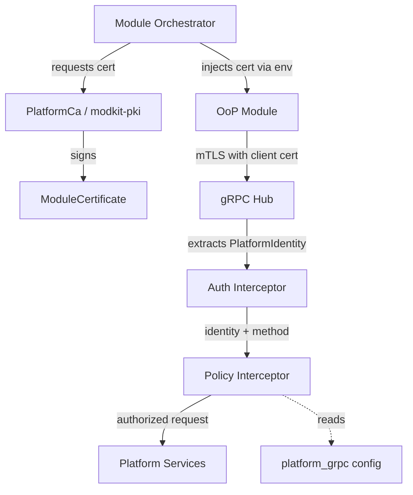
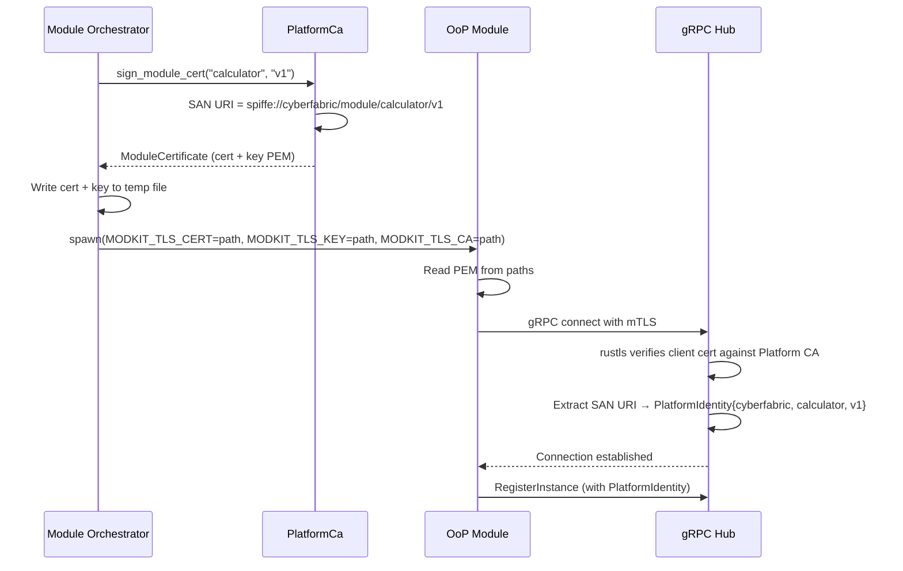
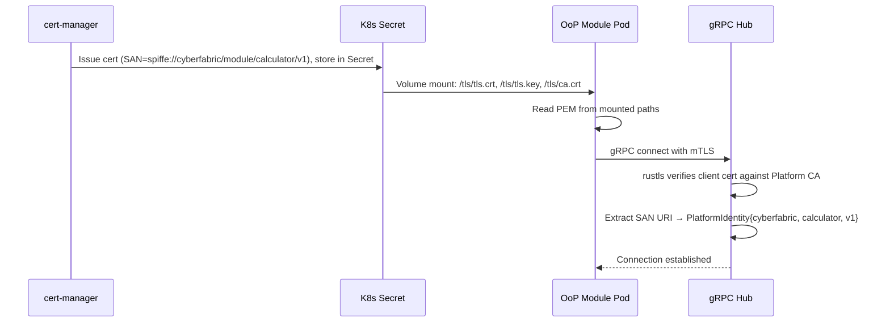
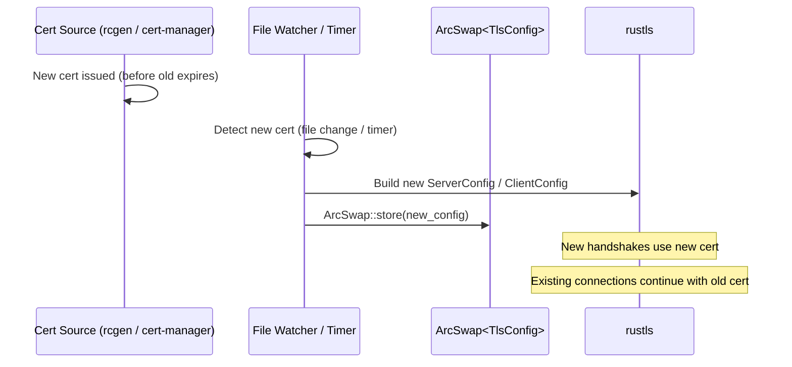

# Technical Design — Platform-Level Authentication

- [ ] `p1` - **ID**: `cpt-cf-platform-authn-design`

## Table of Contents

<!-- toc -->
<!-- /toc -->

## 1. Architecture Overview

### 1.1 Architectural Vision

Platform-level authentication provides cryptographic identity and mutual authentication for Cyber Fabric modules communicating over the network. It is distinct from tenant-scoped authentication (AuthN Resolver + Bearer tokens) and operates in a separate identity domain.

In-process modules communicate via ClientHub with implicit trust (same process boundary). Out-of-Process (OoP) modules — both managed (spawned by the orchestrator) and unmanaged (Kubernetes pods, systemd services, etc.) — require explicit authentication over gRPC channels. mTLS with a Platform CA provides this: each module receives an X.509 certificate identifying it by name and version, and all gRPC channels require mutual certificate verification.

The platform supports two certificate provisioning modes: an embedded CA (via rcgen) for on-prem / air-gapped deployments, and cert-manager integration for Kubernetes. The Rust TLS code is identical in both modes — it consumes PEM-encoded certificates from configurable paths.

### 1.2 Architecture Drivers

#### Functional Drivers

| Requirement | Design Response |
|-------------|-----------------|
| OoP modules must register global GTS entities | gRPC SDK path authenticated via mTLS, bypasses tenant-scoped auth |
| Module identity must be verifiable | SPIFFE URI in X.509 SAN: `spiffe://cyberfabric/module/<name>/<version>` |
| On-prem must work without external infrastructure | Embedded CA via rcgen, zero external dependencies |
| Kubernetes must use standard tooling | cert-manager issues PEM certs, same Rust code consumes them |

#### Key ADRs

| ADR | Summary |
|-----|---------|
| `cpt-cf-platform-authn-adr-mtls-platform-ca` | Use mTLS with Platform CA for inter-module authentication |
| `cpt-cf-platform-authn-adr-spiffe-uri-module-identity` | Use SPIFFE URI in SAN for module identity |

### 1.3 Architecture Layers

| Layer | Responsibility | Technology |
|-------|---------------|------------|
| PKI | Certificate generation, signing, rotation | rcgen (on-prem), cert-manager (k8s) |
| Transport | mTLS channel establishment, peer cert extraction | rustls, tonic `ServerTlsConfig` / `ClientTlsConfig` |
| Identity | SPIFFE URI extraction from certificate SAN | tonic `Request::peer_certs()`, x509-parser, custom interceptor |

## 2. Principles & Constraints

### 2.1 Design Principles

#### Separate Identity Domains

- [ ] `p1` - **ID**: `cpt-cf-platform-authn-principle-separate-identity`

Platform identity (SPIFFE URI in X.509 SAN) and tenant-scoped identity (`SecurityContext`) are independent. Platform identity is used for module-to-module communication over gRPC. Tenant-scoped identity is used for external-facing REST APIs. They never substitute for each other.

#### Environment-Agnostic TLS Code

- [ ] `p1` - **ID**: `cpt-cf-platform-authn-principle-env-agnostic`

The Rust TLS configuration code is identical for on-prem and Kubernetes. It reads PEM bytes from configurable paths. The certificate provisioning mechanism (rcgen vs cert-manager) is an operational concern, not a code concern.

#### Short-Lived Certificates

- [ ] `p2` - **ID**: `cpt-cf-platform-authn-principle-short-lived-certs`

Module certificates default to short validity periods (24 hours) to reduce the impact of key compromise and minimize the need for revocation infrastructure. The Platform CA certificate has a longer validity (1 year).

### 2.2 Constraints

#### No SecurityContext for Platform Operations

- [ ] `p1` - **ID**: `cpt-cf-platform-authn-constraint-no-secctx`

Platform-level operations (GTS entity registration via SDK path, directory service registration, heartbeats) do not use `SecurityContext`. The caller is identified by its X.509 certificate, not by a tenant-scoped subject.

#### Platform CA Trust Only

- [ ] `p1` - **ID**: `cpt-cf-platform-authn-constraint-ca-trust`

gRPC channels for inter-module communication trust only the Platform CA. System-wide root CAs are not included in the trust store. This prevents external certificates from being accepted for platform operations.

## 3. Technical Architecture

### 3.1 Domain Model

**Core Entities:**

| Entity | Description |
|--------|-------------|
| `PlatformIdentity` | Module identity extracted from X.509 SAN (SPIFFE URI): trust domain, module name, version |
| `PlatformCa` | Certificate Authority: CA cert + key, cert signing operations |
| `ModuleCertificate` | Issued certificate for a module: cert + key + CA chain, validity period |
| `TlsConfig` | Configuration: cert/key/CA paths, validity periods, algorithms |

### 3.2 Component Model



#### modkit-pki

- [ ] `p1` - **ID**: `cpt-cf-platform-authn-component-modkit-pki`

##### Why this component exists

Encapsulates all platform PKI operations: CA management, certificate generation, PEM I/O. Isolates rcgen dependency from the rest of the codebase.

##### Responsibility scope

- Embedded CA: generation, loading from disk, cert signing
- Module certificate generation (key pair + cert signed by CA, SPIFFE URI in SAN)
- SPIFFE ID construction: `spiffe://<trust_domain>/module/<name>/<version>`
- PEM serialization/deserialization
- Configuration: trust domain, paths, validity periods, key algorithms

##### Responsibility boundaries

- Does NOT handle TLS channel setup (delegated to tonic/rustls)
- Does NOT handle certificate distribution (delegated to module-orchestrator)
- Does NOT handle k8s cert-manager integration (operational, not code)

##### Related components

- `cpt-cf-platform-authn-component-auth-interceptor` — consumes issued certificates

#### Auth Interceptor

- [ ] `p1` - **ID**: `cpt-cf-platform-authn-component-auth-interceptor`

##### Why this component exists

Extracts module identity from the client certificate on incoming gRPC requests and makes it available to service handlers.

##### Responsibility scope

- Extract client certificate chain from `tonic::Request::peer_certs()`
- Parse SPIFFE URI from SAN to derive `PlatformIdentity` (trust domain, module name, version)
- Inject `PlatformIdentity` as request extension
- Reject requests without valid client certificates or without a SPIFFE URI SAN

##### Responsibility boundaries

- Does NOT make authorization decisions (only authentication)
- Does NOT handle TLS handshake (delegated to tonic/rustls)

##### Related components

- `cpt-cf-platform-authn-component-modkit-pki` — issues the certificates this interceptor verifies
- `cpt-cf-platform-authn-component-policy-interceptor` — consumes `PlatformIdentity` for authorization

#### Policy Interceptor

- [ ] `p1` - **ID**: `cpt-cf-platform-authn-component-policy-interceptor`

##### Why this component exists

Enforces per-method access policies for platform gRPC services. After the Auth Interceptor establishes _who_ the caller is, the Policy Interceptor decides _whether_ the caller is allowed to invoke the requested method.

##### Responsibility scope

- Read `platform_grpc` access policy from module configuration
- On each gRPC request: match `(method path, caller SPIFFE ID)` against policy rules
- SPIFFE ID pattern matching with trailing `*` wildcard on path segments
- Return `PermissionDenied` if no rule matches and `default: deny`
- Pass through if a matching `allow` rule is found

##### Responsibility boundaries

- Does NOT authenticate the caller (delegated to Auth Interceptor)
- Does NOT handle TLS or certificate verification (delegated to rustls/tonic)
- Does NOT implement domain-specific authorization (that is tenant-scoped AuthZ via PolicyEnforcer)

##### Related components

- `cpt-cf-platform-authn-component-auth-interceptor` — provides `PlatformIdentity`

### 3.3 API Contracts

#### Platform Identity (internal)

- [ ] `p1` - **ID**: `cpt-cf-platform-authn-interface-platform-identity`

- **Technology**: Rust struct, passed as tonic request extension

```rust
/// Identity of a platform module, extracted from SPIFFE URI in X.509 SAN.
///
/// SPIFFE ID format: spiffe://<trust_domain>/module/<module_name>/<version>
/// Example: spiffe://cyberfabric/module/calculator/v1
pub struct PlatformIdentity {
    /// SPIFFE trust domain (e.g., "cyberfabric")
    pub trust_domain: String,
    /// Module name (e.g., "calculator")
    pub module_name: String,
    /// Module version (e.g., "v1")
    pub version: String,
    /// Full SPIFFE ID (e.g., "spiffe://cyberfabric/module/calculator/v1")
    pub spiffe_id: String,
}
```

#### TLS Configuration

- [ ] `p1` - **ID**: `cpt-cf-platform-authn-interface-tls-config`

Configuration is split by role. The server (hyperspot-server process hosting gRPC Hub) and the client (OoP module process) have different configuration needs.

##### Server configuration (hyperspot-server)

Located in the main server config file (`config.yaml`). The server needs the CA to verify client certs, its own server cert, and in embedded mode — the CA key to sign new module certs.

```yaml
platform_tls:
  # SPIFFE trust domain for this deployment.
  # Used when generating certificates in embedded mode.
  trust_domain: cyberfabric

  # Certificate provisioning mode:
  # "embedded" = platform generates CA and module certs via rcgen (on-prem)
  # "external" = all certs provided externally via paths (k8s / cert-manager)
  mode: embedded

  # Platform CA certificate (both modes: used to verify client certs)
  ca_cert_path: "data/pki/ca.crt"

  # CA private key (embedded mode only: used to sign module certs)
  ca_key_path: "data/pki/ca.key"

  # Server certificate presented to connecting modules
  server_cert_path: "data/pki/server.crt"
  server_key_path: "data/pki/server.key"

  # Certificate validity (embedded mode only)
  validity:
    ca_days: 365
    server_hours: 720       # 30 days
    module_hours: 24
```

##### Client configuration (OoP module)

OoP modules receive their configuration via environment variables set by the orchestrator (managed mode) or by the deployment system (k8s). The module needs its own client cert and the CA cert to verify the server.

```
MODKIT_TLS_CERT=/tls/tls.crt        # module client certificate (PEM)
MODKIT_TLS_KEY=/tls/tls.key         # module private key (PEM)
MODKIT_TLS_CA=/tls/ca.crt           # Platform CA certificate (PEM)
```

In managed mode, the orchestrator generates the cert via `modkit-pki`, writes to temp files, and sets these env vars before spawning the process. In k8s, cert-manager writes PEM files to a mounted Secret and the deployment sets the env vars to the mount paths.

The module code is identical in both cases:

```rust
let cert = std::fs::read(std::env::var("MODKIT_TLS_CERT")?)?;
let key  = std::fs::read(std::env::var("MODKIT_TLS_KEY")?)?;
let ca   = std::fs::read(std::env::var("MODKIT_TLS_CA")?)?;

let tls = ClientTlsConfig::new()
    .ca_certificate(Certificate::from_pem(ca))
    .identity(Identity::from_pem(cert, key));
```

#### gRPC Access Policy

- [ ] `p1` - **ID**: `cpt-cf-platform-authn-interface-grpc-access-policy`

- **Technology**: YAML configuration (per-module section in server config)

Generic access policy for platform gRPC services. Each module that exposes gRPC methods declares a `platform_grpc` section with rules mapping gRPC method paths to allowed SPIFFE ID patterns. The Policy Interceptor (`cpt-cf-platform-authn-component-policy-interceptor`) enforces these rules.

**Structure:**

```yaml
modules:
  <module_name>:
    platform_grpc:
      # Default policy when no rule matches.
      # "deny" (default) — reject unmatched requests with PermissionDenied
      # "any_module" — allow any caller with valid Platform CA cert
      default: deny
      rules:
        - methods:
            - /<package>.<Service>/<Method>
          allow:
            - "<spiffe_id_pattern>"
```

**SPIFFE ID pattern matching:**
- `spiffe://cyberfabric/module/*` — any module in the trust domain
- `spiffe://cyberfabric/module/calculator/*` — any version of calculator
- `spiffe://cyberfabric/module/calculator/v1` — exact match
- Trailing `*` only (consistent with GTS wildcard convention)

**Examples:**

```yaml
# types-registry: any module can register and read, delete is restricted
modules:
  types_registry:
    platform_grpc:
      default: deny
      rules:
        - methods:
            - /types_registry.v1.TypesRegistryService/Register
            - /types_registry.v1.TypesRegistryService/RegisterSchemas
            - /types_registry.v1.TypesRegistryService/RegisterInstances
            - /types_registry.v1.TypesRegistryService/Get
            - /types_registry.v1.TypesRegistryService/List
            - /types_registry.v1.TypesRegistryService/ListSchemas
            - /types_registry.v1.TypesRegistryService/ListInstances
          allow:
            - "spiffe://cyberfabric/module/*"

# directory service: any module can register and heartbeat
  module_orchestrator:
    platform_grpc:
      default: deny
      rules:
        - methods:
            - /directory.v1.DirectoryService/RegisterInstance
            - /directory.v1.DirectoryService/Heartbeat
            - /directory.v1.DirectoryService/DeregisterInstance
          allow:
            - "spiffe://cyberfabric/module/*"

# resource-group: only authz-resolver can read hierarchy
  resource_group:
    platform_grpc:
      default: deny
      rules:
        - methods:
            - /resource_group.v1.ResourceGroupService/ListGroupHierarchy
          allow:
            - "spiffe://cyberfabric/module/authz-resolver/*"
```

**Enforcement flow:**

```
gRPC request arrives
  → rustls: verify client cert chain against Platform CA ✓
  → Auth Interceptor: extract SPIFFE URI from SAN → PlatformIdentity ✓
  → Policy Interceptor: lookup (gRPC method path, caller spiffe_id)
      → match against platform_grpc.rules[].methods
      → check caller spiffe_id against rule.allow patterns
      → if match found → pass through
      → if no match and default=deny → PermissionDenied
  → service handler executes
```

### 3.4 Internal Dependencies

| Dependency | Interface Used | Purpose |
|------------|----------------|---------|
| `rcgen` (0.13+) | `CertificateParams`, `KeyPair`, `Issuer` | CA creation, cert signing |
| `rustls` (0.23) | `ServerConfig`, `ClientConfig`, `WebPkiClientVerifier` | mTLS runtime, client cert verification |
| `tonic` (0.14) | `ServerTlsConfig`, `ClientTlsConfig`, `Request::peer_certs()` | gRPC mTLS integration |
| `arc-swap` | `ArcSwap<ServerConfig>` | Hot-swap TLS config on cert rotation |

### 3.5 Interactions & Sequences

#### Managed OoP Module Startup

**ID**: `cpt-cf-platform-authn-seq-managed-startup`

**Actors**: Module Orchestrator, OoP Module, gRPC Hub



#### Unmanaged OoP Module Startup (Kubernetes)

**ID**: `cpt-cf-platform-authn-seq-unmanaged-startup`

**Actors**: cert-manager, OoP Module Pod, gRPC Hub



#### Certificate Rotation

**ID**: `cpt-cf-platform-authn-seq-cert-rotation`



## 4. Integration Points

### gRPC Hub

- [ ] `p1` - **ID**: `cpt-cf-platform-authn-integration-grpc-hub`

Currently serves unencrypted HTTP/2. Changes:

- Accept `ServerTlsConfig` with Platform CA as `client_ca_root`
- Enable `client_auth_optional(false)` — all gRPC clients must present a valid client cert
- Add Auth Interceptor extracting `PlatformIdentity` from `peer_certs()` SAN
- Add Policy Interceptor enforcing `platform_grpc` access rules
- Provide `PlatformIdentity` as request extension for downstream services

### Module Orchestrator

- [ ] `p1` - **ID**: `cpt-cf-platform-authn-integration-orchestrator`

Currently spawns OoP processes without credentials. Changes:

- On module spawn: request cert from `PlatformCa`, write to temp file, inject path via env var
- Track issued certificates for potential revocation
- Clean up temp cert files after module connects

### OoP Bootstrap

- [ ] `p1` - **ID**: `cpt-cf-platform-authn-integration-oop-bootstrap`

Currently connects to DirectoryService without auth (`libs/modkit/src/bootstrap/oop.rs`). Changes:

- Read cert/key/CA paths from `MODKIT_TLS_CERT`, `MODKIT_TLS_KEY`, `MODKIT_TLS_CA` env vars
- Configure `ClientTlsConfig` with client identity and CA root
- Connect with `https://` endpoints instead of `http://`

### modkit-transport-grpc

- [ ] `p1` - **ID**: `cpt-cf-platform-authn-integration-transport-grpc`

Currently has no TLS configuration (`libs/modkit-transport-grpc/`). Changes:

- Add `TlsConfig` fields to `GrpcClientConfig`
- Wire `ClientTlsConfig` into `build_endpoint()`
- Provide Auth Interceptor and Policy Interceptor as reusable tonic layers
- Add helper for extracting `PlatformIdentity` from `peer_certs()` SAN

## 5. Technology Stack

All crates are already in the workspace:

| Crate | Version | Role |
|-------|---------|------|
| `rcgen` | 0.13 (upgrade to 0.14 recommended for `Issuer` API) | CA cert generation, module cert signing |
| `rustls` | 0.23 | TLS runtime, client cert verification via `WebPkiClientVerifier` |
| `tonic` | 0.14 | gRPC mTLS via `ServerTlsConfig` / `ClientTlsConfig` |
| `tokio-rustls` | (via tonic) | Async TLS integration |
| `arc-swap` | (already used) | Hot-swap TLS config on cert rotation |

No new external dependencies required for on-prem mode.

## 6. Open Questions

1. **CA key protection on-prem** — should the CA private key be encrypted at rest? What KMS integration, if any?
2. **Graceful degradation** — should the platform support a "no TLS" mode for local development, or always require mTLS (with a dev-mode self-signed CA)?
3. **Certificate scope** — should one certificate cover all gRPC services a module exposes, or one cert per service?

## 7. Traceability

- **ADRs**: [ADR-0001: mTLS with Platform CA](ADR/0001-mtls-platform-ca.md), [ADR-0002: SPIFFE URI for Module Identity](ADR/0002-spiffe-uri-module-identity.md)
- **Related**: [Authorization DESIGN.md](../authorization/DESIGN.md) — tenant-scoped AuthN/AuthZ design
- **Related**: [TENANT_MODEL.md](../authorization/TENANT_MODEL.md) — forest tenant topology
- **Consumer**: [Types Registry DESIGN.md](../../../modules/system/types-registry/docs/DESIGN.md) — gRPC interface for OoP GTS entity registration
- **Consumer**: [Resource Group DESIGN.md](../../../modules/system/resource-group/docs/DESIGN.md) — mTLS for AuthZ plugin hierarchy reads (`cpt-cf-resource-group-seq-auth-modes`)
