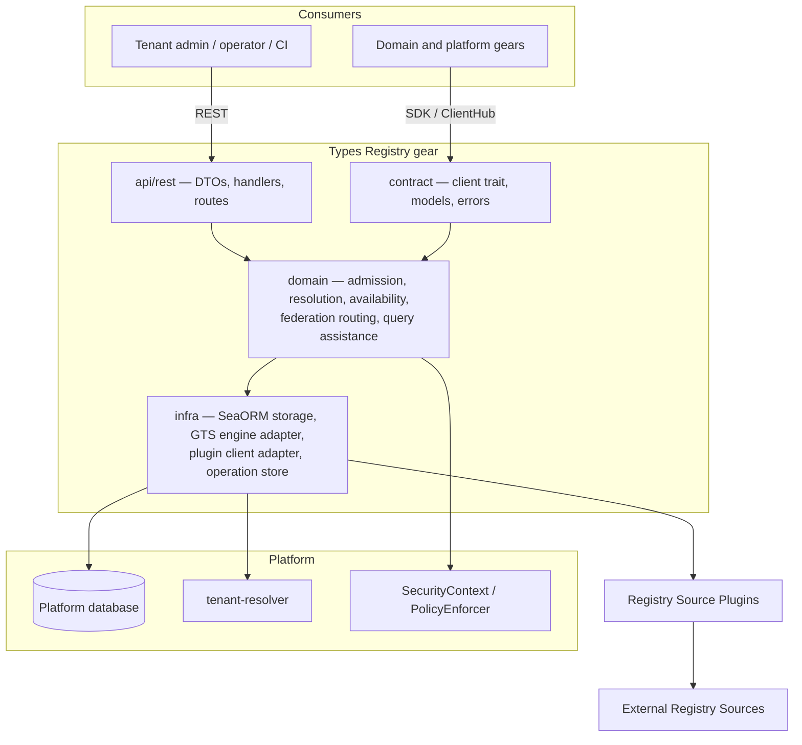
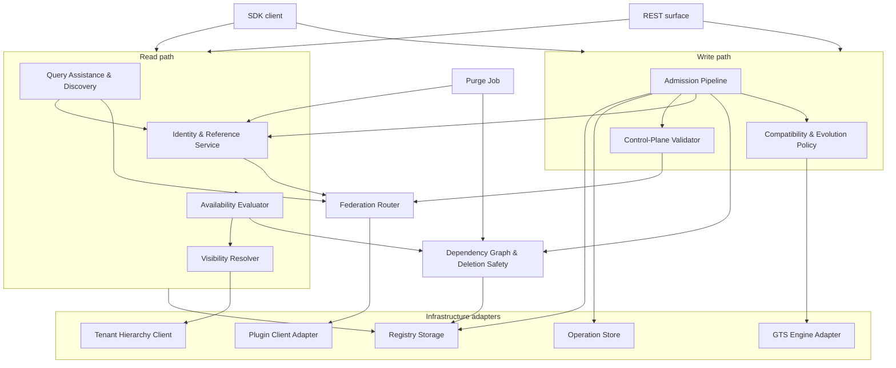

# Technical Design — Types Registry

- [ ] `p1` - **ID**: `cpt-cf-types-registry-design-types-registry`

## Table of Contents

<!-- generated by `cfs toc` -->

## 1. Architecture Overview

### 1.1 Architectural Vision

Types Registry is a control plane for type contracts. It owns the identity, definition, evolution, and platform-facing usability of GTS Type Schemas and registered GTS Instances, and it owns none of the runtime objects that conform to them. Every other gear reaches it through one SDK and one REST surface, whether the entity it asks about is stored here or lives in a vendor's own registry.

Four decisions give the architecture its shape. First, **identity is derived rather than allocated**: a Registry Reference is a deterministic UUID computed from the canonical GTS Identifier, so the same contract carries the same reference in every installation with no allocation state to transport, and domain gears persist that UUID instead of an identifier string (ADR-0001). Second, **a managed identifier is a mutable logical entity with an immutable revision history**: the major-only GTS Identifier names a channel, not a snapshot, and successive definitions are internal revisions admitted under one enforced backward-compatibility mode (ADR-0003, ADR-0004, ADR-0005, ADR-0006). This buys stability of stored references at the cost of making every resolution result something that has to be validated rather than assumed current. Third, **every actual mutation is an asynchronous operation guarded by optimistic concurrency**: a caller reads the current entities, omits authored content that is already equal, and submits the remaining candidates with an entity-level precondition. The API durably binds the `Idempotency-Key` to the request fingerprint on the operation row itself, persists the operation and its candidates, atomically enqueues the operation through the ToolKit transactional outbox, and returns the operation UUID. Acceptance has exactly one successful shape: there is no synchronous path, because a batch that equals current state is unreachable for a caller honouring its own preconditions, and a caller that has reconciled sends no request at all. A worker performs dependency-aware partial admission and records an independent outcome for every candidate GTS Identifier. Fourth, **federation is live delegation across a closed boundary**: external definitions are never projected into local storage, and the managed and externally managed identifier spaces are disjoint — no reference or derivation crosses in either direction. Every guarantee the platform offers for a managed entity is therefore enforceable from local state alone, without a plugin call on the managed read path and without depending on data a plugin chose to supply (ADR-0002, ADR-0007, ADR-0011).

The performance shape follows from a property of GTS itself: the derivation chain of a type is encoded in its identifier. `GtsId::chain_ids()` reconstructs every base from the string alone, so hierarchy questions need no graph traversal, and because a GTS pattern admits a wildcard only as its final token, every pattern query is an index range scan over the canonical identifier. What is not identifier-derivable — `$ref` and `x-gts-ref` targets — is kept as a flat edge set between managed entities, used for deletion safety and impact analysis, off the read path. Every Type Schema revision retains the authored schema and the effective schema, traits, and trait schema computed by `gts-rust` against the exact dependency revision vector used for admission. A separate current-state projection retains the same read payload resolved against the dependencies that are current now. This distinction is load-bearing: a floating managed reference can change the current effective form without mutating the dependent's authored revision. Ordinary Type Schema and registered Instance reads use only the identity row and the appropriate current-state projection; revision tables are reserved for admission, history, diagnostics, and purge.

### 1.2 Architecture Drivers

#### Functional Drivers

| Requirement | Design Response |
|-------------|------------------|
| `cpt-cf-types-registry-fr-id-resolution` | Deterministic derivation of the Registry Reference from the canonical identifier; durable forward/reverse mapping with tombstones for Managed Entities; ordered plugin chain for references not resolved locally. |
| `cpt-cf-types-registry-fr-register-schemas`, `cpt-cf-types-registry-fr-register-instances` | Read/reconcile/conditional-write over an entity `resource_version`; one acceptance shape, always an asynchronous operation carrying its own request-key idempotency, with durable per-candidate state and dependency-aware partial admission. The no-op fast path lives in the caller, which sends no request when nothing differs. |
| `cpt-cf-types-registry-fr-validate-schema-compat` | Backward-only enforcement against the current revision, computed on the resolved effective schema and recorded with the specification and implementation versions used, so a semantic change to the relation can be detected and the affected chain frozen. The relation is well-posed because one dialect governs every revision of an entity. |
| `cpt-cf-types-registry-fr-validate-type-derivation` | Derivation chain taken from the identifier and validated against every base in it; derivation from an externally managed base rejected; one dialect across the resolution closure, so no base is reinterpreted under a dialect other than the one it was authored in. |
| `cpt-cf-types-registry-fr-gts-validation` | All GTS semantics reached through the engine adapter; managed content profile narrowed to Draft-07 with the dialect pinned at initial admission, checked synchronously on the submitted document and never persisted; no dialect check on the federation path. |
| `cpt-cf-types-registry-fr-ref-tracking` | Flat dependency edge set between managed entities covering `$ref`, `x-gts-ref`, and Instance-to-schema; authoritative for deletion safety, evaluated without contacting any plugin and without consuming plugin-supplied data. |
| `cpt-cf-types-registry-fr-type-query-assistance` | Pattern compiled to a range predicate over the canonical identifier, post-filtered by the GTS matcher, expanded source-major, and returned as one complete bounded set of Registry References or a structured limit failure. |
| `cpt-cf-types-registry-fr-tenant-ownership` | Ownership scope stored on every Managed Entity; visibility evaluated as the directed descendant relation using the tenant ancestor chain, with disclosure bounded to name availability on the registration surface. |
| `cpt-cf-types-registry-fr-registration-authority` | Global writes accepted only on the platform plane under `PlatformSecurityContext`; tenant writes authorized by the PDP against the candidate's GTS Identifier as a resource property, evaluated before identifier availability so the bounded name-availability disclosure cannot become a namespace probe. |
| `cpt-cf-types-registry-fr-tenant-availability` | Verdict computed by the registry from the materialized per-entity dependency closure and the requesting tenant's ancestor chain, as one SQL predicate; never recomputed by consumers. |
| `cpt-cf-types-registry-fr-lifecycle` | `ACTIVE` and `DELETED` for Managed Entities; no newest-member statement, with exact family enumeration offered as a discovery filter instead; deletion blocked from local state while any registered dependent exists. |
| `cpt-cf-types-registry-fr-registry-federation`, `cpt-cf-types-registry-fr-registry-source-routing` | Managed storage consulted first, then non-overlapping Source Claims in deterministic priority order; claims are rooted single-segment patterns, so an identifier's owning source follows from its first segment, an external entity's whole derivation chain sits in one claim, and the two identifier spaces stay disjoint; capability profile enforced at claim activation, with no write path granted to a plugin. |
| `cpt-cf-types-registry-fr-cache-freshness-metadata` | Every read carries an opaque composite validator covering entity revision, the closure fingerprint, tenant ancestor-chain version, and plugin configuration revision, published atomically with the mutation that invalidates it. |
| `cpt-cf-types-registry-fr-two-phase-init` | One plane per batch, dependency-aware partial admission with atomic cyclic dependency groups, no global startup barrier, and readiness gated by each registrant on its own required candidate outcomes. |

#### NFR Allocation

| NFR ID | NFR Summary | Allocated To | Design Response | Verification Approach |
|--------|-------------|--------------|-----------------|----------------------|
| `cpt-cf-types-registry-nfr-lookup-latency` | Exact lookup p95 < 10 ms | Resolution path: identity mapping, current-state read, availability evaluation | Reference derived in-process rather than looked up; authored and effective content read from one current-state row keyed on the entity; availability decided in SQL from the materialized per-entity dependency closure plus a cached tenant ancestor chain; no plugin call can occur on a managed path because ADR-0011 admits no edge across the boundary in either direction. | Automated benchmark against the profile in §4.1. |
| `cpt-cf-types-registry-nfr-query-latency` | Bounded search p95 < 100 ms (P2) | Discovery and query assistance | Pattern compiled to an index range predicate over the canonical identifier; over-returned candidates filtered in memory by the GTS matcher; federated expansion source-major with bounded internal paging. | Automated benchmark against the profile in §4.1. |
| `cpt-cf-types-registry-nfr-multi-pod-correctness` | Committed mutations visible on every pod's first post-commit read | Storage, outbox worker, and caching layers | The platform database is the only authoritative store; the leased ToolKit outbox excludes concurrent claims while idempotent admission commits remain safe after lease expiry or duplicate delivery; every state transition and its validator metadata commit in one transaction; process-local state is confined to derived caches that are validated against a committed token before use and never consulted as authority. | Integration tests exercising duplicate delivery, lease expiry, concurrent first-family admission, and commit-then-read across pods. |
| `cpt-cf-types-registry-nfr-cache-correctness` | No invalidated result accepted as current (P2) | SDK client cache | Opaque composite validator returned with every result and required on revalidation; a cache entry is current only while its validator matches. | Integration tests covering mutation, revalidation, and stale-entry rejection. |

#### Key ADRs

| ADR ID | Decision Summary |
|--------|-----------------|
| `cpt-cf-types-registry-adr-storage-identity-query-model` | Domain gears persist an opaque Registry Reference UUID derived deterministically from the exact client-supplied GTS Identifier. |
| `cpt-cf-types-registry-adr-external-source-live-delegation` | Externally managed definitions and tenant state are delegated live to the owning Registry Source Plugin, never projected. |
| `cpt-cf-types-registry-adr-type-schema-evolution-compatibility` | Managed Type Schemas evolve under `BACKWARD` compatibility, compared against the current revision only. |
| `cpt-cf-types-registry-adr-gts-minor-version-identity-evolution` | Managed identifiers carry no minor version and name a mutable logical entity within one major. |
| `cpt-cf-types-registry-adr-type-schema-revisions` | Every admitted Type Schema definition is an immutable retained revision with optimistic concurrency on the logical entity. |
| `cpt-cf-types-registry-adr-registered-instance-revisions` | A registered Instance is a mutable logical entity whose every admitted value is an immutable revision bound to the Type Schema revision that validated it. |
| `cpt-cf-types-registry-adr-federated-source-routing-query` | Ordered resolver chain over non-overlapping Source Claims, managed storage first, source-major federated traversal. |
| `cpt-cf-types-registry-adr-managed-version-family-lifecycle` | Several majors of a family may be `ACTIVE`; the registry names no newest member, and managed deprecation is deferred past P1. |
| `cpt-cf-types-registry-adr-tenant-ownership-visibility-authority` | Two ownership scopes; tenant-owned entities visible down the tenant subtree; visibility never implies authority. |
| `cpt-cf-types-registry-adr-tenant-availability-evaluation` | Availability follows the live semantic dependency closure, independently of whether effective artifacts are materialized, and propagates transitively along outgoing edges only. |
| `cpt-cf-types-registry-adr-managed-external-boundary` | The managed–external boundary is closed in both directions; Source Claims are rooted single-segment patterns, plugins are read-only, and a retired Source Claim is a permanent reservation. |
| `cpt-cf-types-registry-adr-write-path-admission-protocol` | Read/reconcile/conditional-write, one always-asynchronous acceptance shape, immutable request-key replay on the operation itself, per-candidate optimistic preconditions and outcomes, dependency-aware partial admission, and control-plane records with built-in validators. |
| `cpt-cf-types-registry-adr-platform-purge-of-deleted-entities` | Physical removal exists only as one explicit operator-invoked purge, which releases the GTS Identifier and is disabled by default. |
| `cpt-cf-types-registry-adr-managed-type-schema-dialect-profile` | Managed Type Schemas declare Draft-07 in P1, the dialect is pinned at initial admission, and P2 widening is governed by dialect uniformity across the resolution closure. |

### 1.3 Architecture Layers

- [ ] `p2` - **ID**: `cpt-cf-types-registry-tech-layering`



| Layer | Responsibility | Technology |
|-------|---------------|------------|
| Presentation | Authenticated REST surface for management, discovery, resolution, validation, and operations; DTOs with OpenAPI schemas | Axum via ToolKit `OperationBuilder`, utoipa, RFC-9457 problem details |
| Contract | Transport-agnostic client trait and models used by other gears through the typed ClientHub | Rust traits, plain domain models, no serde or HTTP types |
| Domain | Admission and compatibility, revision and concurrency control, identity and reference resolution, dependency and deletion safety, availability evaluation, federation routing, query assistance, built-in control-plane validators | Rust, `gts-rust` for all GTS semantics |
| Infrastructure | Authoritative persistence, operation and idempotency store, GTS engine adapter, tenant hierarchy client, Registry Source Plugin clients | SeaORM over SQLite / PostgreSQL / MySQL, ToolKit scoped ClientHub, `tenant-resolver` SDK |

Two rules constrain the layering beyond the standard gear structure. All GTS semantics — parsing, canonicalization, pattern matching, reference extraction, resolution, compatibility, content-model classification — are reached only through the infrastructure adapter over `gts-rust`; the domain layer never reimplements or approximates them. And no authoritative decision is ever taken from process-local state: caches exist, but each is a derived projection validated against a committed token before use.

## 2. Principles & Constraints

### 2.1 Design Principles

#### Authority is local

- [ ] `p2` - **ID**: `cpt-cf-types-registry-principle-local-authority`

Every guarantee Types Registry offers for a Managed Entity must be decidable from state Types Registry owns. No authoritative decision — admission, deletion, availability, routing activation — may depend on the uptime, latency, honesty, or diligence of a component the platform does not operate.

This is what closes the managed–external boundary in both directions and splits plugin capabilities into authoritative and advisory. An advisory output may degrade with a stated warning; an authoritative one may not degrade at all.

The last word in that list is the one that decided the boundary. Data a counterparty supplies makes a decision independent of its *uptime* while leaving it dependent on its *diligence*, and the second is not observable: a plugin that never registers a dependency is indistinguishable from one that has none, so the registry would believe a managed type unreferenced and permit a deletion that breaks a consumer. Closing the boundary removes the class rather than mitigating it — there is nothing to register because nothing can depend across.

**ADRs**: `cpt-cf-types-registry-adr-managed-external-boundary`, `cpt-cf-types-registry-adr-external-source-live-delegation`, `cpt-cf-types-registry-adr-federated-source-routing-query`

#### Derive facts, materialize computations

- [ ] `p2` - **ID**: `cpt-cf-types-registry-principle-derive-not-store`

A fact that can be computed from state already held is computed at request time, not stored. Stored copies of derivable facts need invariants to keep them truthful, serialization points to keep them consistent, and repair paths for when they drift. The derivation chain of a type and the Registry Reference of an identifier are derived for this reason.

The principle has a second edge that is easy to miss: a fact already present in what the caller receives should not be recomputed on the caller's behalf either. Version ordering within a family is the worked example — it is carried by the members' identifiers, so the registry neither stores which member is newest nor computes it, and offers exact family enumeration instead.

The principle bounds itself rather than excluding denormalization. What may be materialized is the *result of an expensive computation over transactionally known inputs* — a resolved effective schema, a dependency closure — where the set of events that change the inputs is closed and every one of them already runs in a transaction. What may not be materialized is a fact whose truth depends on state the registry does not control, because that produces a second authority.

**ADRs**: `cpt-cf-types-registry-adr-managed-version-family-lifecycle`, `cpt-cf-types-registry-adr-storage-identity-query-model`, `cpt-cf-types-registry-adr-tenant-availability-evaluation`

#### Fail closed on incomplete information

- [ ] `p2` - **ID**: `cpt-cf-types-registry-principle-fail-closed`

Absence of evidence is never evidence of absence. A source that cannot answer is not a `NOT_FOUND`; a compatibility check the implementation cannot decide is a rejection, not a pass; external state that cannot be confirmed is never `AVAILABLE`; a query whose completeness cannot be established returns a failure rather than a partial result.

The single exception is output explicitly labelled advisory — a reverse dependency-impact report — which degrades with a stated source-unavailable warning precisely because no authoritative decision reads it.

**ADRs**: `cpt-cf-types-registry-adr-external-source-live-delegation`, `cpt-cf-types-registry-adr-type-schema-evolution-compatibility`, `cpt-cf-types-registry-adr-tenant-availability-evaluation`, `cpt-cf-types-registry-adr-managed-external-boundary`

#### Identity is permanent

- [ ] `p2` - **ID**: `cpt-cf-types-registry-principle-permanent-identity`

An admitted GTS Identifier never comes to name a different logical entity. Deletion is logical and terminal, the identifier stays reserved by a tombstone, previously issued Registry References keep reverse-resolving, and a retired Source Claim remains a reservation over its identifier space.

Because references are derived rather than allocated, releasing an identifier is a data-corruption primitive rather than a storage optimization: the reused identifier reproduces the same reference and silently rebinds any domain row still holding it. Purge is the single named exception, disabled by default and guarded by deployment policy rather than by a check.

**ADRs**: `cpt-cf-types-registry-adr-storage-identity-query-model`, `cpt-cf-types-registry-adr-platform-purge-of-deleted-entities`, `cpt-cf-types-registry-adr-managed-external-boundary`

#### One public vocabulary per concept

- [ ] `p2` - **ID**: `cpt-cf-types-registry-principle-single-vocabulary`

Where two vocabularies describe one client-visible concept, only one is public. The operation resource is the sole mutation-progress contract: it exposes one operation status plus one candidate status keyed by each exact GTS Identifier. There is no second Admission Status resource, no pending logical entity, and no second acceptance shape — a redundant batch is reported as an operation whose candidates terminate `unchanged`, not as an inline receipt. The principle also decided the storage: request identity has no record of its own, because the operation already is that record. Lifecycle Status, Tenant Enablement State, and Tenant Availability State remain three distinct dimensions and are never collapsed into a single field, because each has a different owner and a different reason to change.

**ADRs**: `cpt-cf-types-registry-adr-write-path-admission-protocol`, `cpt-cf-types-registry-adr-tenant-availability-evaluation`

#### The registry governs contracts, not objects

- [ ] `p2` - **ID**: `cpt-cf-types-registry-principle-contract-not-object`

Types Registry decides what a type contract is, who may see it, and whether a tenant may use it. It never deletes, hides, or rewrites data owned by another gear on the strength of that verdict. An owning gear defines what happens to its runtime objects whose referenced entity became unavailable, and Types Registry supplies only the verdict it needs to decide.

**ADRs**: `cpt-cf-types-registry-adr-tenant-availability-evaluation`, `cpt-cf-types-registry-adr-storage-identity-query-model`

### 2.2 Constraints

#### GTS semantics belong to the platform implementation

- [ ] `p2` - **ID**: `cpt-cf-types-registry-constraint-gts-implementation`

Types Registry does not implement GTS. Parsing, canonicalization, chain derivation, pattern matching and coverage, reference extraction, schema resolution, trait merging, content-model classification, compatibility, and casting all come from `gts-rust`. Any behaviour the registry needs and the implementation lacks is a change request against `gts-rust`, not a local approximation.

A prerequisite recorded here previously is now satisfied. It said that alignment of `gts-rust` with GTS 0.13 gates the compatibility model, because the 0.12 rules report some incompatible pairs as compatible and the candidate-versus-current baseline is sound only under 0.13. `gts-rust` is aligned: it exposes `GTS_SPECIFICATION_VERSION` and `GTS_IMPLEMENTATION_VERSION` for the provenance ADR-0005 records, reports the tri-state `Compatible` / `Incompatible` / `Unknown` of OP#8, classifies every object level as `Open`, `Closed`, or `Partial` on the resolved effective schema, discriminates property addition and removal per content model in each direction, renders a partially open level as `NotProvable` rather than as a verdict, and the transitive-baseline workaround that existed to compensate for the 0.12 rules has been removed. `GtsStore::compare_documents` resolves both sides and fails rather than comparing unresolved documents, which is the fail-closed behaviour `cpt-cf-types-registry-principle-fail-closed` requires of an undecidable check.

What remains is not an alignment gap but a standing obligation: because a checker upgrade can change the verdict for an unchanged pair of schemas, every admitted revision records the specification and implementation versions used, and ADR-0003's freeze state machine exists to handle the next semantic change of the relation rather than this one.

A second prerequisite recorded here previously has dissolved. It said that Source Claim matching needs an anchored entry point because the matcher gives a bare type-id pattern implicit coverage of chains derived from it, "which is the opposite of what claim matching requires", and that the registry would enforce segment-count anchoring itself in the meantime. Both halves are obsolete. Under ADR-0011's closed boundary that implicit chain coverage is exactly what a claim needs, and under the rooted single-segment grammar the anchoring reduces to a grammar check — the pattern has one segment — rather than a matching concern. The containment primitive the overlap test needs, `GtsIdPattern::covers()`, is already present in `gts-id` 0.11.

What the registry does owe the matcher is a post-filter, not an anchoring workaround. Pattern matching is segment-wise and field-wise rather than character-wise, and a pattern with no minor version accepts any minor, so a string range over the canonical identifier is a candidate pre-filter whose result the matcher must confirm. Managed identifiers carry no minor version under ADR-0004, so the range is exact for a managed-only scan; claim matching runs against external identifiers, which ADR-0004 permits to carry minors, so there the post-filter is load-bearing.

**ADRs**: `cpt-cf-types-registry-adr-type-schema-evolution-compatibility`, `cpt-cf-types-registry-adr-managed-external-boundary`

#### Managed Type Schemas are Draft-07 in P1

- [ ] `p2` - **ID**: `cpt-cf-types-registry-constraint-schema-dialect`

A managed Type Schema declares JSON Schema Draft-07 and nothing else in P1, and the dialect a logical entity is admitted under never changes. This is a third narrowing of the managed profile alongside ADR-0004's prohibition on minor versions and ADR-0001's on an explicit UUID tail, and it exists for the same reason: to keep a platform guarantee decidable.

Both relations the registry enforces are set inclusions over accepted instances, and a set is only defined once a dialect is fixed. GTS makes the dialect a per-document property (§11.0) while defining every verdict relative to the declaring document's dialect (§4.3), and says nothing about a closure whose members disagree. The platform implementation does resolve that case, but not in a way an authoritative decision can rest on: `resolve_schema_refs` strips `$id` and `$schema` from every fragment it inlines at a non-root position, and the effective traits schema is composed under the **leaf** document's dialect with each ancestor's stripped. The referring document's dialect therefore governs the whole resolved closure, and because JSON Schema ignores keywords it does not recognize, a mismatch deletes constraints instead of failing — a base closed by `unevaluatedProperties: false` reads as open to a Draft-07 dependent, and a Draft-07 base using tuple `items` loses its positional constraint under a Draft 2020-12 dependent.

Pinning the dialect also keeps the freeze state machine on one axis. A dialect change would break the transitivity that makes candidate-versus-current sufficient, in exactly the way a semantic change of the compatibility relation does, but per-entity and author-initiated rather than platform-wide — and the repair pass that restores the guarantee would itself be ill-posed, because it would compare two retained revisions whose accepted-instance sets are defined under different validation semantics.

The check is one comparison over the submitted document, so it belongs with the synchronous envelope validation rather than in the worker, and the value is not stored: it is a top-level key of a document the registry retains in full, and admission already loads every closure member to resolve references. When P2 widens the admissible set, the rule is dialect uniformity across the resolution closure — the `$id` chain plus `$ref` targets including those inside `x-gts-traits-schema`, but not `x-gts-ref` targets, which are never inlined. P1 is that rule's degenerate case, so widening is additive.

Externally Managed Entities are out of scope, and safely so only because ADR-0011 closes the boundary: no external document can enter a managed resolution closure, so its dialect can never reach a managed verdict. Reading `$schema` from returned external content is prohibited for the same reasons ADR-0011 permanently rejected content parsing on the federation read path.

**ADRs**: `cpt-cf-types-registry-adr-managed-type-schema-dialect-profile`, `cpt-cf-types-registry-adr-type-schema-evolution-compatibility`, `cpt-cf-types-registry-adr-managed-external-boundary`

#### One authoritative installation, no cross-datacentre replication

- [ ] `p2` - **ID**: `cpt-cf-types-registry-constraint-single-installation`

An installation of Types Registry has exactly one authoritative database, served by many pods. There is no active-active replication of registry state across datacentres and no reconciliation protocol between installations.

Deterministic reference derivation is therefore a portability property, not a replication mechanism: two independent installations that admit the same GTS Identifier produce the same Registry Reference, so domain data, fixtures, and exported contracts mean the same thing in both without any mapping being transported. Nothing requires them to hold the same entities or to converge.

This narrows several statements written before the constraint was settled. Cross-datacentre reconciliation of revision lineage, divergent same-identity histories, and multi-replica propagation of a purge do not apply; the purge is an ordinary local transaction. The affected passages in ADR-0001, ADR-0004, ADR-0005, and ADR-0013 are to be revised to match, and their confirmation criteria replaced by fixtures that pin representative `GTS Identifier → UUID` mappings so an implementation or `gts-rust` upgrade cannot silently change persisted identities.

**ADRs**: `cpt-cf-types-registry-adr-storage-identity-query-model`, `cpt-cf-types-registry-adr-platform-purge-of-deleted-entities`

#### Three database backends

- [ ] `p2` - **ID**: `cpt-cf-types-registry-constraint-multi-backend`

Storage must behave identically on SQLite, PostgreSQL, and MySQL. Identifier range predicates are expressed as explicit bounds rather than pattern operators, so the index is used the same way on all three. UUIDs use a native column type where one exists and a consistent 16-byte representation where it does not. Any set-membership constraint large enough to meet a backend parameter limit is chunked by a shared repository helper rather than by each call site. Compare-and-swap is expressed once in the repository layer and never leaks into the domain.

**ADRs**: `cpt-cf-types-registry-adr-storage-identity-query-model`

#### Types Registry is on every gear's boot path

- [ ] `p2` - **ID**: `cpt-cf-types-registry-constraint-boot-path`

Because every other gear may depend on it, anything Types Registry waits for during startup is something the platform waits for. It publishes ready when its own storage is ready, has no notion of an expected registration set, and never blocks on a registrant. Registrants retry and gate their own readiness.

**ADRs**: `cpt-cf-types-registry-adr-write-path-admission-protocol`

#### The tenant hierarchy is a read-path dependency

- [ ] `p2` - **ID**: `cpt-cf-types-registry-constraint-tenant-hierarchy`

Visibility of a tenant-owned entity is the directed descendant relation, so the ancestor chain of the requesting tenant is an input to almost every read. It is obtained from `tenant-resolver` with barrier traversal disabled, because contract visibility flows from ancestor to descendant and is orthogonal to the barriers that protect descendant data from ancestor access. Since it sits inside the 10 ms budget, the chain is cached per tenant and its version participates in the resolution validator.

**ADRs**: `cpt-cf-types-registry-adr-tenant-ownership-visibility-authority`, `cpt-cf-types-registry-adr-tenant-availability-evaluation`

#### Registry content carries no secrets and no personal data

- [ ] `p2` - **ID**: `cpt-cf-types-registry-constraint-no-sensitive-content`

Schema documents, Instance values, and revision metadata must not contain secrets, credentials, keys, tokens, or personal data.

Retention is unbounded by policy: no time-to-live and no background sweep ever removes an admitted revision, and the one operation that removes anything physically also releases the GTS Identifier and is therefore disabled in production. Admitted content in a production deployment is consequently unremovable.

That makes this prohibition the only control rather than one of several, which is why it is a constraint and not a guideline. ADR-0013 records why no erasure mechanism is offered instead: the registry stores contracts authored about contracts, and a mechanism that reached only the live dataset, only deleted entities, and never identifiers would invite reliance it could not support.

**ADRs**: `cpt-cf-types-registry-adr-registered-instance-revisions`, `cpt-cf-types-registry-adr-type-schema-revisions`, `cpt-cf-types-registry-adr-platform-purge-of-deleted-entities`

## 3. Technical Architecture

### 3.1 Domain Model

*Pending — designed together with §3.7 in a dedicated working session, because the entity set and the table layout are one decision here.*

### 3.2 Component Model

Types Registry is a single in-process gear. The components below are internal modules with distinct responsibilities, not deployable units; Registry Source Plugins are the only counterparties that may run out of process.



#### Admission Pipeline

- [ ] `p2` - **ID**: `cpt-cf-types-registry-component-admission-pipeline`

##### Why this component exists

Every mutation of registry state — initial admission, content revision, lifecycle transition, control-plane write, purge — must pass the same ordered set of checks. A batch is one durable client-visible operation, but its candidates have independent outcomes unless their dependency relation requires them to commit together. Spreading that order, partial-admission rules, or concurrency protocol across handlers would let one path skip a check another enforces.

##### Responsibility scope

Owns the candidate lifecycle and the single write contract: request-identity resolution against a stored fingerprint, the synchronous whole-batch no-op proof and receipt, operation and candidate creation when work remains, dependency ordering, content-equality no-op detection inside an operation, the ordered validation sequence, optimistic concurrency against the caller-observed entity resource version and the dependency freshness used during validation, allocation of the next revision number on success, and durable status and diagnostics for every asynchronous candidate GTS Identifier. It is the only component that writes entity state.

It also owns the position of the authorization check in that order, which is load-bearing rather than incidental. **Authorization runs first, before identifier availability is evaluated at all.** The reverse order would let an unauthorized caller distinguish a free identifier from a taken one by attempting a registration, converting the deliberate name-availability disclosure of ADR-0009 into an unauthenticated probe of the whole namespace. The plane is decided by the context type rather than by the endpoint: a candidate whose requested owner is global is admissible only under `PlatformSecurityContext`, and a tenant-scoped candidate is authorized by the platform PDP for the requesting subject, the action, and the candidate's canonical GTS Identifier supplied as a resource property.

##### Read, reconcile, and conditionally register

The POST endpoint has exactly one successful response shape: `202 Accepted` with an operation UUID. The request does not wait for validation or commit, and never returns an inline admission result — not because validation finished quickly, and not because the batch turned out to change nothing. P2 semantic hooks therefore cannot change the response shape of any request.

The no-op fast path is the caller's, not the server's. A caller that reconciles before writing sends no request at all, which is strictly cheaper than any inline response the server could produce. The server-side synchronous `unchanged` acceptance that ADR-0012 originally admitted is withdrawn: it optimized a state no correct caller reaches, since `must_not_exist` yields `precondition_failed` once the entity exists and `match_resource_version` fails once the content the caller read has moved. A whole batch can only be `unchanged` if the caller read current state, compared it, found equality, and submitted anyway.

The normal caller workflow is read-before-write. It batch-reads the exact identifiers it owns, compares the returned canonical authored content with the desired definitions, and does not POST candidates that are already equal. A missing candidate is submitted with `must_not_exist`; an existing but different candidate is submitted with `match_resource_version` and the `resource_version` returned by the read. The tenant REST plane derives the owner from `SecurityContext`; ownership is not caller-controlled request data. Platform gears use the SDK platform plane and `PlatformSecurityContext` for global definitions.

Before accepting, the API validates the request envelope, batch size, uniqueness and canonical form of candidate GTS Identifiers, the declared JSON Schema Dialect of every Type Schema candidate, one common ownership and authorization scope, and registration authority for every candidate. Authorization still precedes every existence lookup. The dialect check is synchronous because it is a static property of the submitted document that needs no registry state: accepting a candidate only to fail it as an asynchronous item would defer a verdict the API already holds. It rejects an absent top-level `$schema`, a value outside the accepted Draft-07 spellings, and a `$schema` below the document root that differs from it. The API canonicalizes each authored schema or Instance value through `gts-rust`, computes a request fingerprint over the canonical body, operation kind, authorization scope, owner, and all optimistic preconditions, and resolves the mandatory `Idempotency-Key`.

The key identifies a request, not a desired state, and it is scoped to the authorization scope, the owning tenant, and the requesting principal. The principal participates so that one subject's key cannot hand another subject's response — and with it another subject's Registry References and resource versions — to a caller inside the same tenant. A matching replay returns the stored operation without consulting current entity state: `202` with the same operation while it is `pending` or `running`, `200` with the stored terminal operation afterwards. The same key with a different fingerprint returns `409 Conflict`. Consequently a later update of one of the entities cannot change the meaning of a completed request. A caller that wants to reconcile again performs a new read and uses a new key.

The acceptance transaction inserts the operation and all candidate rows and enqueues a ToolKit outbox message whose payload contains only the operation UUID. Request identity lives on the operation row, so acceptance is one insert into one table rather than a receipt and an operation linked one-to-one. Candidate schemas and values never enter outbox payloads or dead-letter rows. The outbox enqueue uses the same database transaction, so neither an undispatchable operation nor a message without its operation can commit. Concurrent acceptance under the same scoped idempotency key is resolved by the uniqueness constraint over `(idempotency_scope_hash, idempotency_key)`; the loser returns the winner's operation after verifying the fingerprint.

No committed, row-locked snapshot is read on the acceptance path. The content-equality rule the withdrawn synchronous predicate needed still exists, but only once, in the worker, and per candidate: a content hash is a lookup prefilter rather than the final equality proof, and effective resolved artifacts are deliberately not compared, because they are a projection of the same authored content against current dependencies and may change without an authored revision.

The outbox owns worker claiming, multi-pod exclusion, lease expiry, retry, and dead-letter infrastructure. Types Registry uses the leased, at-least-once processing mode because GTS resolution and compatibility work must not hold a database transaction open. Delivery duplication is expected: a worker may commit registry state and fail before acknowledging the outbox message. Every admission-unit commit is therefore idempotent and guarded by operation-item identity, content equality, unique revision constraints, and compare-and-swap on the current projection. Outbox lease columns are not duplicated in the operation table.

The current ToolKit API is gated by the experimental `toolkit-db/preview-outbox` feature. P1 enables that feature and treats stabilizing or explicitly accepting this dependency as an implementation prerequisite; Types Registry does not introduce a parallel lease implementation while the ToolKit facility provides the required semantics.

```mermaid
sequenceDiagram
    participant C as Client
    participant A as Types Registry API
    participant D as Database
    participant O as toolkit-db outbox
    participant W as Admission worker
    participant G as gts-rust

    C->>A: Batch-get exact GTS IDs
    A->>D: Read identity + current projections
    A-->>C: Current authored content + resource_version
    C->>C: Drop equal entities; attach per-item preconditions
    opt nothing differs
        C->>C: Report UpToDate; send no request
    end
    C->>A: Register remaining batch + idempotency key
    A->>G: Canonicalize authored content
    A->>D: Insert operation (carrying the key) and candidate rows
    A->>O: Enqueue operation UUID in the same transaction
    A-->>C: 202 Accepted + operation UUID
    O->>W: Leased at-least-once delivery
    W->>D: Load candidates, current projections, reverse dependents
    W->>G: Resolve and validate admission units
    W->>D: Short idempotent commits per admission unit
    W-->>O: Ok / Retry / Reject
    C->>A: Poll operation UUID
    A->>D: Read operation and per-GTS-ID outcomes
    A-->>C: Progress or terminal result
```

An expected domain outcome is not an outbox processing failure. A completed operation with rejected candidates acknowledges its outbox message successfully. A transient database or infrastructure failure returns `Retry`; `Reject` is reserved for an invalid internal outbox message or another permanent dispatcher defect. P2 semantic hooks must not hold one lease while waiting indefinitely: long-running hook workflows split into bounded durable stages or admission units, each dispatched by an outbox message.

An operation has one status: `pending`, `running`, `succeeded`, `unchanged`, `partially_succeeded`, `failed`, `cancelled`, or `expired`. Progress and outcome are one field rather than two, because an outcome only ever existed under one progress value — splitting a tagged union across two columns made illegal pairs representable and needed a constraint to forbid them. Each candidate independently exposes `pending`, `running`, `succeeded`, `unchanged`, `failed`, `blocked`, or `cancelled`, keyed by its exact GTS Identifier. `unchanged` is preferred over `not_modified` and `already_registered`: it covers both create and update requests and does not overload HTTP `304 Not Modified`. It means the worker proved, under the supplied precondition, that this candidate already equals the current authored state and created no revision or resource-version increment. It is a guarantee about redundant submissions rather than a path a correct caller traverses, since a caller that reconciled would not have submitted the candidate and either precondition fails once the content has moved. `blocked` means the candidate was not evaluated to completion because an intra-batch dependency or its atomic dependency group failed. An operation whose items are all `succeeded` or `unchanged` is `succeeded`; one containing a rejection alongside at least one `succeeded` or `unchanged` item is `partially_succeeded`.

##### Dependency-aware partial admission

The P1 batch mode is **dependency-aware partial admission**, not best effort. Its result is deterministic for one committed baseline:

* independent candidates that pass every check commit even when another branch fails;
* when a candidate in the batch references another candidate, resolution selects the candidate overlay and never silently falls back to the previously committed revision of that identifier;
* if the selected dependency fails, the dependent is `blocked`;
* the candidate graph is condensed into strongly connected components and processed in topological order;
* one acyclic candidate is one admission unit; every cyclic component is one atomic admission unit because its members cannot be admitted separately;
* failure of one member fails or blocks the rest of that atomic component, while unrelated components continue.

Each admission unit performs expensive parsing, resolution, compatibility, derivation, reference, and dependent-revalidation checks through `gts-rust` outside a long-lived database transaction. Validation records the current revision of the target and a revision vector for every correctness-relevant dependency. A short commit transaction first enforces the caller precondition: creation succeeds only while the exact GTS Identifier is absent, and update succeeds only while `entity.resource_version` still equals `expected_resource_version`. A target mismatch is a terminal per-item `precondition_failed`; the server does not silently rebase the caller's update. If the target still matches but an internal dependency revision changed during validation, the worker reloads and revalidates the admission unit within a bounded retry policy. Once both baselines hold, the transaction locks or creates the version-family row, inserts the immutable revision, replaces the current-state projection, updates direct dependencies and the materialized dependency closure, refreshes affected current effective schemas, increments `resource_version`, and records the candidate outcome and resulting version.

The version-family row is the single ownership authority. Its canonical family key is unique. Creation uses a backend-specific insert-if-absent followed by a locked read; the requested owner must equal the stored owner before any family member is admitted. The entity copy of the owner exists for SecureORM visibility and is updated only while holding the family row. Consequently concurrent registration can create at most one global or tenant-owned family, never one family for two owners.

##### Registration authority is a grant over an identifier region

- [ ] `p2` - **ID**: `cpt-cf-types-registry-tech-registration-authority`

Authority over part of the GTS namespace is granted, never acquired by registering first. The platform's canonical permission GTS Type already carries what is needed: its `resource_type` field accepts a GTS wildcard pattern, and matching follows GTS §3.6. A grant covering `gts.<vendor>.<package>.*` therefore authorizes registration inside that region and nothing outside it, with no new authorization primitive.

Two properties of the write path make this cheap. The candidate's identifier is fully known before the check, so there is no result set to filter and the decision is boolean — `require_constraints: false` under the PEP fail-closed rules, which is the "non-resource decision" case. And because the identifier is the resource property, the PDP needs no knowledge of registry storage.

The read path deliberately does not acquire the same filter. Narrowing discovery by granted pattern would need a prefix-capable predicate, and the five standard predicate types have none — it would mean registering a custom predicate type and a SQL compilation handler, which would compile to exactly the range scan §3.7 already indexes. P1 does not do this: what a caller may *see* stays the directed descendant relation of ADR-0009, and what a caller may *write* is the grant. Visibility and authority remain separate, as ADR-0009 requires.

How the grant encodes its region is PRD open question #24. Two encodings are available and they are not equivalent: the pattern can sit directly in `resource_type`, which reads naturally and works today but overloads "the type of the resource" to mean "the identifier region governed"; or a Types-Registry resource type can carry the identifier as an attribute, which is more orthodox but needs a prefix operator that neither the standard predicates nor the GTS §3.3 examples currently provide.

##### Responsibility boundaries

It sequences checks; it does not implement them. Compatibility verdicts come from the Compatibility policy, GTS validity from the engine adapter, dependency safety from the dependency graph, control-plane invariants from the built-in validator, and authorization from the platform enforcer. It never rewrites a dependent's `$ref` or synthesises a derived type.

##### Related components (by ID)

- `cpt-cf-types-registry-component-compatibility-policy` — calls
- `cpt-cf-types-registry-component-dependency-graph` — calls, and writes edges through
- `cpt-cf-types-registry-component-identity-service` — calls for identifier profile and reference allocation
- `cpt-cf-types-registry-component-control-plane-validator` — calls for platform-defined types
- `cpt-cf-types-registry-component-operation-store` — owns data for

#### Compatibility & Evolution Policy

- [ ] `p2` - **ID**: `cpt-cf-types-registry-component-compatibility-policy`

##### Why this component exists

The enforced compatibility mode is policy, not computation. Which baseline a candidate is compared against, what happens when the meaning of the relation itself changes, and how a verdict is reported are decisions the registry owns even though the verdict is produced elsewhere.

##### Responsibility scope

Selects the current revision as the comparison baseline, invokes the document-level compatibility entry point on the resolved effective schemas, rejects any candidate whose compatibility cannot be established, records the specification and implementation versions used for each admitted revision, and owns the freeze state machine: a logical entity whose revision chain spans a semantic change of the relation admits no new content revision until the affected edges are revalidated, stays fully resolvable while frozen, and reports the unproven-chain state alongside any candidate verdict. It also owns per-level content-model classification and its exposure as evolvability metadata.

##### Responsibility boundaries

It does not decide Type Derivation Compatibility, which is a property of the chain validated during admission, and it does not compute set inclusion itself. It makes no claim about producer conventions, reader tolerance, casting, or default materialization, and never reports one as a compatibility result.

##### Related components (by ID)

- `cpt-cf-types-registry-component-gts-engine-adapter` — depends on
- `cpt-cf-types-registry-component-admission-pipeline` — called by

#### Identity & Reference Service

- [ ] `p2` - **ID**: `cpt-cf-types-registry-component-identity-service`

##### Why this component exists

The Registry Reference is the one value other gears persist. Its derivation, its uniqueness, and its behaviour after deletion are the contract that makes stored domain data meaningful, and they must be enforced in exactly one place.

##### Responsibility scope

Derives the reference from the canonical identifier, enforces the managed identity profile — no minor version, no explicit UUID tail — maintains the durable forward and reverse mapping and its tombstones, detects and rejects identity collisions rather than selecting a winner, and performs forward and reverse resolution: locally for Managed Entities, then through the federation router in deterministic order for references it does not hold.

##### Responsibility boundaries

It resolves identity, not content or usability: the revision returned and the verdict attached to it come from storage and the availability evaluator. It does not decide whether the caller may see the result — it reports what exists, and the visibility resolver decides what may be said about it.

##### Related components (by ID)

- `cpt-cf-types-registry-component-federation-router` — delegates to
- `cpt-cf-types-registry-component-visibility-resolver` — results filtered by
- `cpt-cf-types-registry-component-gts-engine-adapter` — depends on

#### Visibility Resolver

- [ ] `p2` - **ID**: `cpt-cf-types-registry-component-visibility-resolver`

##### Why this component exists

Two rules that are easy to violate independently must hold together: a tenant-owned entity is visible only down its owner's subtree, and nothing outside a caller's visible scope may be disclosed — not existence, not metadata, not a distinguishable error.

##### Responsibility scope

Evaluates the directed descendant relation from the requesting tenant's ancestor chain, filters every read, discovery, and resolution result by it, and owns the shape of the responses that touch the disclosure boundary: an out-of-scope reverse resolution indistinguishable from an unissued reference, a registration conflict that reveals only that the name is unavailable, and a blocked deletion that reports a count without identities.

##### Responsibility boundaries

Visibility is not authority. It decides what a caller may learn, never what a caller may do; operation authorization stays with the platform enforcer. It also does not decide usability — a visible entity may still be unavailable.

##### Related components (by ID)

- `cpt-cf-types-registry-component-tenant-hierarchy-client` — depends on
- `cpt-cf-types-registry-component-availability-evaluator` — supplies visibility input to

#### Availability Evaluator

- [ ] `p2` - **ID**: `cpt-cf-types-registry-component-availability-evaluator`

##### Why this component exists

Consumers need one authoritative answer to "can this tenant use this entity now" instead of independently recombining lifecycle, tenancy, dependency, and source rules. Any consumer that recombines them will diverge from the registry the first time a rule changes.

##### Responsibility scope

Computes the verdict for one entity and one tenant from the entity's own state, the materialized dependency closure of that entity, and the requesting tenant's ancestor chain; for an Externally Managed Entity, from the live assertions of the owning plugin alone, since no blocking edge crosses the boundary. Owns the reason vocabulary and the rule that identifies the nearest blocking target only when the caller may see it.

##### Responsibility boundaries

It computes and returns; it does not act. It never mutates an entity, never filters gear-owned data, and never treats an unconfirmed external state as available. Maintaining the closure as edges change belongs to the dependency graph; this component reads it.

##### Related components (by ID)

- `cpt-cf-types-registry-component-dependency-graph` — reads the dependency closure from
- `cpt-cf-types-registry-component-visibility-resolver` — depends on
- `cpt-cf-types-registry-component-federation-router` — depends on for external entities

#### Dependency Graph & Deletion Safety

- [ ] `p2` - **ID**: `cpt-cf-types-registry-component-dependency-graph`

##### Why this component exists

Deleting a contract that something still depends on is the one registry mistake nothing can repair. The decision must be reachable from local state, with every plugin unreachable, and it must over-block rather than under-block.

##### Responsibility scope

Maintains the dependency set that is not derivable from identifiers — exact `$ref` and `x-gts-ref` targets as edges, pattern-valued `x-gts-ref` expressions as indexed ranges, and an Instance's conforming Type Schema. Every dependency has a Managed Entity at both ends once a pattern is expanded, so the set is complete by construction rather than by a counterparty's cooperation. Decides deletion admissibility from that set alone and maintains one transitive dependency closure over every availability-blocking relationship, including derivation and Instance-to-schema relations that are derivable rather than stored as direct edges. Pattern membership is expanded against current managed identifiers and the closure is refreshed when an authored pattern or identifier membership changes. The closure serves both tenant availability and reverse impact lookup for schema evolution: its reverse index returns every entity whose current effective contract may change when a target changes. The component also produces advisory federated reverse-impact reports.

##### Responsibility boundaries

It does not track derivation ancestry as direct edges, which is read from the identifier chain — with one deliberate exception recorded in §3.7, where derivation is materialized into the dependency closure so that availability and reverse impact are indexed SQL lookups. It owns no plugin write path, because there is none. Advisory impact reports are labelled as such and never gate an authoritative decision.

##### Related components (by ID)

- `cpt-cf-types-registry-component-availability-evaluator` — owns data for
- `cpt-cf-types-registry-component-admission-pipeline` — called by
- `cpt-cf-types-registry-component-federation-router` — requests advisory reverse-impact reports through

#### Federation Router

- [ ] `p2` - **ID**: `cpt-cf-types-registry-component-federation-router`

##### Why this component exists

Several registry sources must appear as one contract without a projection of external state, which means routing, response conformance, and failure semantics all have to be correct at request time rather than at import time.

##### Responsibility scope

Matches a canonical identifier against active Source Claims by its first segment, orders plugins deterministically, selects at most one source for an exact identifier and every intersecting source for a pattern, fans out batch resolution so each plugin is called at most once, validates every response against the platform boundary — identifier integrity, derived reference equality, claim conformance, entity kind, revision and hash consistency — mints and validates federation cursors bound to the plugin configuration revision, and maps source outcomes onto the platform failure vocabulary without ever converting unavailability into absence.

##### Responsibility boundaries

It never persists external definitions, revisions, hashes, mappings, tombstones, or tenant state. It does not validate external content under source-owned rules, which remain the source's responsibility, and it **does not parse returned content at all** — in particular it does not extract GTS references from an external document in order to detect a reference across the managed–external boundary. That check was considered and permanently rejected in ADR-0011: it would put parsing on the live read path, make the platform read source-owned content to enforce a platform rule, and turn a documented limitation into a hard integration barrier. The consequence is that the external half of the boundary rule is declared and not enforced, and the guarantees Types Registry withholds for such a reference are enumerated in `cpt-cf-types-registry-fr-externally-managed-entities`. It does not decide whether a claim may be activated — that is the control-plane validator — and it is never reachable from a managed resolution path.

##### Related components (by ID)

- `cpt-cf-types-registry-component-plugin-client-adapter` — depends on
- `cpt-cf-types-registry-component-identity-service` — called by
- `cpt-cf-types-registry-component-control-plane-validator` — routing configuration validated by

#### Query Assistance & Discovery

- [ ] `p2` - **ID**: `cpt-cf-types-registry-component-query-assistance`

##### Why this component exists

Domain gears store references, so a user-facing type filter has to become a set of references before it can be applied to gear-owned data — and it has to be complete, because a partial set silently returns wrong rows.

##### Responsibility scope

Compiles a validated pattern into a bounded range predicate over the canonical identifier, post-filters candidates through the GTS matcher, expands compatible-version and derivation-hierarchy constraints from the identifier chain, traverses sources source-major, and returns one complete deduplicated set of Registry References — or `QUERY_EXPANSION_LIMIT_EXCEEDED`, or a failure when completeness cannot be established. Paginated discovery shares the routing and matching but exposes cursors, which query assistance never does.

##### Responsibility boundaries

It returns concrete references, never a normalized predicate or an executable plan, and never a truncated or paginated constraint. It does not apply the result to any gear's storage, and it does not decide what a gear does with references whose entities are unavailable.

##### Related components (by ID)

- `cpt-cf-types-registry-component-federation-router` — depends on
- `cpt-cf-types-registry-component-visibility-resolver` — filtered by
- `cpt-cf-types-registry-component-gts-engine-adapter` — depends on

#### Control-Plane Validator

- [ ] `p2` - **ID**: `cpt-cf-types-registry-component-control-plane-validator`

##### Why this component exists

Registry Source Plugin configuration is a registered Instance, and its invariants — claim non-overlap with other claims, with the managed identifier space, and with retired reservations — are statements about registry state that can only be checked against it at write time. Without an in-process validator, the routing authority of the federation subsystem would be mutable with no invariant check at all, and making it a P2 hook would require the hook system to validate itself.

##### Responsibility scope

A closed, hand-written set of validators for platform-defined control-plane types. Enforces Source Claim invariants and the capability profile required for a claim and entity kind to activate, rejects tenant-scoped registration of any control-plane type or instance, and governs claim takeover over a retired reservation as an explicit operation.

##### Responsibility boundaries

Not extensible and not registered: it is not the P2 Validation Hook mechanism and must never grow into one. It validates only types the platform itself defines, whose base schemas are seeded built-ins that do not depend on user-registered definitions.

##### Related components (by ID)

- `cpt-cf-types-registry-component-admission-pipeline` — called by
- `cpt-cf-types-registry-component-federation-router` — governs configuration of

#### Supporting components

These are thin adapters and one maintenance job. They hold no policy.

| Component | ID | Responsibility | Boundary |
|---|---|---|---|
| GTS Engine Adapter | `cpt-cf-types-registry-component-gts-engine-adapter` | Sole access to `gts-rust`: parsing, canonicalization, chain derivation, pattern matching and coverage with registry-side anchoring, reference extraction, schema resolution and trait merging, content-model classification, compatibility, casting | Holds no registry state and no policy; wraps behaviour the library lacks rather than reimplementing behaviour it has |
| Registry Storage | `cpt-cf-types-registry-component-registry-storage` | SeaORM repositories over the authoritative database; owns backend-portable range predicates, UUID representation, set-membership chunking, and compare-and-swap | Contains no domain rules; never consulted as a cache |
| Operation Store | `cpt-cf-types-registry-component-operation-store` | Public asynchronous operation resources carrying their own scoped request key and fingerprint, per-GTS-ID candidate preconditions, state, results and diagnostics, and atomic enqueue of operation UUIDs through a dedicated `toolkit-db` outbox table family | Request identity has no record of its own; the operation is the receipt. Outbox tables own dispatch leases, attempts, retry, and dead letters; registry operation tables own only client-visible workflow state. Outbox payloads contain no candidate content |
| Tenant Hierarchy Client | `cpt-cf-types-registry-component-tenant-hierarchy-client` | Ancestor chain of a tenant from `tenant-resolver` with barrier traversal disabled, cached with a version participating in the resolution validator | Does not interpret tenancy semantics; supplies the chain only |
| Plugin Client Adapter | `cpt-cf-types-registry-component-plugin-client-adapter` | Scoped ClientHub access to Registry Source Plugins, timeouts, concurrency limits, and per-source failure classification | Applies no platform policy to responses; conformance validation belongs to the federation router |
| Purge Job | `cpt-cf-types-registry-component-purge-job` | Operator-invoked purge over a GTS pattern, with dry run, on the platform plane; removes entity records, revisions, an emptied version family, and the operation items naming the purged identifiers, Instances before Type Schemas | Never scheduled, never automatic; disabled by default; re-evaluates deletion preconditions at execution time and writes through the ordinary write path |

### 3.3 Registration Interfaces

- [ ] `p1` - **ID**: `cpt-cf-types-registry-interface-registration`

#### REST contract

All tenant routes are authenticated tenant-plane operations. The handler receives `SecurityContext`; `owner_tenant_id` is taken from that context and is never accepted in a tenant request body. Registration authority is checked for every canonical GTS Identifier before any availability lookup. Global registration is a platform-plane SDK operation under `PlatformSecurityContext`, not a way for a tenant REST caller to select `global` in a payload.

| Method and path | Purpose | Success |
|---|---|---|
| `GET /types-registry/v1/entities/{gts_id}` | Read one visible current entity | `200` with current authored and effective content, revision, and `resource_version`; `404` when not visible or absent |
| `POST /types-registry/v1/entities:batchGet` | Read an exact bounded set without GET-body or URL-length ambiguity | `200` with one ordered `found` or `not_found` result per distinct GTS Identifier |
| `POST /types-registry/v1/entities` | Submit one tenant-owned registration batch with required `Idempotency-Key` | `202` with the operation, always; `200` only when replaying a key whose operation is already terminal |
| `GET /types-registry/v1/operations/{operation_id}` | Poll a registration operation in the same authorization scope | `200` with progress and all per-GTS-ID results known so far |

`POST ...:batchGet` is intentionally a read-only custom action. A batch of exact identifiers is too large and structured for query parameters, while a body on HTTP GET is not a portable contract. It performs no mutation and is named `batchGet` rather than `search` because every requested identifier receives an explicit result.

The registration request contains a non-empty bounded `candidates` array. Each candidate contains the authored GTS JSON and exactly one precondition:

```text
must_not_exist
match_resource_version { resource_version: u64 }
```

Registration returns one model rather than a discriminated union, because acceptance has one shape:

```text
RegistrationOperation {
    operation_id: UUID,
    status: pending | running | succeeded | unchanged
          | partially_succeeded | failed | cancelled | expired,
    items: [RegistrationItemResult]
}

RegistrationItemResult {
    gts_id,
    status: pending | running | succeeded | unchanged | failed | blocked | cancelled,
    registry_reference?,
    revision_no?,
    resource_version?,
    error?                 // structured canonical error, including precondition_failed
}
```

The response preserves request order and also carries `gts_id`; position is not the identity mechanism. `succeeded` and `unchanged` results contain the resulting Registry Reference, revision number, and entity `resource_version`. Errors use the canonical/RFC-9457 vocabulary and stable machine-readable reasons. A target optimistic-lock failure is an asynchronous item failure, not an HTTP `412`, because it is discovered after the batch has been accepted. Envelope, authorization, malformed-precondition, batch-limit, and idempotency-key failures remain synchronous HTTP errors. In particular, the same scoped key with another fingerprint returns `409 Conflict`.

The `Location` header on `202` points to the operation resource. `Retry-After` is a polling hint. A same-key replay returns the immutable stored operation: `202` while it is non-terminal and `200` after it is terminal; it never asks whether the originally submitted content still equals today's state. The key is scoped to the authorization scope, the owning tenant, and the requesting principal, so two principals in one tenant can use the same key value without one receiving the other's operation.

#### Rust SDK contract

The SDK is the transport-agnostic contract crate. It exposes plain Rust models and canonical errors, contains no Axum, HTTP status, or REST DTO types, and keeps the security context as the first argument. Tenant and platform authority remain distinct at the type level:

```rust
#[async_trait]
pub trait TypesRegistryClient: Send + Sync {
    async fn batch_get_entities(
        &self,
        ctx: &SecurityContext,
        ids: Vec<GtsId>,
    ) -> Result<Vec<EntityLookup>, CanonicalError>;

    async fn register_entities(
        &self,
        ctx: &SecurityContext,
        key: IdempotencyKey,
        request: RegisterEntities,
    ) -> Result<RegistrationOperation, CanonicalError>;

    async fn get_operation(
        &self,
        ctx: &SecurityContext,
        operation_id: Uuid,
    ) -> Result<RegistrationOperation, CanonicalError>;
}

#[async_trait]
pub trait PlatformTypesRegistryClient: Send + Sync {
    async fn batch_get_global_entities(
        &self,
        ctx: &PlatformSecurityContext,
        ids: Vec<GtsId>,
    ) -> Result<Vec<EntityLookup>, CanonicalError>;

    async fn register_global_entities(
        &self,
        ctx: &PlatformSecurityContext,
        key: IdempotencyKey,
        request: RegisterEntities,
    ) -> Result<RegistrationOperation, CanonicalError>;

    async fn get_global_operation(
        &self,
        ctx: &PlatformSecurityContext,
        operation_id: Uuid,
    ) -> Result<RegistrationOperation, CanonicalError>;
}
```

`EntitySnapshot` inside `EntityLookup::Found` contains the canonical authored payload used for reconciliation, the current Type Schema resolved/effective columns or current Instance value, ownership and lifecycle metadata, revision number, Registry Reference, and `resource_version`. Callers compare only canonical authored content when deciding whether a definition needs registration; dependency-derived effective content is not part of content equality.

The SDK also provides a convenience reconciliation workflow for gear startup:

1. batch-get every desired exact identifier;
2. omit authored content equal to the corresponding current snapshot;
3. attach `must_not_exist` to missing entities and `match_resource_version` to differing entities;
4. return `UpToDate` without a POST when no candidates remain — this, and not a server-side inline response, is where the no-op is handled;
5. otherwise submit once with one idempotency key, poll the operation, and return the terminal per-GTS-ID result.

The helper reuses one generated key across transport retries and polling during that invocation. A caller that must resume the same request after process loss persists and supplies the key explicitly. A new reconciliation cycle performs a fresh read and uses a new key. A domain gear gates only its own readiness on the required outcomes; Types Registry has no global registration barrier.

The vNext contract replaces the current `register(Vec<Value>) -> Vec<RegisterResult>` API. Backward compatibility adapters, the synchronous sequential local-client loop, and kind-specific registration duplicates are intentionally out of scope.

#### Persistence alignment

The P1 reference schema in `database.sql` supports the protocol without reading revision history on the normal reconciliation path:

| Protocol need | Authoritative storage |
|---|---|
| Immutable scoped request key and fingerprint, plus asynchronous progress and aggregate result | `operation`, with `UNIQUE (idempotency_scope_hash, idempotency_key)` |
| Per-GTS-ID authored candidate, optimistic precondition, result, and diagnostics | `operation_item` |
| Logical-entity compare-and-swap token | `entity.resource_version` |
| Exact current Type Schema read, including raw and resolved/effective artifacts | `entity` joined to `type_schema` |
| Exact current Instance read | `entity` joined to `instance` |
| Immutable audit and compatibility baseline | `type_schema_revision`, `instance_revision` |
| Fast reverse impact set for target-schema update checks | reverse index on `dependency_closure.dependency_entity_id` |
| Single owner for every version family under concurrent first admission | unique `version_family.family_key` plus locked ownership check |
| Durable at-least-once dispatch and multi-pod lease | ToolKit outbox tables, linked by an operation-UUID-only message |

The application commit predicate for an update is `entity.resource_version = expected_resource_version`; success increments it in the same transaction that inserts the revision, replaces the current projection, refreshes dependency state, and completes the operation item. A create uses the unique canonical GTS Identifier plus `must_not_exist`. The database constraints prevent malformed precondition/result combinations, while backend-specific repository code implements the compare-and-swap and family-row locking consistently for SQLite, PostgreSQL, and MySQL.
