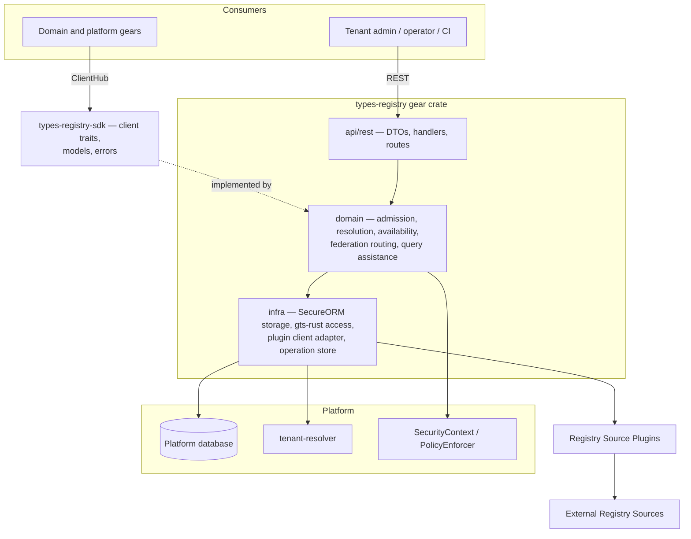
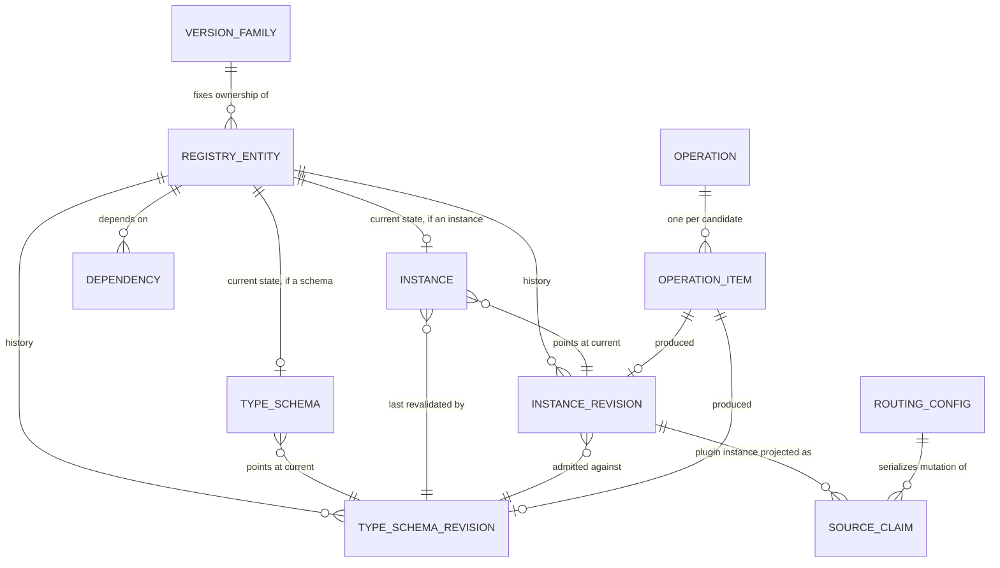
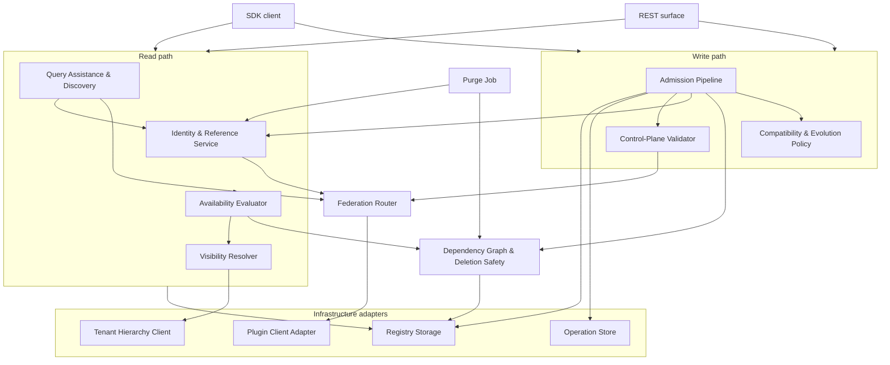

# Technical Design — Types Registry

- [ ] `p1` - **ID**: `cpt-cf-types-registry-design-types-registry`

## Table of Contents

<!-- toc -->

- [1. Architecture Overview](#1-architecture-overview)
  - [1.1 Architectural Vision](#11-architectural-vision)
  - [1.2 Architecture Drivers](#12-architecture-drivers)
  - [1.3 Architecture Layers](#13-architecture-layers)
- [2. Principles & Constraints](#2-principles--constraints)
  - [2.1 Design Principles](#21-design-principles)
  - [2.2 Constraints](#22-constraints)
- [3. Technical Architecture](#3-technical-architecture)
  - [3.1 Domain Model](#31-domain-model)
  - [3.2 Component Model](#32-component-model)
  - [3.3 API Contracts](#33-api-contracts)
  - [3.4 Internal Dependencies](#34-internal-dependencies)
  - [3.5 External Dependencies](#35-external-dependencies)
  - [3.6 Interactions & Sequences](#36-interactions--sequences)
  - [3.7 Database schemas & tables](#37-database-schemas--tables)
  - [3.8 Deployment Topology](#38-deployment-topology)
- [4. Additional context](#4-additional-context)
  - [Open questions](#open-questions)
  - [Benchmark profile](#benchmark-profile)
  - [Implementation prerequisites](#implementation-prerequisites)
- [5. Traceability](#5-traceability)

<!-- /toc -->

## 1. Architecture Overview

### 1.1 Architectural Vision

Types Registry is a control plane for type contracts. It owns the identity, definition, evolution, and platform-facing usability of GTS Type Schemas and registered GTS Instances, and it owns none of the runtime objects that conform to them. Every other gear reaches it through one SDK and one REST surface, whether the entity it asks about is stored here or lives in a vendor's own registry.

Four decisions give the architecture its shape.

#### Identity is derived, not allocated

A Registry Reference is a deterministic UUID computed from the canonical GTS Identifier, so the same contract carries the same reference in every installation with no allocation state to transport. Domain gears persist that UUID instead of an identifier string (ADR-0001).

#### A managed identifier names a logical entity whose revision history is immutable

Its **shape** decides whether the entity itself is, and the shape is fixed per major by its first admitted member. A major-only `v1~` is one mutable entity: successive definitions are internal revisions under one enforced backward-compatibility mode, so the identifier names a channel and every dependent moves with it. A minor-bearing `v1.0~`, `v1.1~` is a sequence of entities each admitted once and never revised, so references pin at the minor boundary — publishing a minor carries nobody onto it and revalidates nothing (ADR-0004, ADR-0005, ADR-0006).

The compatibility chain runs through both, each definition checked against the one before, which makes the guarantee a statement about a **major** rather than about one definition (ADR-0003). Minors are contiguous and open at `M.0`, which is what makes the chain sound under concurrency: the baseline of `vM.n~` is named by its own identifier, so no concurrent admission can leave a step unchecked. Nothing in the registry rests on that cross-minor edge, which is what lets `force` waive it for one candidate, recorded on the revision and read back through provenance. Major 0 is the single exemption from the enforced mode, quarantined so it cannot reach anything outside itself (ADR-0015).

Two bounds are easy to misread. Immutability is of **authored content** only — a resolved form still moves when a floating dependency advances. And stability of stored references is bought at the price that no resolution result is implicitly current: every one has to be validated rather than assumed.

#### Every mutation on the admission path is one asynchronous operation

A caller reads current state, drops candidates whose authored content is already equal, and submits the rest with an entity-level precondition. The API binds the `Idempotency-Key` to the request fingerprint on the operation row itself, persists the operation and its candidates, enqueues the operation UUID through the ToolKit transactional outbox in the same transaction, and returns it. Acceptance has exactly one successful shape: there is no synchronous path, because a batch that equals current state is reached only by a caller that reconciled and submitted anyway. A worker then performs dependency-aware partial admission and records an independent outcome for every candidate GTS Identifier (ADR-0012). Purge is the one mutation outside this path — synchronous, operator-invoked, and disabled by default (ADR-0013).

#### Federation is live delegation across a closed boundary

External definitions are never projected into local storage, and the managed and externally managed identifier spaces are disjoint: no reference or derivation crosses in either direction. Every guarantee the platform offers for a managed entity is therefore enforceable from local state alone, with no plugin call on the managed read path and no dependence on data a plugin chose to supply (ADR-0002, ADR-0007, ADR-0011).

#### What follows from the identifier

The performance shape follows from a property of GTS itself: the derivation chain of a type is encoded in its identifier. `GtsId::chain_ids()` reconstructs every base from the string alone, so hierarchy questions need no graph traversal, and a pattern compiles to a bounded range predicate over the canonical identifier — an index range scan whose candidates the GTS matcher then confirms, since matching is segment-wise and field-wise rather than character-wise. What is not identifier-derivable — `$ref` and `x-gts-ref` targets — is kept as a flat edge set between managed entities, used for deletion safety and impact analysis, off the read path.

Storage follows the same split. A revision is the immutable admission snapshot of what was authored; the current-state projection holds what that content resolves to against the dependencies current **now**, which moves without producing a revision here. An ordinary read joins the identity row to the projection and, for the authored document or Instance value, to the revision it points at. §3.1, *Current state is not a cache of the revision*, sets out why the two are distinct facts and why a revision retains neither the effective artifacts nor the dependency revisions they were resolved against.

### 1.2 Architecture Drivers

#### Functional Drivers

| Requirement | Design Response |
|-------------|------------------|
| `cpt-cf-types-registry-fr-id-resolution` | Deterministic derivation of the Registry Reference from the canonical identifier; durable forward/reverse mapping with tombstones for Managed Entities; ordered plugin chain for references not resolved locally. |
| `cpt-cf-types-registry-fr-register-schemas`, `cpt-cf-types-registry-fr-register-instances` | Read/reconcile/conditional-write over an entity `resource_version`; one acceptance shape, always an asynchronous operation carrying its own request-key idempotency, with durable per-candidate state and dependency-aware partial admission. The no-op fast path lives in the caller, which sends no request when nothing differs. |
| `cpt-cf-types-registry-fr-dry-run` | A boolean mode on the operation, orthogonal to its kind and part of the request fingerprint; the admission pipeline runs its whole check sequence and suppresses the commit, so the checks cannot drift from the ones admission applies. Same acceptance shape, so P2 hooks do not withdraw it. |
| `cpt-cf-types-registry-fr-validate-schema-compat` | Backward-only enforcement against one baseline — the entity's current revision, or the current revision of the preceding minor for the first revision of a new minor — computed on the resolved effective schema and recorded with the specification and implementation versions used, so a later semantic change to the relation can be attributed to the chains admitted under superseded rules. Reporting is confined to refusal: a rejected candidate carries the cause and the offending schema location, an admitted one carries nothing, and no read carries either — so the write path needs no per-item result payload. The relation is well-posed because one dialect governs every revision of a major. Major 0 is exempt from the check and quarantined from every entity that is not, by one comparison over the candidate's direct references — its immediate derivation base plus the `$ref` and `x-gts-ref` targets in the submitted document, the rest of the chain following inductively, a wider edge set than the dialect check reads, and one that needs identifiers rather than documents. |
| `cpt-cf-types-registry-fr-minor-version-profile` | A minor admitted on any Type Schema identifier and refused outright on a registered Instance, both decided synchronously from the candidate identifier. `force` is additionally gated by one global run-time deployment value, off by default, checked before the identifier clauses and refused rather than ignored. Contiguity — minors gap-free and opening at `M.0` — makes every remaining family-level rule a keyed lookup under the lock the family row already takes, and makes the compatibility baseline a function of the candidate's identifier rather than of family state, so concurrent admission cannot leave an unchecked step. A minor-bearing entity is immutable, so its content revision path is closed at admission. `force` waives the cross-minor check for one candidate and is recorded on the revision. The platform's own major-only convention is a build-time lint rather than an admission rule. |
| `cpt-cf-types-registry-fr-validate-type-derivation` | Derivation chain taken from the identifier and validated against every base in it; derivation from an externally managed base rejected; one dialect across the resolution closure, so no base is reinterpreted under a dialect other than the one it was authored in. |
| `cpt-cf-types-registry-fr-gts-validation` | All GTS semantics taken from `gts-rust`; managed content profile narrowed to Draft-07 with the dialect pinned across a major, checked synchronously on the submitted document and never persisted; managed identifier profile narrowed to no explicit UUID tail anywhere, a minor admissible on any Type Schema identifier, and neither a minor nor major 0 in the last segment of a registered Instance one — every one of them a property of the submitted identifier, so all are decided before any registry state is read; no dialect or identifier-profile check on the federation path. |
| `cpt-cf-types-registry-fr-ref-tracking` | Flat dependency edge set between managed entities covering `$ref`, `x-gts-ref`, and Instance-to-schema; authoritative for deletion safety, evaluated without contacting any plugin and without consuming plugin-supplied data. Admission additionally refuses an edge from a stable subject to an unstable target, so the quarantine of ADR-0015 is a property of which edges may be written rather than a filter applied when they are read. |
| `cpt-cf-types-registry-fr-type-query-assistance` | Pattern compiled to a range predicate over the canonical identifier, post-filtered by the GTS matcher, expanded source-major, and returned as one complete bounded set of Registry References or a structured limit failure. |
| `cpt-cf-types-registry-fr-tenant-ownership` | Ownership scope stored on every Managed Entity; visibility evaluated as the directed descendant relation using the tenant ancestor chain, with disclosure bounded to name availability on the registration surface. |
| `cpt-cf-types-registry-fr-registration-authority` | Global writes accepted only on the platform plane under `PlatformSecurityContext`; tenant writes authorized by the PDP against the candidate's GTS Identifier as a resource property, evaluated before identifier availability so the bounded name-availability disclosure cannot become a namespace probe. Which regions admit tenant ownership, and which vendors they admit at all, is `cpt-cf-types-registry-fr-registration-policy`: closed by default and decided from the identifier before the PDP is consulted, so no grant can bring a new entity into a closed region — while a revision or deletion of one already admitted there remains an ordinary grant question. |
| `cpt-cf-types-registry-fr-registration-policy` | Two parameters per GTS Identifier Region — tenant ownership and admitted vendors — both closed by default, resolved per parameter by exact-then-longest-pattern match, shipped closed by the release and opened only by deployment configuration; evaluated on both planes at step 3 of the acceptance path, before the PDP, for a candidate that would create a logical entity and not for a revision or a deletion of one, and refused as configuration rather than as an authorization decision. |
| `cpt-cf-types-registry-fr-tenant-availability` | Verdict computed by the registry from the entity's own state and the requesting tenant's ancestor chain, as one SQL predicate; never recomputed by consumers. In P1 no dependency can make a visible entity unavailable, so no closure is traversed. |
| `cpt-cf-types-registry-fr-lifecycle` | `ACTIVE` and `DELETED` for Managed Entities; no newest-member statement, with exact family enumeration offered as a discovery filter instead; deletion blocked from local state while any registered dependent exists. |
| `cpt-cf-types-registry-fr-externally-managed-entities` | No row, column, or projection of an external entity anywhere in §3.7; results enter live, are checked against the platform invariants of §3.2 — identifier integrity, derived reference equality, claim conformance, entity kind, ownership scope, revision and hash consistency — and leave. The managed-only tail of the read result sits in an `Origin` variant rather than in nullable fields, so a write precondition on an external entity does not compile. Returned content is never parsed, so the external half of the boundary rule is declared and not enforced. |
| `cpt-cf-types-registry-fr-registry-federation`, `cpt-cf-types-registry-fr-registry-source-routing` | Managed storage consulted first, then non-overlapping Source Claims in deterministic priority order; claims are rooted single-segment patterns, so an identifier's owning source follows from its first segment, an external entity's whole derivation chain sits in one claim, and the two identifier spaces stay disjoint; capability profile enforced at claim activation, with no write path granted to a plugin. |
| `cpt-cf-types-registry-fr-cache-freshness-metadata` | Every resolution read — exact by either key, and each member of a batch, but not a discovery page — carries an opaque composite validator, computed per request and never stored, published atomically with the mutation that invalidates it. Its components differ by origin: a managed one digests entity revision, closure fingerprint, tenant ancestor-chain version, and the normalized projection, while an external one additionally carries the source's revision and hash verbatim, because the registry keeps no copy to compare against. |
| `cpt-cf-types-registry-fr-client-cache` | One SDK store per client instance, keyed by entity key, Context Tenant, and normalized projection because the validator digests the last two; bounded staleness whose safe direction comes from ADR-0003, with the residual for unstable entities stated rather than mechanised; revalidation coalesced onto the caller's own batch read rather than scheduled; fail-closed on revalidation failure. |
| `cpt-cf-types-registry-fr-two-phase-init` | One plane per batch, dependency-aware partial admission with atomic cyclic dependency groups, no global startup barrier, and readiness gated by each registrant on its own required candidate outcomes. |

#### NFR Allocation

| NFR ID | NFR Summary | Allocated To | Design Response | Verification Approach |
|--------|-------------|--------------|-----------------|----------------------|
| `cpt-cf-types-registry-nfr-lookup-latency` | Exact lookup p95 < 10 ms | Resolution path: identity mapping, current-state read, availability evaluation | Reference derived in-process rather than looked up; effective content read from the current-state row and authored content from the single revision it points at, both keyed on the entity with no history scan; availability decided in SQL from the entity's own state plus a cached tenant ancestor chain, with no dependency traversal; no plugin call can occur on a managed path because ADR-0011 admits no edge across the boundary in either direction. | Automated benchmark against the profile in §4, *Benchmark profile*. |
| `cpt-cf-types-registry-nfr-query-latency` | Bounded search p95 < 100 ms (P2) | Discovery and query assistance | Pattern compiled to an index range predicate over the canonical identifier; over-returned candidates filtered in memory by the GTS matcher; federated expansion source-major with bounded internal paging. | Automated benchmark against the profile in §4, *Benchmark profile*. |
| `cpt-cf-types-registry-nfr-multi-pod-correctness` | Committed mutations visible on every pod's first post-commit read | Storage, outbox worker, and caching layers | The platform database is the only authoritative store; the leased ToolKit outbox excludes concurrent claims while idempotent admission commits remain safe after lease expiry or duplicate delivery; every state transition and its validator metadata commit in one transaction; process-local state is confined to derived caches that are validated against a committed token before use and never consulted as authority. | Integration tests exercising duplicate delivery, lease expiry, concurrent first-family admission, and commit-then-read across pods. |
| `cpt-cf-types-registry-nfr-cache-correctness` | No invalidated result accepted as current | SDK client cache | Opaque composite validator returned with every result and required on revalidation; past its freshness window an entry is served only if the registry confirms it, a failed revalidation is not served at all, and a successful mutation drops its own keys. §3.3, *The client-side cache*. | Integration tests covering mutation, revalidation, and stale-entry rejection. |

#### Key ADRs

| ADR ID | Decision Summary |
|--------|-----------------|
| `cpt-cf-types-registry-adr-storage-identity-query-model` | Domain gears persist an opaque Registry Reference UUID derived deterministically from the exact client-supplied GTS Identifier. |
| `cpt-cf-types-registry-adr-external-source-live-delegation` | Externally managed definitions and tenant state are delegated live to the owning Registry Source Plugin, never projected. |
| `cpt-cf-types-registry-adr-type-schema-evolution-compatibility` | Managed Type Schemas evolve under `BACKWARD` compatibility, compared against one baseline rather than against history, and the guarantee that follows is a statement about a major. |
| `cpt-cf-types-registry-adr-gts-minor-version-identity-evolution` | A major is either one mutable major-only entity or a gap-free sequence of immutable minors opening at `M.0`, chosen by its first member; a minor is the boundary at which references stop floating, and `force` waives the cross-minor check. |
| `cpt-cf-types-registry-adr-type-schema-revisions` | Every admitted Type Schema definition is an immutable retained revision with optimistic concurrency on the logical entity. |
| `cpt-cf-types-registry-adr-registered-instance-revisions` | A registered Instance is a mutable logical entity whose every admitted value is an immutable revision bound to the Type Schema revision that validated it. |
| `cpt-cf-types-registry-adr-federated-source-routing-query` | Ordered resolver chain over non-overlapping Source Claims, managed storage first, source-major federated traversal. |
| `cpt-cf-types-registry-adr-managed-version-family-lifecycle` | Several majors of a family may be `ACTIVE`; the registry names no newest member, and managed deprecation is deferred past P1. |
| `cpt-cf-types-registry-adr-tenant-ownership-visibility-authority` | Two ownership scopes; tenant-owned entities visible down the tenant subtree; visibility never implies authority. |
| `cpt-cf-types-registry-adr-tenant-availability-evaluation` | Availability follows the live semantic dependency closure, independently of whether effective artifacts are materialized, and propagates transitively along outgoing edges only. |
| `cpt-cf-types-registry-adr-managed-external-boundary` | The managed–external boundary is closed in both directions; Source Claims are rooted single-segment patterns, plugins are read-only, and a retired Source Claim reserves its space until the plugin is purged. |
| `cpt-cf-types-registry-adr-write-path-admission-protocol` | Read/reconcile/conditional-write, one always-asynchronous acceptance shape, immutable request-key replay on the operation itself, per-candidate optimistic preconditions and outcomes, dependency-aware partial admission, and control-plane records with built-in validators. |
| `cpt-cf-types-registry-adr-platform-purge-of-deleted-entities` | Physical removal exists only as one explicit operator-invoked purge, which releases the GTS Identifier and is disabled by default. |
| `cpt-cf-types-registry-adr-managed-type-schema-dialect-profile` | Managed Type Schemas declare Draft-07 in P1, the dialect is pinned at initial admission, and P2 widening is governed by dialect uniformity across the resolution closure. |
| `cpt-cf-types-registry-adr-major-zero-unstable-profile` | Major 0 marks a Type Schema whose evolution is unenforced; nothing outside the profile may depend on one, and graduation is an ordinary registration of v1. |

### 1.3 Architecture Layers

- [ ] `p2` - **ID**: `cpt-cf-types-registry-tech-layering`



The gear follows the canonical DDD-light layout of [`02_gear_layout_and_sdk_pattern.md`](../../../../docs/toolkit_unified_system/02_gear_layout_and_sdk_pattern.md): a public `types-registry-sdk` crate beside the `types-registry` gear crate, which holds `gear.rs`, `config.rs`, and the three layers below.

| Layer | Responsibility | Technology |
|-------|---------------|------------|
| SDK (`types-registry-sdk/`) | The public API surface consumers link and resolve through the typed ClientHub: `TypesRegistryClient` and `PlatformTypesRegistryClient`, transport-agnostic models, canonical errors. A separate crate rather than a layer of the gear, which is what lets a consumer depend on the contract without depending on the implementation | Rust traits and plain models; no serde, no HTTP types, no REST DTOs |
| Presentation (`api/rest/`) | Authenticated REST surface for management, discovery, resolution, validation, and operations; DTOs with OpenAPI schemas | Axum via ToolKit `OperationBuilder`, utoipa, RFC-9457 problem details |
| Domain (`domain/`) | Admission and compatibility, revision and concurrency control, identity and reference resolution, dependency and deletion safety, availability evaluation, federation routing, query assistance, built-in control-plane validators | Rust, `gts-rust` for all GTS semantics |
| Infrastructure (`infra/`) | Authoritative persistence, operation and idempotency store, tenant hierarchy client, Registry Source Plugin clients | SeaORM through the secure ORM layer over SQLite / PostgreSQL / MySQL, ToolKit scoped ClientHub, `tenant-resolver` SDK |

Two rules constrain the layering beyond the standard gear structure. All GTS semantics — parsing, canonicalization, pattern matching, reference extraction, resolution, compatibility, content-model classification — come from `gts-rust`, and no layer reimplements or approximates them. `gts-rust` is a pure library and part of this gear's domain vocabulary rather than an infrastructure concern, so the rule is about substance and not about placement: the domain calls it directly. And no authoritative decision is ever taken from process-local state: caches exist, but each is a derived projection validated against a committed token before use.

## 2. Principles & Constraints

### 2.1 Design Principles

#### Authority is local

- [ ] `p2` - **ID**: `cpt-cf-types-registry-principle-local-authority`

Every guarantee Types Registry offers for a Managed Entity must be decidable from state Types Registry owns. No authoritative decision — admission, deletion, availability, routing activation — may depend on the uptime, latency, honesty, or diligence of a component the platform does not operate.

This is what closes the managed–external boundary in both directions. Every capability the P1 plugin contract asks for is therefore authoritative, and none of them may degrade: a plugin answers or the request fails closed. There is no advisory tier — not as an exemption granted to nothing, but because the one output that would have needed it was dropped for want of a consumer (§3.3, *Registry Source Plugin contract*).

*Diligence* is the word in that list that decided the boundary, because it is the one property that is not observable: a plugin that never registers a dependency is indistinguishable from one that has none, so the registry would believe a managed type unreferenced and permit a deletion that breaks a consumer. Closing the boundary removes the class rather than mitigating it (ADR-0011).

**ADRs**: `cpt-cf-types-registry-adr-managed-external-boundary`, `cpt-cf-types-registry-adr-external-source-live-delegation`, `cpt-cf-types-registry-adr-federated-source-routing-query`

#### Derive facts, materialize computations

- [ ] `p2` - **ID**: `cpt-cf-types-registry-principle-derive-not-store`

A fact that can be computed from state already held is computed at request time, not stored. Stored copies of derivable facts need invariants to keep them truthful, serialization points to keep them consistent, and repair paths for when they drift. The derivation chain of a type and the Registry Reference of an identifier are derived for this reason.

The principle has a second edge that is easy to miss: a fact already present in what the caller receives should not be recomputed on the caller's behalf either. Version ordering within a family is the worked example — it is carried by the members' identifiers, so the registry neither stores which member is newest nor computes it, and offers exact family enumeration instead.

The principle bounds itself rather than excluding denormalization. What may be materialized is the *result of an expensive computation over transactionally known inputs* — a resolved effective schema, a dependency closure — where the set of events that change the inputs is closed and every one of them already runs in a transaction. What may not be materialized is a fact whose truth depends on state the registry does not control, because that produces a second authority.

**ADRs**: `cpt-cf-types-registry-adr-managed-version-family-lifecycle`, `cpt-cf-types-registry-adr-storage-identity-query-model`, `cpt-cf-types-registry-adr-tenant-availability-evaluation`

#### Fail closed on incomplete information

- [ ] `p2` - **ID**: `cpt-cf-types-registry-principle-fail-closed`

Absence of evidence is never evidence of absence. A source that cannot answer is not a `NOT_FOUND`; a compatibility check the implementation cannot decide is a rejection, not a pass; external state that cannot be confirmed is never `AVAILABLE`; a query whose completeness cannot be established returns a failure rather than a partial result.

**The rule has no exception.** Every output the contract defines is authoritative, so there is nothing that degrades with a warning instead of failing — see §3.3, *Registry Source Plugin contract*, for the one candidate exception and why it is not in P1.

**ADRs**: `cpt-cf-types-registry-adr-external-source-live-delegation`, `cpt-cf-types-registry-adr-type-schema-evolution-compatibility`, `cpt-cf-types-registry-adr-tenant-availability-evaluation`, `cpt-cf-types-registry-adr-managed-external-boundary`

#### Identity is permanent

- [ ] `p2` - **ID**: `cpt-cf-types-registry-principle-permanent-identity`

An admitted GTS Identifier never comes to name a different logical entity. Deletion is logical and terminal, the identifier stays reserved by a tombstone, previously issued Registry References keep reverse-resolving, and a retired Source Claim remains a reservation over its identifier space.

Because references are derived rather than allocated, releasing an identifier is a data-corruption primitive rather than a storage optimization: the reused identifier reproduces the same reference and silently rebinds any domain row still holding it. Purge is the single named exception, disabled by default and guarded by deployment policy rather than by a check.

**ADRs**: `cpt-cf-types-registry-adr-storage-identity-query-model`, `cpt-cf-types-registry-adr-platform-purge-of-deleted-entities`, `cpt-cf-types-registry-adr-managed-external-boundary`

#### One public vocabulary per concept

- [ ] `p2` - **ID**: `cpt-cf-types-registry-principle-single-vocabulary`

Where two vocabularies describe one client-visible concept, only one is public. The operation resource is the sole mutation-progress contract: it exposes one operation status carrying progress alone, plus one candidate status keyed by each exact GTS Identifier, which is where the outcome lives and the only place it lives. There is no second Admission Status resource, no pending logical entity, and no second acceptance shape — a redundant batch is reported as an operation whose candidates terminate `unchanged`, not as an inline receipt. The principle also decided the storage: request identity has no record of its own, because the operation already is that record. Lifecycle Status, Tenant Enablement State, and Tenant Availability State remain three distinct dimensions and are never collapsed into a single field, because each has a different owner and a different reason to change.

**ADRs**: `cpt-cf-types-registry-adr-write-path-admission-protocol`, `cpt-cf-types-registry-adr-tenant-availability-evaluation`

#### The registry governs contracts, not objects

- [ ] `p2` - **ID**: `cpt-cf-types-registry-principle-contract-not-object`

Types Registry decides what a type contract is, who may see it, and whether a tenant may use it. It never deletes, hides, or rewrites data owned by another gear on the strength of that verdict. An owning gear defines what happens to its runtime objects whose referenced entity became unavailable, and Types Registry supplies only the verdict it needs to decide.

**ADRs**: `cpt-cf-types-registry-adr-tenant-availability-evaluation`, `cpt-cf-types-registry-adr-storage-identity-query-model`

### 2.2 Constraints

#### GTS semantics belong to the platform implementation

- [ ] `p2` - **ID**: `cpt-cf-types-registry-constraint-gts-implementation`

Types Registry does not implement GTS. Parsing, canonicalization, chain derivation, pattern matching and coverage, reference extraction, schema resolution, trait merging, content-model classification, compatibility, and casting all come from `gts-rust`. Any behaviour the registry needs and the implementation lacks is a change request against `gts-rust`, not a local approximation.

The constraint has a price, and it is not paid by using the library but by depending on precisely what it does. ADR-0003's candidate-versus-baseline check is sound only where **compatibility is defined as inclusion of accepted-instance sets** and **the content model is classified on the resolved effective schema**; an implementation that merely offers a compatibility check does not establish either. §4, *Implementation prerequisites*, enumerates the seven capabilities that follow and makes confirming them a precondition of building on this design. No library version is named, deliberately: a pinned version would date faster than this document, and what the registry depends on is the behaviour.

What the registry owes the matcher in return is a post-filter. Pattern matching is segment-wise and field-wise rather than character-wise, and a pattern with no minor version accepts any minor, so a string range over the canonical identifier is only a candidate pre-filter and the matcher must confirm its result. That holds on **every** scan, managed and external alike: external identifiers have always been permitted to carry minors, and under ADR-0004 a managed one may carry a minor too.

**ADRs**: `cpt-cf-types-registry-adr-type-schema-evolution-compatibility`, `cpt-cf-types-registry-adr-managed-external-boundary`

#### Managed Type Schemas are Draft-07 in P1

- [ ] `p2` - **ID**: `cpt-cf-types-registry-constraint-schema-dialect`

A managed Type Schema declares JSON Schema Draft-07 and nothing else in P1, and the dialect a major is admitted under never changes — not across the revisions of one identifier and not across the minors of that major, since the compatibility chain of ADR-0003 runs through both and a set inclusion between two dialects is ill-posed either way. This is a third narrowing of the managed profile alongside ADR-0004's minor-version rules and ADR-0001's prohibition on an explicit UUID tail, and it exists for the same reason: to keep a platform guarantee decidable.

Both relations the registry enforces are set inclusions over accepted instances, and a set is only defined once a dialect is fixed. GTS makes the dialect a per-document property (§11.0) while defining every verdict relative to the declaring document's dialect (§4.3), and says nothing about a closure whose members disagree. The platform implementation resolves that case in a way no authoritative decision can rest on — `resolve_schema_refs` strips `$schema` from every fragment inlined at a non-root position, so the referring document's dialect governs the whole closure — and because JSON Schema ignores unrecognized keywords, a mismatch deletes constraints instead of failing. ADR-0014 works both directions through.

Pinning the dialect across a major closes the remaining way for a chain to span two semantics, which would break the transitivity that makes candidate-versus-baseline sufficient and, unlike a platform-wide change of the compatibility relation, could never be reckoned with afterwards.

The check is one comparison over the submitted document, so it belongs with the synchronous envelope validation rather than in the worker, and the value is not stored: it is a top-level key of a document the registry retains in full, and admission already loads every closure member to resolve references. When P2 widens the admissible set, the rule is dialect uniformity across the resolution closure — the `$id` chain plus `$ref` targets including those inside `x-gts-traits-schema`, but not `x-gts-ref` targets, which are never inlined. P1 is that rule's degenerate case, so widening is additive.

Externally Managed Entities are out of scope, and safely so only because ADR-0011 closes the boundary: no external document can enter a managed resolution closure, so its dialect can never reach a managed verdict. Reading `$schema` from returned external content is prohibited for the same reasons ADR-0011 permanently rejected content parsing on the federation read path.

**ADRs**: `cpt-cf-types-registry-adr-managed-type-schema-dialect-profile`, `cpt-cf-types-registry-adr-type-schema-evolution-compatibility`, `cpt-cf-types-registry-adr-managed-external-boundary`

#### One authoritative database per installation

- [ ] `p2` - **ID**: `cpt-cf-types-registry-constraint-single-installation`

An installation of Types Registry has exactly one authoritative database, served by many pods. Every guarantee in this document is a guarantee about that database.

Deterministic reference derivation is a portability property rather than a coordination mechanism: two installations that admit the same GTS Identifier produce the same Registry Reference, so domain data, fixtures, and exported contracts mean the same thing in both without any mapping being transported. Nothing requires them to hold the same entities, and nothing requires them to enforce the same input bounds either, since those are deployment configuration (§3.8). A verdict obtained from one installation — a Dry Run above all — is therefore relative to that installation's state *and* its configuration. Compatibility fixtures pin representative `GTS Identifier → UUID` mappings so that an implementation or `gts-rust` upgrade cannot silently change persisted identities.

**ADRs**: `cpt-cf-types-registry-adr-storage-identity-query-model`, `cpt-cf-types-registry-adr-platform-purge-of-deleted-entities`

#### Three database backends

- [ ] `p2` - **ID**: `cpt-cf-types-registry-constraint-multi-backend`

Storage must behave identically on SQLite, PostgreSQL, and MySQL. Identifier range predicates are expressed as explicit bounds rather than pattern operators, so the index is used the same way on all three. UUIDs use a native column type where one exists and a consistent 16-byte representation where it does not. Any set-membership constraint large enough to meet a backend parameter limit is chunked by a shared repository helper rather than by each call site. Compare-and-swap is expressed once in the repository layer and never leaks into the domain.

Transitive dependency questions are answered by a **recursive CTE** over `dependency`, and no transitive closure is materialized. All three backends support one — PostgreSQL since 8.4, SQLite since 3.8.3, MySQL since 8.0.1, and MySQL 8.0 is already the floor because the `toolkit-db` outbox needs `FOR UPDATE SKIP LOCKED` from the same release. This is the most backend-divergent construct in the design and therefore the one most tightly constrained: the traversal uses `UNION` and never `UNION ALL`, because the graph can contain cycles and the resulting non-termination would fail differently on each backend rather than uniformly; the recursive term carries no depth or other per-row accumulator, which would defeat the deduplication that `UNION` is there to provide; and the query is written once in the repository, since the self-reference-once restriction that shapes it is a storage fact the domain must not have to know. `database.sql` states each of these beside the table they constrain, and §4 records both the unverified `sea-query` expression of a parameterised recursive CTE and the remedy if MySQL — whose implementation materializes the working set into an unindexed temporary table — does not hold up.

**ADRs**: `cpt-cf-types-registry-adr-storage-identity-query-model`

#### Types Registry is on every gear's boot path

- [ ] `p2` - **ID**: `cpt-cf-types-registry-constraint-boot-path`

Because every other gear may depend on it, anything Types Registry waits for during startup is something the platform waits for. It publishes ready when its own storage is ready, has no notion of an expected registration set, and never blocks on a registrant. Registrants retry and gate their own readiness.

**ADRs**: `cpt-cf-types-registry-adr-write-path-admission-protocol`

#### The tenant hierarchy is a read-path dependency

- [ ] `p2` - **ID**: `cpt-cf-types-registry-constraint-tenant-hierarchy`

Visibility of a tenant-owned entity is the directed descendant relation, so the ancestor chain of the requesting tenant is an input to almost every read. It is obtained from `tenant-resolver` with barrier traversal disabled, because contract visibility flows from ancestor to descendant and is orthogonal to the barriers that protect descendant data from ancestor access. Since it sits inside the 10 ms budget, the chain is cached per tenant and its version participates in the resolution validator.

**ADRs**: `cpt-cf-types-registry-adr-tenant-ownership-visibility-authority`, `cpt-cf-types-registry-adr-tenant-availability-evaluation`

#### Admitted content is retained without limit

- [ ] `p2` - **ID**: `cpt-cf-types-registry-constraint-unbounded-retention`

Retention is unbounded by policy: no time-to-live and no background sweep ever removes an admitted revision, and the one operation that removes anything physically also releases the GTS Identifier and is therefore disabled by default. Admitted content is consequently unremovable wherever it stays disabled, which is the expected steady state for production; ADR-0013 leaves enabling it an operator decision for a specific planned migration, kept exceptional by the rebinding hazard.

Nor can the payload of a deleted entity be dropped while its identity is kept, which would otherwise be the obvious middle ground. ADR-0013 records the invariant that closes it: P1 permits deleting a Type Schema while live domain data still conforms to it, and the owning gear retiring that data needs the contract rather than a tombstone (§3.3, *Read results*).

These terms are a property of the registry, not a judgement about what may be stored under them. Whether a given class of content may be held on them is a platform data-classification question that Types Registry neither owns nor evaluates: it applies no content policy of its own, and a use case whose content cannot be retained on these terms belongs to a different storage owner.

**ADRs**: `cpt-cf-types-registry-adr-registered-instance-revisions`, `cpt-cf-types-registry-adr-type-schema-revisions`, `cpt-cf-types-registry-adr-platform-purge-of-deleted-entities`

## 3. Technical Architecture

### 3.1 Domain Model

**Technology**: GTS identity and schema semantics through `gts-rust`; plain Rust domain types; SeaORM entities in `infra/storage`.

**Location**: persisted half in [database.sql](./database.sql); the Rust types do not exist yet.

The model has an unusual shape for a registry, and the shape is the decision rather than a detail of it. A managed GTS Identifier names a logical entity — **mutable** where it is major-only, **immutable** where it carries a minor — whose content history is in either case **immutable** (ADR-0004, ADR-0005, ADR-0006), so identity, current state, and history are three different things about one entity rather than one record with a version column. Layered on that, a large part of what the gear returns is **not stored at all**: the Registry Reference is derived from the identifier, availability and the freshness validator are computed per request, and an Externally Managed Entity is never persisted in any form.

#### Core entities

- [ ] `p2` - **ID**: `cpt-cf-types-registry-entity-model`

| Entity | Description | Schema |
|---|---|---|
| Registry Entity | One admitted managed GTS Identifier, of kind Type Schema or registered Instance. Carries identity, ownership, the owning gear, lifecycle, and the `resource_version` that write preconditions test. Survives deletion as the tombstone that keeps a previously issued reference resolvable | `entity`, plus the kind-specific current-state row `type_schema` or `instance` |
| Revision | One immutable admitted definition or value, with the content hash and the specification and implementation versions in force at its admission | `type_schema_revision`, `instance_revision` |
| Version Family | The set of Version Successors of one another, named by the family key of ADR-0004. Holds an ownership scope and nothing else | `version_family` |
| Dependency | A direct edge between two Registry Entities: `$ref`, `x-gts-ref`, immediate derivation base, or Instance conformance. Nothing transitive is stored | `dependency` |
| Operation | One accepted mutation: its scoped request identity, its client-visible progress, and one durable outcome per candidate identifier | `operation`, `operation_item` |
| Registry Source | Where an identifier is authoritative — managed storage, or an External Registry Source behind a claim. Managed storage is implicit; a claim is a projection of a plugin's registered Instance and outlives it as a reservation | `source_claim`, `routing_config` |

#### Current state is not a cache of the revision

The distinction is load-bearing and is the reason `type_schema` exists beside `type_schema_revision` rather than being a view over it. A revision holds what was *authored* and admitted. The current-state row holds what the authored content *resolves to* against the dependencies that are current now — and that changes when a floating dependency advances, with no new revision here and no `resource_version` movement. §1.1 sets out why neither the effective artifacts nor the dependency revisions are retained on the revision itself.

For a registered Instance the divergence is smaller but the same in kind: the current row records which Type Schema revision most recently revalidated an unchanged value, which the revision cannot know.

#### Values that are computed, never stored

| Value | Computed from | Why not stored |
|---|---|---|
| Registry Reference (`gts_uuid`) | the canonical identifier, deterministically | A stored copy would be a second authority over a derived fact. It is nevertheless a column, because a hash is not invertible and reverse resolution needs an index over it — and its uniqueness constraint is ADR-0001's collision detector |
| Tenant Availability State | lifecycle, visibility, the requesting tenant's ancestor chain, and live source state where applicable | It is per-tenant, so there is no single value to store, and ADR-0010 requires it to follow the live semantic closure rather than an admission snapshot |
| Freshness validator | entity, tenant, and projection state — the components are tabulated in §3.3, *What a validator is made of* | It is per-projection and per-tenant, so there is no single value to store, and a stored table of issued tokens would grow with readers rather than entities |
| Per-level content model | the resolved effective schema | Computed at admission as an input to the compatibility verdict and reported nowhere, so nothing stores it. An owner asking whether a change is admissible asks the Dry Run of that change, whose refusal names the level that blocked it (ADR-0003) |
| Derivation chain | the identifier, through `chain_ids()` | GTS encodes it in the string; storing it would need an invariant to keep it true. The one exception is the immediate base, stored as a dependency edge so that one recursive query can span every edge kind |
| Whether an entity is unstable | the major version of the last segment of the identifier | A substring of a column the registry already holds. ADR-0015 keeps it there rather than in a `stability` column for the same reason ADR-0014 keeps the dialect out of one, and with a second benefit: because an identifier never changes, a closure that satisfied the quarantine rule at admission satisfies it forever |
| Whether a major carries minors, and whether a candidate minor's predecessor exists | one keyed lookup on `entity.gts_id` each, under the family lock admission already takes | Contiguity fixes which single identifier answers each question — `vM~` or `vM.0~` for the shape, `vM.(n-1)~` for the predecessor — so ADR-0004's rules need no column, no migration, and no scan. Storing either would put a second authority over a fact the identifiers already state, and a stored highest minor would additionally be the newest-member pointer ADR-0008 declined |

#### Externally Managed Entities are not in this model

They have no representation here — no row, no projection, no cached identifier. They enter as a live result, are validated against platform invariants, and leave. ADR-0011 closes the boundary in both directions, so no dependency edge, no derivation, and no availability-blocking relationship crosses it, and the model above is complete for everything the registry decides from its own state.

What the two share is the read contract: §3.3 gives them the same result shape, with the managed-only tail — `resource_version` and the timestamps — carried in a variant rather than as nullable fields.

#### Relationships



Four of these carry an invariant worth stating outright, because none of them is enforced by the relationship alone.

**A Version Family fixes ownership before any member exists.** That ordering is the whole reason the row exists: two concurrent first registrations must not be able to create one family under two owners. The entity's own owner columns are a copy kept for SecureORM scoping, and admission maintains the agreement under the family row's lock rather than a constraint — a composite foreign key would silently skip the global case, where the tenant column is null. `owning_gear` is not part of that agreement and is deliberately not held by the family: it is per-entity attribution that may be restated on any admission, while family ownership is write-once and decides visibility.

**An Instance is pinned to the exact Type Schema revision that validated it,** and separately records the revision that most recently revalidated it. Neither is exposed: §3.3 removed revision numbers from the contract, and the second would invite the false inference that a value is stale, which ADR-0005 forbids by refusing to make a schema revision current while an affected Instance would cease to be valid.

**Every dependency edge has a Managed Entity at both ends,** which is what makes deletion safety decidable with every plugin unreachable. Deletion reads only the direct edges; a transitive-only dependent must not block, since it would vanish with the intermediate entity.

**A Source Claim outlives the plugin Instance it projects.** Deleting the Instance retires the claim into a reservation over the same identifier space, and only the purge of ADR-0013 removes it — because releasing that space would let a managed registration reproduce a reference that domain rows already hold.

### 3.2 Component Model

The components below are internal modules of one gear with distinct responsibilities, not deployable units — the gear itself runs as its own process and is horizontally scaled, as §3.8 describes. Of everything inside that process, Registry Source Plugins are the only part that may later move out, and §3.3, *Registry Source Plugin contract*, says why that move is a transport change rather than a semantic one.



#### Admission Pipeline

- [ ] `p2` - **ID**: `cpt-cf-types-registry-component-admission-pipeline`

##### Responsibility scope

Every mutation of registry state — initial admission, content revision, lifecycle transition, control-plane write — passes the same ordered set of checks here, so that no path can skip a check another enforces. Purge is the exception and is a job of its own (ADR-0013): it admits nothing and runs synchronously outside this path, which is why it re-evaluates the deletion preconditions itself rather than inheriting them.

The component owns the candidate lifecycle and the single write contract: the dry-run mode and the suppression of the commit under it, request-identity resolution against a stored fingerprint, operation and candidate creation, dependency ordering, content-equality no-op detection inside an operation, the ordered validation sequence, optimistic concurrency against the caller-observed entity resource version and the dependency freshness used during validation, allocation of the next revision number on success, and durable status and diagnostics for every asynchronous candidate GTS Identifier. It is the only component that writes entity state.

It also owns the position of the authorization check: **authorization runs before identifier availability is evaluated at all**, per `cpt-cf-types-registry-fr-registration-authority`, and is itself preceded by the registration-policy gate of §3.2, which is configuration rather than authorization. One order: identifiers, policy, authorization, the remaining static checks, and availability last. The plane is decided by the context type rather than by the endpoint — a candidate whose requested owner is global is admissible only under `PlatformSecurityContext`, and a tenant-scoped candidate is authorized by the platform PDP for the requesting subject, the action, and the candidate's canonical GTS Identifier supplied as a resource property.

##### Acceptance path

The POST endpoint has exactly one successful response shape: `202 Accepted` with an operation UUID. It never returns an inline admission result.

**Admission is asynchronous because its work is not bounded by the request.** Every caller-supplied input is capped by *Bounded inputs* below, but admitting a content revision also revalidates every transitive dependent of the target, and that count is deliberately uncapped — the platform base types are widely depended upon by design, which is exactly the case a cap would break. P2 semantic hooks point the same way: their duration is unbounded, so keeping one shape now means they cannot later change the response shape of any request.

The no-op fast path is the caller's, not the server's: ADR-0012 offers no synchronous `unchanged` acceptance, because a caller that reconciles before writing sends no request at all.

The normal caller workflow is read-before-write. It batch-reads the exact identifiers it owns, compares the returned canonical authored content with the desired definitions, and does not POST candidates that are already equal. A missing candidate is submitted with no `expected_resource_version`; an existing but different one carries the `resource_version` the read returned. The tenant REST plane derives the owner from `SecurityContext`; ownership is not caller-controlled request data. Platform gears use the SDK platform plane and `PlatformSecurityContext` for global definitions.

Everything on the acceptance path is decided from the request itself — the submitted identifiers and documents, the plane, and deployment configuration that is read at process start: the `force` switch and the registration policy of §3.2. **No registry state is read.** That is why each of the following is a synchronous refusal rather than a candidate accepted and then failed as an asynchronous item, which would defer a verdict the API already holds.

1. **Envelope and batch size** — refuses more than 100 candidates.
2. **Candidate identifiers** — refuses a non-canonical GTS Identifier, or a duplicate within the batch.
3. **Registration policy** — for a candidate that would create a new logical entity, refuses it **unless** its GTS Identifier Region admits the vendor its own last segment carries **and**, where the candidate would be tenant-owned, admits tenant ownership there. Either parameter failing refuses; the ownership half is not evaluated for a global candidate (*Registration policy*, below). A revision and a deletion are not gated here.
4. **Registration authority** — refuses more than one ownership and authorization scope in the batch, a global candidate off the platform plane, and a candidate not covered by a grant.
5. **Managed identifier profile** — refuses an explicit UUID tail on any candidate (ADR-0001), and a minor or major 0 in the **last segment** of a registered Instance identifier (ADR-0004, ADR-0015). A minor on a Type Schema identifier is admissible under any prefix.
6. **Declared dialect, Type Schema candidates** — refuses an absent top-level `$schema`, a value outside the accepted Draft-07 spellings, and a `$schema` below the document root that differs from it (ADR-0014).
7. **`force`, per candidate** — refuses the flag where `allow_compatibility_force` is off, and where the candidate has no cross-minor check to waive: major-only, the first minor of its major, or major 0 (ADR-0004).
8. **ADR-0015 quarantine** — refuses a stable candidate whose immediate derivation base, `$ref` targets, or `x-gts-ref` targets include a major-0 identifier.
9. **Canonicalization and request identity** — canonicalizes each authored schema or Instance value through `gts-rust`, computes the request fingerprint, and resolves the mandatory `Idempotency-Key`.

Three properties of that order are load-bearing rather than conventional.

**Steps 3 and 4 precede any existence lookup**, so an unauthorized caller cannot distinguish a free identifier from a taken one by attempting a registration; and 3 precedes 4 because registration policy is decided from the identifier, the plane, and configuration alone, so consulting the PDP first could only produce an allow that has to be discarded.

**Every clause of 5 and 7 is static** — decidable from the candidate identifier and one deployment value, which is what permits them on a path that reads nothing. *First minor of a major* is static only because ADR-0004's contiguity rule reduces it to `n == 0`. Whether *this* family may hold a minor, and whether the waived check would have failed, are questions for the worker under the version-family lock (*Dependency-aware partial admission*, below).

**Step 8 checks direct references only.** The rule reads as a property of the resolution closure, but if every admitted entity satisfies it, no stable entity holds a direct edge to an unstable one and therefore reaches none transitively. Its base case is a precondition rather than a theorem: §4, *Implementation prerequisites*, carries the preflight scan that establishes it.

The request fingerprint of step 9 covers the canonical body, operation kind, authorization scope, owner, all optimistic preconditions, and every per-candidate `force` — the last two because a submission differing from a stored one only in a precondition or a waiver would otherwise replay it and never execute (ADR-0012).

The key identifies a request, not a desired state, and is scoped to the authorization scope, the owning tenant, and the requesting principal. The principal participates so that one subject's key cannot hand another subject's response — and with it another subject's Registry References and resource versions — to a caller inside the same tenant. A matching replay returns the stored operation without consulting current entity state: `202` with the same operation while it is `pending` or `running`, `200` with the stored terminal operation afterwards. The same key with a different fingerprint returns `409 Conflict`. A caller that wants to reconcile again performs a new read and uses a new key.

A dry run travels this same path, running every check and stopping before the commit transaction, so the mode is one branch at the end rather than a parallel implementation. The mode is part of the fingerprint, so a dry run and the real submission that follows it are distinct requests under one key. It is stored on the operation and copied onto each candidate row, because `ck_tr_operation_item_state` has to require the absence of a resulting revision for a dry-run item and a CHECK cannot read another table. The per-candidate vocabulary is unchanged; §3.3, *Read results*, gives the one respect in which a dry-run result differs from the real one it predicts.

The acceptance transaction inserts the operation and all candidate rows and enqueues a ToolKit outbox message whose payload contains only the operation UUID. Request identity lives on the operation row, so acceptance is one insert into one table rather than a receipt and an operation linked one-to-one. Candidate schemas and values never enter outbox payloads or dead-letter rows. The enqueue shares the same database transaction, so neither an undispatchable operation nor a message without its operation can commit. Concurrent acceptance under the same scoped idempotency key is resolved by the uniqueness constraint over `(idempotency_scope_hash, idempotency_key)`; the loser returns the winner's operation after verifying the fingerprint.

No committed, row-locked snapshot is read here, which a synchronous whole-batch equality check would have required. Content equality is instead established once, in the worker, and per candidate: a content hash is a lookup prefilter rather than the final equality proof, and effective resolved artifacts are deliberately not compared, being a projection of the same authored content against current dependencies.

##### Dispatch and the outbox

The outbox owns worker claiming, multi-pod exclusion, lease expiry, retry, and dead-letter infrastructure. Types Registry uses the leased, at-least-once processing mode because GTS resolution and compatibility work must not hold a database transaction open. Delivery duplication is expected — a worker may commit registry state and fail before acknowledging the message — so every admission-unit commit is idempotent and guarded by operation-item identity, content equality, unique revision constraints, and compare-and-swap on the current projection. Outbox lease columns are not duplicated in the operation table.

A payload carrying nothing but a UUID is a reuse decision rather than a necessity: claiming work directly over the `operation` row with `FOR UPDATE SKIP LOCKED` would serve, at the cost of rebuilding the retry, backoff, and dead-letter handling the ToolKit facility already provides. The status index on `operation` therefore stays what `database.sql` describes — the backstop that terminalizes an operation redelivery has given up on, not a second dispatcher.

The ToolKit API is gated by the `toolkit-db/preview-outbox` feature, which is a maturity marker rather than an unused one: `ledger`, `file-storage`, and `chat-engine` already depend on it, and `event-broker-sdk` exposes it as a feature of its own. What P1 owes is an explicit acceptance of that status rather than its stabilization (§4).

An expected domain outcome is not an outbox processing failure. A completed operation with rejected candidates acknowledges its message successfully. A transient database or infrastructure failure returns `Retry`; `Reject` is reserved for an invalid internal outbox message or another permanent dispatcher defect. P2 semantic hooks must not hold one lease while waiting indefinitely: long-running hook workflows split into bounded durable stages or admission units, each dispatched by an outbox message.

The end-to-end flow this pipeline drives — read, reconcile, submit, dispatch, admit, poll — is `cpt-cf-types-registry-seq-batch-admission` in §3.6.

##### Operation and candidate status

An operation has one status, and it carries **progress only**: `pending`, `running`, or `completed`, where `completed` asserts that every item is terminal and nothing more. Each candidate independently exposes `pending`, `running`, `succeeded`, `unchanged`, or `failed`, keyed by its exact GTS Identifier, and that set of values *is* the outcome. It is not aggregated onto the operation, which would be a stored fold over the item statuses whose agreement with them spans two tables and no CHECK can enforce (`cpt-cf-types-registry-principle-derive-not-store`).

One rule decides what earns a status of its own: **a status distinguishes outcomes that differ in effect, and a reason distinguishes causes.** `succeeded` changed the entity, whether by a new revision or by a lifecycle transition that creates none, while `unchanged` proved the submission redundant and changed nothing. Everything that produced nothing is `failed`, whatever produced it, with the cause in the structured reason.

Three values that vocabularies of this shape usually carry are deliberately absent:

- **No cancellation.** No requirement, actor, or use case asks to abandon a mutation in flight; P2 hooks make the question real and it can be answered then.
- **No expiry.** The outbox reclaims the lease and redelivers, and commits are idempotent, so terminality arrives once retries are exhausted. A stalled operation past its timeout is completed with its unfinished items `failed` and a cause in `error_payload`.
- **No per-candidate `blocked`.** A candidate not evaluated because an in-batch dependency or its atomic group failed is `failed` under a `blocked_by_dependency` reason — or `blocked_by_predecessor` where what failed was the preceding minor of its major, which the caller never declared and fixes differently. The distinction is a difference in cause, not in effect.

`unchanged` is preferred over `not_modified` and `already_registered`: it reads correctly whatever the caller was attempting and does not overload HTTP `304 Not Modified`. It means the worker proved, under the supplied precondition, that this candidate already equals the current authored state and created no revision or resource-version increment. It is reachable **only for an update**, which follows from the preconditions rather than being a rule of its own: a create declares `must_not_exist` and fails outright once the entity is there, and a deletion has no redundant branch. `ck_tr_operation_item_state` refuses both combinations.

##### Operation retention

- [ ] `p1` - **ID**: `cpt-cf-types-registry-tech-operation-retention`

A terminal operation is removed once its completion is older than `operation_retention` (§3.8, *Gear configuration*, defaulting to **30 days**) **and** nothing points at it. Age is measured from terminality rather than from acceptance, so an operation whose worker ran longer than the window is not eligible the moment it completes.

**An operation is pinned by every revision it produced.** `type_schema_revision.operation_item_id` and `instance_revision.operation_item_id` are `NOT NULL` with `ON DELETE RESTRICT`, which is also why neither revision table duplicates the admitting principal: the operation carrying it is always reachable. A pinned operation lives exactly as long as its revisions, which is until purge.

**Pinning is by revision, not by outcome, and the sweep's predicate has to say so.** A predicate testing candidate status would exclude dry runs and successful deletions permanently, since both carry `succeeded` items and no revision. The sweep therefore anti-joins over `operation_item_id` in the two revision tables, each served by its own unique index on that column and bounded by the 100-candidate batch limit.

Deleting an operation cascades to its items and releases its `(idempotency_scope_hash, idempotency_key)` pair, so a replay presented after the window executes afresh instead of returning the stored result. That is a behaviour change rather than a correctness hazard, and it holds for every removable class:

| Removable class | Why it holds no revision | What a replay does after the sweep |
|---|---|---|
| Dry run | wrote nothing, by construction | nothing, by definition |
| No candidate succeeded | admitted nothing | fails again, or succeeds because the world has since changed |
| Successful deletion | a lifecycle transition creates no content revision | fails `precondition_failed`: the entity is already `DELETED` and `resource_version` has moved past what the replay carries |
| Revisions removed by a purge | ADR-0013 deletes revisions and leaves operation items in place | registers a new logical entity under a name purge freed — not a restore of what was released |

In every case the caller learns the current state instead of a stored receipt.

This does not weaken ADR-0013, which protects admitted content and identity — revisions, entities, tombstones, and the identifiers whose release would silently rebind a stored Registry Reference. An unpinned operation holds none of those. Extending the sweep to reach revisions, and the operations that produced them, is D4 in §4.

##### Bounded inputs

- [ ] `p1` - **ID**: `cpt-cf-types-registry-tech-input-bounds`

Five inputs are unbounded unless bounded deliberately, and most of what they admit lands in storage retained until purge. **All five are deployment configuration** (§3.8, *Gear configuration*); what this section fixes is the default and the reasoning behind it.

- **Authored document**, default **256 KB**. The largest JSON Schema document in the repository is 14 KB and the typical one is 3–7 KB, so the default is roughly seventeen times the observed maximum.
- **Resolved document**, default **1 MB**. A separate bound is required rather than convenient: derivation multiplies, so capping the authored form does not cap what the chain inlines into `resolved_schema`.
- **Resolution closure**, default **64 documents**. Bounds the work admission does — the documents it must load to resolve references and compose the effective form.
- **Batch size**, default **100 candidates**, rejected synchronously before anything is stored. The largest gear in the platform today declares 26 definitions. It is also the largest dependency cycle the platform can admit, since a cycle's members are admissible only together and therefore cannot be split across two batches.
- **Type filter expansion**, default **1000 references**. Unlike the other four this one is not derived from anything observable, since it depends on what tenants create through the API. It is chosen from the consumer side: a thousand references is roughly 36 KB of JSON, comfortable to transfer and to chunk into a gear's own `IN` predicate.

The closure bound is also the derivation-depth bound, so there is no second number for depth: a chain contributes one document per level, so depth can never exceed closure size.

**Two things are deliberately not bounded.** *The number of dependents an entity has* is uncapped, because a bound on it would refuse to let anything new depend on a widely used base — which the platform base types are by design; the work it would have limited is already off the request path, performed by the worker outside a transaction over a recursive CTE. *The number of retained revisions* is uncapped because ADR-0003 compares a candidate against one baseline rather than against history, so admission cost does not grow with it.

Entities per tenant is a quota rather than a guard — abuse control and billing, not correctness — and is not set here.

##### Dependency-aware partial admission

The P1 batch mode is **dependency-aware partial admission**, not best effort, and its result is deterministic for one committed baseline. A worker does five things:

1. build the candidate graph from the authored references between candidates, plus the one implicit edge described below;
2. condense it into strongly connected components and process them in topological order;
3. treat one acyclic candidate as one admission unit, and every cyclic component as one **atomic** admission unit, since its members cannot be admitted separately;
4. validate each unit outside a long-lived database transaction, then commit it in a short one;
5. record a durable outcome for every candidate GTS Identifier.

**What the mode guarantees**

- Independent candidates that pass every check commit even when another branch of the same batch fails, and unrelated components continue after a failure.
- A reference from one candidate to another resolves against the submitted candidate: resolution selects the candidate overlay and never silently falls back to the previously committed revision of that identifier.
- If a selected in-batch dependency fails, the dependent fails under a `blocked_by_dependency` reason rather than being admitted.
- Failure of one member of an atomic component fails or blocks the rest of that component.

**The ordering edge between minors exists for determinism, not soundness.** Two minors of one major carry no reference to each other, so the graph gains one edge derived from their identifiers alone, ordering `vM.(n-1)~` before `vM.n~`; a failed lower minor then blocks the higher one under a `blocked_by_predecessor` reason instead of letting it be admitted over a gap. Without the edge the higher minor fails retryably and succeeds on the next reconciliation cycle. It is acyclic by construction and never becomes a row in `dependency` (§3.7).

**Committing one admission unit**

Validation runs first and outside any long-lived transaction: parsing, resolution, compatibility, derivation, reference, and dependent-revalidation checks through `gts-rust`, recording the target's current revision and a revision vector for every correctness-relevant dependency. The commit transaction is then short and ordered:

1. enforce the caller precondition — creation succeeds only while the exact GTS Identifier is absent, an update only while `entity.resource_version` still equals `expected_resource_version`;
2. lock or create the `version_family` row of every family the unit touches, **in the same canonical order purge uses**, since a cyclic component may span several families and two units — or one unit and a concurrent purge — would otherwise acquire the same rows in different orders;
3. re-ask the predecessor test for a minor-bearing candidate, for the reason below;
4. insert the immutable revision, replace the current-state projection, and replace the entity's dependency edges;
5. refresh the affected current effective schemas;
6. increment `resource_version` and record the candidate outcome and resulting version.

**Three guards, three different races.** Each protects against something the other two do not.

- **The caller precondition** guards against the entity moving between the caller's read and its submission. A mismatch is a terminal per-item `precondition_failed`; the server does not silently rebase the caller's update.
- **The dependency revision vector** guards against a dependency advancing while validation ran. Where the target still matches but a recorded dependency revision changed, the worker reloads and revalidates the unit within a bounded retry policy.
- **The `version_family` row lock** guards against what no compare-and-swap on a single row can express: two first registrations creating one family under two owners, a concurrent purge removing a predecessor, and two units acquiring families in different orders.

**The family row is the single ownership authority.** Its canonical family key is unique; creation uses a backend-specific insert-if-absent followed by a locked read, and the requested owner must equal the stored owner before any member is admitted. The entity's copy of the owner exists for SecureORM visibility and is updated only while the family row is held. Concurrent registration can therefore create at most one global or tenant-owned family, never one family under two owners.

**Three further rules are settled under that same lock and store nothing.** ADR-0004's family key strips the whole version, so `v1~`, `v1.4~`, and `v2~` all reach one row.

- **Kind** must match the family's, and this is the only one of the three that reads the family's members — any one of them, through `idx_tr_entity_family`, since kind is a property of the family.
- **Shape** is refused by `vM~` existing for a minor-bearing candidate, or `vM.0~` existing for a major-only one.
- **Contiguity** is refused by `vM.(n-1)~` being absent for a candidate with `n > 0`.

The last two are keyed lookups rather than scans, because contiguity fixes which single identifier decides each. There is no fourth rule reserving revisions to a particular member: a minor-bearing entity accepts no content revision at all.

**Why the predecessor test is re-asked at commit.** The baseline of a minor-bearing candidate is named by its own identifier, so no concurrent admission can change *which* definition should have been compared — but a concurrent delete-and-purge can remove it, because at validation time the candidate does not yet exist and therefore pins nothing. An absent predecessor fails the candidate retryably, the same outcome as a base that is not yet registered, and not a caller-precondition failure: the caller declared nothing about that identifier. Nothing about the predecessor enters the dependency revision vector or the `dependency` relation — an edge there would make deletion safety refuse to delete `v1.0~` while `v1.1~` exists, which ADR-0008 permits.

##### Tenant-plane authorization

- [ ] `p1` - **ID**: `cpt-cf-types-registry-tech-registration-authority`

Authority over part of the GTS namespace is granted, never acquired by registering first.

**What Types Registry does** is one call, at step 4 of the acceptance path and therefore before any existence lookup: it supplies the subject, the action, and the candidate's canonical GTS Identifier as a resource property, and consumes a boolean. No new authorization primitive is needed — the platform's canonical permission GTS Type already accepts a GTS wildcard pattern in `resource_type`, and matching follows GTS §3.6, so a grant covering `gts.<vendor>.<package>.*` authorizes registration inside that region and nothing outside it. The decision is cheap: the identifier is fully known before the check, so there is no result set to filter and the answer is boolean — `require_constraints: false`, the PEP "non-resource decision" case — and because the identifier is itself the resource property, the PDP needs no knowledge of registry storage.

**Some regions admit no new entity at all**, and which ones is configuration rather than a constant: *Registration policy*, below. Where a candidate would create one, a grant is consulted only if policy already admits it, so the two never disagree — step 3 refuses before step 4 runs. A revision or deletion of one already admitted reaches step 4 whatever the region's policy says today, which is what keeps a closed region from freezing what it admitted. The platform's own contracts are closed there under the shipped declarations, which subsumes two checks that would otherwise exist separately: a Source Claim projection and a permission Instance both carry identifiers inside `gts.cf.toolkit.*`, so neither the Control-Plane Validator nor the authorization model needs an ownership rule of its own.

**Three things this gear deliberately does not decide.**

- **How the region is expressed.** It is a GTS pattern in the resource expression, matched against the candidate's canonical identifier — not an attribute on a Types-Registry resource type, which GTS §3.3 could express only as equality.
- **Where the region is stored.** A `resource_type` per grantable vendor prefix does not scale, since Types Registry cannot know vendor prefixes in advance, so the region arrives from the identity-to-permission binding — whose data model [`PERMISSION_GTS_TYPE.md`](../../../../docs/arch/authorization/PERMISSION_GTS_TYPE.md) leaves to a future design. Nothing here is blocked by that.
- **Whether reads are filtered by grant.** They are not. What a caller may *see* stays the directed descendant relation of ADR-0009; what a caller may *write* is the grant.

**The action vocabulary is `register` and `delete`.** `register` covers initial admission **and** content revision, and that is a constraint rather than a simplification: authorization runs before identifier availability is evaluated, so at decision time it is not known whether the act is a creation or a revision, and there is nothing to select an action on. Should the split ever be wanted, the lever is the caller's **declared** precondition — an absent `expected_resource_version` declares a creation and a present one a revision — rather than an existence lookup.

`purge` is deliberately not in the vocabulary. It exists only on the platform plane, which evaluates no grants, so the permission would have no evaluation point: defined, grantable, never consulted, and therefore reading as a control that is in force. ADR-0013 makes the separation more strongly anyway, by deployment policy. A Dry Run likewise carries no action of its own and is authorized as the operation it rehearses. There is no read action.

##### Platform-plane authorization

The platform plane authorizes by a different mechanism rather than a variation of the same one: under `cpt-cf-adr-two-plane-auth` a `PlatformSecurityContext` is never handed to the tenant `PolicyEnforcer`, and `cpt-cf-adr-platform-plane-auth` calls these handlers AuthZ-exempt. There is no PEP call, no PDP decision, and no grant over an identifier region here. The context type is the plane marker, so Types Registry does not get to choose otherwise.

What stands in its place is authentication of a **workload**: `InternalAuthMiddleware` validates an `X-ToolKit-Internal-Token` service-account token in the first phase and an mTLS SPIFFE identity after, and produces the `PlatformIdentity` inside the context. Any narrowing beyond *is this a platform workload at all* is workload policy over that identity and lives outside this gear. Purge carries a second, unrelated guard: deployment policy decides whether the operation exists in a deployment at all (ADR-0013).

**The consequence is worth stating rather than leaving to be discovered: any authenticated platform workload can author, revise, or delete any global entity, including one another gear registered.** Nothing in Types Registry narrows that, and `owning_gear` does not — it is caller-declared attribution that nothing authorizes on (*`owning_gear`*, §3.3). What bounds it in practice: global authoring is a startup reconciliation of definitions compiled into the binary, every mutation is audited with the operation and its candidates, and the plane is reachable only from inside the trust boundary, on a separate listener, by a workload the platform issued an identity to. A deployment wanting per-gear narrowing adds it as workload policy on `PlatformIdentity`.

##### Registration policy

Registration policy is a deployment allowlist for **new logical entities**. For each GTS Identifier Region it answers two independent questions:

1. Which vendors may appear in the candidate's last identifier segment?
2. May an entity in this region be tenant-owned?

Both answers are closed by default: no vendor is allowed and tenant ownership is disabled. The only exception is the platform vendor on a global candidate, described below. A missing entry therefore causes an immediate refusal instead of silently admitting an entity whose owner cannot later be changed.

Policy and authorization solve different problems. Policy decides **what a region admits**; a grant decides **who may write there**. Policy runs first, before the PDP and before any registry lookup, so a grant cannot open a region that policy has closed.

**Policy entries.** A key is either an exact canonical GTS Identifier or a GTS pattern with one trailing wildcard on a token boundary. Each entry may set `allowed_vendors`, `tenant_ownable`, or both. For example:

| Entry | `allowed_vendors` | `tenant_ownable` | Meaning |
|---|---|---|---|
| `gts.acme.*` | `[acme]` | `true` | Onboard `acme` in its own namespace, including derivations |
| `gts.cf.core.rg.type.v1~*` | `[acme]` | `true` | Let `acme` create tenant-owned derivations of the resource-group type |
| `gts.cf.core.rg.type.v1~` | `[]` | `false` | Keep the base type itself closed |
| `gts.cf.toolkit.plugins.plugin.v1~*` | `["*"]` | `false` | Allow any vendor globally in the plugin region, but not tenant ownership |

The exact base-type entry matters because `gts.cf.core.rg.type.v1~*` also matches the base type itself. It can therefore be treated differently from its derivation subtree.

**Resolution is per parameter.** `allowed_vendors` and `tenant_ownable` are resolved separately:

1. Find the matching entry with the longest literal prefix that names the parameter. An exact key is more specific than any pattern.
2. Skip matching entries that omit that parameter; a less-specific entry may still provide it.
3. If no entry provides it, use the closed default.

Within `allowed_vendors`, the selected set replaces rather than extends a less-specific set. Because a wildcard can appear only at the end, matching regions are nested and cannot produce an ambiguous tie.

Entries come from the platform release and from the deployment's `registration_policy` map (§3.8). If both sources contain the same key, deployment values replace the corresponding release values; an omitted parameter keeps the release value at that key. Resolution then runs over the merged entries.

**Exact keys use equality, not GTS pattern matching.** GTS treats a bare Type identifier used as a pattern as covering its derived types. Equality is required here so an exact key can decide only the base type while a separate `~*` key decides its subtree.

**How a candidate is checked.** The vendor is always taken from the candidate's last segment, never from the caller:

| Candidate | Vendor rule | Ownership rule |
|---|---|---|
| Global, platform vendor (`cf`) | Always admitted | Global by construction |
| Global, any other vendor | Vendor must be in `allowed_vendors` | Global by construction |
| Tenant-owned, including vendor `cf` | Vendor must be in `allowed_vendors` | `tenant_ownable` must be `true` |

The implicit platform-vendor allowance applies only to global candidates, ensuring that configuration cannot prevent the platform from registering its own contracts. A tenant-owned candidate gets no such exception: admitting `cf` there must be explicit. `allowed_vendors: ["*"]` includes `cf` and every other vendor.

For example, under the entries above:

- `gts.cf.core.rg.type.v1~acme.crm._.order.v1~` may be tenant-owned;
- the same identifier with `fabrikam` in its last segment is refused;
- `gts.cf.core.rg.type.v1~` is refused as tenant-owned by its exact entry;
- `gts.acme.crm._.thing.v1~cf.evil._.x.v1~` is refused as tenant-owned because the resolved vendor set contains `acme`, not `cf`.

**Minors belong to their Version Family, not to this table.** All minors of one major share one family row and owner (§3.3). A successor inherits that owner, so policy needs no entry per minor.

**The release ships nothing open.** It contains only the closed `gts.*` default. A stock deployment still registers platform contracts because global candidates carrying the platform vendor use the implicit allowance above. Nothing under `gts.cf.*` is opened to other vendors or to tenants.

Onboarding another vendor normally requires entries for more than its own namespace. Permissions and plugins declared by its gears live below platform base types, so the deployment must also name the vendor in those regions:

```yaml
"gts.acme.*":                            { allowed_vendors: [acme], tenant_ownable: true }
"gts.cf.toolkit.authz.permission.v1~*":  { allowed_vendors: [acme] }
"gts.cf.toolkit.plugins.plugin.v1~*":    { allowed_vendors: [acme] }
```

Those platform regions do not ship open because `~*` cannot mean "Instances only": it matches both Instances and derived types. Opening them to every vendor would therefore also pre-approve third-party extensions. A missing entry instead refuses the gear's first registration and identifies the missing region and parameter. How another gear could contribute release entries for a region it owns is deferred as D5 in §4.

**Policy gates creation, not the life of an existing entity.** The candidate precondition identifies the operation without a registry read: an absent `expected_resource_version` declares creation, while a present value declares revision. Revisions and deletions bypass policy. Closing a region therefore prevents new entities without preventing existing owners from revising or deleting theirs; ongoing write authority remains controlled by grants.

If a region was opened by mistake, correction is deletion followed by identifier purge under ADR-0013. The policy in force is not stored on revisions (§3.8, *None of the four is stored*).

**A refusal is configuration, not permission.** It identifies the region and the parameter that failed, is distinguishable from an invalid identifier or denied grant, and is returned before the PDP runs. This reveals only a decision derived from the submitted identifier and deployment policy, never whether the identifier already exists.

**Four matcher properties this relies on** are pinned by §4, *Implementation prerequisites*:

- `X~*` matches both `X~` and everything derived from it;
- `X~acme.*` requires the `acme` segment and does not match `X~`;
- a trailing wildcard matches derived types and Instances alike;
- a major-only pattern such as `…v1~*` also matches that major's minors, such as `…v1.3~`.

##### Responsibility boundaries

It sequences checks; it does not implement them. Compatibility verdicts come from the Compatibility policy, GTS validity from `gts-rust`, dependency safety from the dependency graph, control-plane invariants from the built-in validator, and authorization from the platform enforcer. It never rewrites a dependent's `$ref` or synthesises a derived type.

##### Related components (by ID)

- `cpt-cf-types-registry-component-compatibility-policy` — calls
- `cpt-cf-types-registry-component-dependency-graph` — calls, and writes edges through
- `cpt-cf-types-registry-component-identity-service` — calls for identifier profile and reference allocation
- `cpt-cf-types-registry-component-control-plane-validator` — calls for platform-defined types
- `cpt-cf-types-registry-component-operation-store` — owns data for


#### Compatibility & Evolution Policy

- [ ] `p2` - **ID**: `cpt-cf-types-registry-component-compatibility-policy`

##### Responsibility scope

Selects the comparison baseline from the candidate's identifier alone — the entity's own current revision where it is major-only, the definition of `vM.(n-1)~` where it is minor-bearing, `ACTIVE` or `DELETED`, which under ADR-0004's contiguity rule is a name rather than a search and therefore cannot be moved by a concurrent admission — invokes the document-level compatibility entry point on the resolved effective schemas, rejects any candidate whose compatibility cannot be established, records, on each admitted revision, the specification and implementation versions in force at its admission and whether `force` waived the cross-minor check, and owns per-level content-model classification as an input to the verdict rather than an output of the gear.

What it does **not** own is a response to the compatibility relation changing meaning. ADR-0003 defers that and keeps only the record — the two version columns on every revision — so this component writes them and nothing here reads them back.

It owns the one exemption as well. A candidate whose own last identifier segment carries major 0 is unstable under ADR-0015: no baseline is selected and no verdict is computed, so the result simply says nothing about compatibility — the caller establishes that no mode applies from the identifier it submitted. Per-level classification is still computed, because the verdicts of stable entities depend on it, and simply has nothing to gate here.

##### Responsibility boundaries

It does not decide Type Derivation Compatibility, which is a property of the chain validated during admission, and it does not compute set inclusion itself. It makes no claim about producer conventions, reader tolerance, casting, or default materialization, and never reports one as a compatibility result.

##### Related components (by ID)

- `cpt-cf-types-registry-component-admission-pipeline` — called by

#### Identity & Reference Service

- [ ] `p2` - **ID**: `cpt-cf-types-registry-component-identity-service`

##### Responsibility scope

Derives the reference from the canonical identifier, enforces the managed identity profile — no explicit UUID tail anywhere, a minor admissible on any Type Schema identifier and no configuration that narrows where, and neither a minor nor major 0 in the last segment of a registered Instance one — maintains the durable forward and reverse mapping and its tombstones, detects and rejects identity collisions rather than selecting a winner, and performs forward and reverse resolution: locally for Managed Entities, then through the federation router in deterministic order for references it does not hold.

##### Responsibility boundaries

It resolves identity, not content or usability: the revision returned and the verdict attached to it come from storage and the availability evaluator. It does not decide whether the caller may see the result — it reports what exists, and the visibility resolver decides what may be said about it.

##### Related components (by ID)

- `cpt-cf-types-registry-component-federation-router` — delegates to
- `cpt-cf-types-registry-component-visibility-resolver` — results filtered by

#### Visibility Resolver

- [ ] `p2` - **ID**: `cpt-cf-types-registry-component-visibility-resolver`

##### Responsibility scope

Evaluates the directed descendant relation from the requesting tenant's ancestor chain, filters every read, discovery, and resolution result by it, and owns the shape of the responses that touch the disclosure boundary: an out-of-scope reverse resolution indistinguishable from an unissued reference, a registration conflict that reveals only that the name is unavailable, and a blocked deletion that reports a count without identities.

##### Responsibility boundaries

Visibility is not authority. It decides what a caller may learn, never what a caller may do; operation authorization stays with the platform enforcer. It also does not decide usability — a visible entity may still be unavailable.

##### Related components (by ID)

- `cpt-cf-types-registry-component-tenant-hierarchy-client` — depends on
- `cpt-cf-types-registry-component-availability-evaluator` — supplies visibility input to

#### Availability Evaluator

- [ ] `p2` - **ID**: `cpt-cf-types-registry-component-availability-evaluator`

##### Responsibility scope

Computes the verdict for one entity and one tenant from the entity's own state and the requesting tenant's ancestor chain; for an Externally Managed Entity, from the live assertions of the owning plugin alone, since no blocking edge crosses the boundary. Owns the reason vocabulary and the rule that identifies the nearest blocking target only when the caller may see it.

##### Responsibility boundaries

It computes and returns; it does not act. It never mutates an entity, never filters gear-owned data, and never treats an unconfirmed external state as available. Maintaining the closure as edges change belongs to the dependency graph; this component reads it.

##### Related components (by ID)

- `cpt-cf-types-registry-component-dependency-graph` — reads dependency edges from
- `cpt-cf-types-registry-component-visibility-resolver` — depends on
- `cpt-cf-types-registry-component-federation-router` — depends on for external entities

#### Dependency Graph & Deletion Safety

- [ ] `p2` - **ID**: `cpt-cf-types-registry-component-dependency-graph`

##### Responsibility scope

Maintains one dependency relation holding every direct managed-to-managed dependency: `$ref` targets, `x-gts-ref` targets, an Instance's conforming Type Schema, and an entity's immediate derivation base. An `x-gts-ref` constrains what an instance value may name rather than declaring that a document is inlined, so it contributes an edge to the entity it **names** — the identifier itself when exact, otherwise the longest prefix of the pattern that is a valid identifier, and nothing at all when it names no entity, which covers both `gts.*` and the relative JSON pointers of GTS §9.6 such as `/$id` and `./properties/id` (accepted as valid, never read as an identifier) — so no dependency is ever on the open set a pattern matches, and registering a new entity under an existing pattern requires no re-expansion. Every dependency has a Managed Entity at both ends, so the set is complete by construction rather than by a counterparty's cooperation. Decides deletion admissibility from the direct rows alone, and answers transitive questions — the reverse impact set when a target advances a revision — with a recursive CTE over the same rows, followed by a second read of the edges among the affected set for the strongly-connected-component condensation and topological sort the worker already performs for a candidate batch. It exposes none of this as a client operation: what a caller wants to know — whether a deletion or a revision would be refused, and by what — is answered by the Dry Run of that mutation, which runs the same dependent revalidation.

##### Responsibility boundaries

It materializes no transitive relation. Derivation and Instance conformance are stored as direct edges despite following from the identifier, because a recursive CTE may reference itself only once on all three backends, so a second branch joining identifiers by prefix range is not expressible and the relation has to be uniform. That materialization is safe where a closure would not be: one edge to the immediate base, written once at admission, never updated, because an identifier never changes. It owns no plugin write path, because there is none.

##### Related components (by ID)

- `cpt-cf-types-registry-component-availability-evaluator` — owns data for
- `cpt-cf-types-registry-component-admission-pipeline` — called by

#### Federation Router

- [ ] `p2` - **ID**: `cpt-cf-types-registry-component-federation-router`

##### Responsibility scope

Matches a canonical identifier against active Source Claims by its first segment, orders plugins deterministically, selects at most one source for an exact identifier and every intersecting source for a pattern, fans out batch resolution so each plugin is called at most once, validates every response against the platform boundary — identifier integrity, derived reference equality, claim conformance, entity kind, revision and hash consistency — mints and validates federation cursors bound to the plugin configuration revision, and maps source outcomes onto the platform failure vocabulary without ever converting unavailability into absence.

##### Responsibility boundaries

It never persists external definitions, revisions, hashes, mappings, tombstones, or tenant state. It does not validate external content under source-owned rules, which remain the source's responsibility, and it **does not parse returned content at all** — in particular it does not extract GTS references from an external document in order to detect a reference across the managed–external boundary. That check was considered and permanently rejected in ADR-0011: it would put parsing on the live read path, make the platform read source-owned content to enforce a platform rule, and turn a documented limitation into a hard integration barrier. The consequence is that the external half of the boundary rule is declared and not enforced, and the guarantees Types Registry withholds for such a reference are enumerated in `cpt-cf-types-registry-fr-externally-managed-entities`. It does not decide whether a claim may be activated — that is the control-plane validator — and it is never reachable from a managed resolution path.

##### Related components (by ID)

- `cpt-cf-types-registry-component-plugin-client-adapter` — depends on
- `cpt-cf-types-registry-component-identity-service` — called by
- `cpt-cf-types-registry-component-control-plane-validator` — routing configuration validated by

#### Query Assistance & Discovery

- [ ] `p2` - **ID**: `cpt-cf-types-registry-component-query-assistance`

##### Responsibility scope

Compiles a validated pattern into a bounded range predicate over the canonical identifier, post-filters candidates through the GTS matcher, expands version-family membership and derivation-hierarchy constraints from the identifier chain — membership rather than compatibility, since a reference set carries no per-edge provenance — traverses sources source-major, and returns one complete deduplicated set of Registry References — or `QUERY_EXPANSION_LIMIT_EXCEEDED`, or a failure when completeness cannot be established. Paginated discovery shares the routing and matching but exposes cursors, which query assistance never does.

##### Responsibility boundaries

It returns concrete references, never a normalized predicate or an executable plan, and never a truncated or paginated constraint. It does not apply the result to any gear's storage, and it does not decide what a gear does with references whose entities are unavailable.

##### Related components (by ID)

- `cpt-cf-types-registry-component-federation-router` — depends on
- `cpt-cf-types-registry-component-visibility-resolver` — filtered by

#### Control-Plane Validator

- [ ] `p2` - **ID**: `cpt-cf-types-registry-component-control-plane-validator`

##### Responsibility scope

A closed, hand-written set of validators for platform-defined control-plane types, in-process rather than a P2 hook: Source Claim invariants are statements about registry state that can only be checked at write time, and a hook would require the hook system to validate itself. Enforces Source Claim invariants and the capability profile required for a claim and entity kind to activate, rejects tenant-scoped registration of any control-plane type or instance, and rejects without exception any claim that overlaps a retired reservation, since ADR-0011 offers no runtime path to transfer one.

##### Responsibility boundaries

Not extensible and not registered: it is not the P2 Validation Hook mechanism and must never grow into one. It validates only types the platform itself defines — the validators are compiled in and keyed by type identifier, while the schemas they validate against are admitted through the ordinary path along with everything else, so the validator set never depends on a user-registered definition.

##### Related components (by ID)

- `cpt-cf-types-registry-component-admission-pipeline` — called by
- `cpt-cf-types-registry-component-federation-router` — governs configuration of

#### Registry Source Plugin registration

- [ ] `p2` - **ID**: `cpt-cf-types-registry-tech-source-plugin-registration`

A Registry Source Plugin does not appear in a configuration file. It registers itself the way every ToolKit plugin does — as a well-known GTS Instance of a Type Schema derived from `gts.cf.toolkit.plugins.plugin.v1~` — which means Types Registry has to define that derived type. It declares it with the `toolkit-gts` macros and reconciles it through the ordinary admission path like any other definition (§3.3, *Inventory and startup reconciliation*); it is a type this gear owns, not a privileged insert.

The base type already supplies most of the shape: `id` as the plugin's own GTS Instance Identifier, `vendor`, `priority` where lower wins, and a generic `properties` carrying the plugin-kind-specific spec. Types Registry's derived type puts three things in `properties` — the Source Claims the plugin asserts, the entity kinds it serves for each, and the capability declarations ADR-0007 requires before a claim may activate. Nothing about routing is invented here: `source_claim.priority` and `source_claim.plugin_entity_gts_id` are projections of the base type's `priority` and `id`.

Registration is an ordinary Instance admission on the platform plane, through the write path of ADR-0012 with its operation, idempotency key, and audit record. There is deliberately no separate plugin-registration API: routing authority is registry state, so it is governed by the mechanism that governs registry state.

The Control-Plane Validator runs before the commit and checks what only registry state can answer — that no asserted claim overlaps an active claim, a retired reservation, or the managed identifier space, the last being a prefix range scan over `entity.gts_id` — and that the declared capabilities satisfy the mandatory profile for every claimed entity kind.

The commit transaction then does three things together: it admits the Instance, writes the `source_claim` projection, and bumps `routing_config.generation` while holding that row's lock. The lock is what makes the overlap verdict sound, because validation ran outside the transaction and overlap is not expressible as a constraint — `gts.acme.*` and `gts.acme.foo.*` are distinct strings. The generation is what makes federated cursors and the in-memory claim set notice.

In P1 the plugin is compiled into the same binary, which changes neither the contract (*Registry Source Plugin contract*, below) nor why ADR-0011 closed the managed–external boundary: that argument rests on a plugin's diligence, which is a property of code the platform did not write, in-process or not.

Retirement is a governance act and never an observation of liveness. An unreachable plugin keeps its claims and a request needing it fails closed. Tying retirement to a health signal would let the claimed identifier space flicker, and not flickering is the entire purpose of a Source Claim.

**A retired reservation is not transferable at runtime.** ADR-0011 leaves no takeover operation: a claim overlapping a retired reservation is rejected, and no declared intent makes it succeed. The reason is that the assertion such an operation would carry — *I serve the same logical entities my predecessor served* — has nothing to be checked against, since the persistence rule leaves the registry holding no identifier, revision, or hash of what the predecessor served. Accepting it through an API would look like a check and be a formality.

Ordinary plugin replacement is unaffected and does not reach this rule. A plugin is a registered Instance, so replacing the implementation behind a claim is a new content revision of the same Instance: the projection is rewritten, the generation is bumped, and no reservation is involved. Only a change of the plugin's own GTS Identity leaves a reservation behind.

For that case the two paths are the purge of ADR-0013, which releases the space to whoever asks next, and a migration shipped with Types Registry, which retargets the claim rows to a named successor and leaves the space reserved throughout. The migration is the narrower act and the one to prefer; whoever writes it owes two things the ordinary write path would have done for them:

- **bump `routing_config.generation` under that row's lock.** Without it the in-memory claim set does not reload and live federated cursors do not go stale, so pods keep routing to a plugin that no longer owns the space. It is also what invalidates every previously issued freshness validator, since the routing generation is one of the validator's components — which is what stops a conditional read from being answered `unchanged` against a source that has changed identity;
- **leave the successor's Instance document and the `source_claim` projection in agreement.** The projection is derived from the document, and the Control-Plane Validator re-derives it on the next ordinary revision of that Instance. A row the document does not declare reads to that validator as a withdrawn claim, so a later routine plugin upgrade would silently undo the migration.

This settles which platform-defined control-plane type the federation subsystem needs. The P2 Validation Hook declaration is the other half and is not decided here; it is D1 in §4.

#### Supporting components

These are thin adapters and one maintenance job. They hold no policy.

**The table below is where these five component IDs are defined**, in place of the five four-heading blocks the template asks for. That is deliberate: "why this component exists" and "related components" carry no information for a repository wrapper or a scoped-ClientHub adapter, and twenty headings of boilerplate would bury the nine components that do hold responsibilities. The IDs are referenced from the *Related components* lists above and resolve here.

`gts-rust` gets no such row, because it is a library rather than a component, and a pure one that the domain calls directly (§1.3). Wrapping it in a stateless pass-through would name a seam the design has no use for.

| Component | ID | Responsibility | Boundary |
|---|---|---|---|
| Registry Storage | `cpt-cf-types-registry-component-registry-storage` | SeaORM repositories over the authoritative database; owns backend-portable range predicates, UUID representation, set-membership chunking, and compare-and-swap | Contains no domain rules; never consulted as a cache |
| Operation Store | `cpt-cf-types-registry-component-operation-store` | Public asynchronous operation resources carrying their own scoped request key and fingerprint, per-GTS-ID candidate preconditions, state, results and diagnostics, and atomic enqueue of operation UUIDs through a dedicated `toolkit-db` outbox table family. Completes a stalled operation once its timeout passes, failing its unfinished items, and sweeps unpinned completed operations past the retention window | Request identity has no record of its own; the operation is the receipt. Outbox tables own dispatch leases, attempts, retry, and dead letters; registry operation tables own only client-visible workflow state. Outbox payloads contain no candidate content. The sweep reaches no admitted content and no identity, so it is not the purge of ADR-0013 in miniature |
| Tenant Hierarchy Client | `cpt-cf-types-registry-component-tenant-hierarchy-client` | Ancestor chain of a tenant from `tenant-resolver` with barrier traversal disabled, cached with a version participating in the resolution validator | Does not interpret tenancy semantics; supplies the chain only |
| Plugin Client Adapter | `cpt-cf-types-registry-component-plugin-client-adapter` | Scoped ClientHub access to Registry Source Plugins, timeouts, concurrency limits, and per-source failure classification | Applies no platform policy to responses; conformance validation belongs to the federation router |
| Purge Job | `cpt-cf-types-registry-component-purge-job` | Operator-invoked purge over a GTS pattern, with dry run, on the platform plane. Expands the pattern, locks the `version_family` row of every family it touches in a deterministic order and holds them to commit, removes entity records, revisions, and an emptied version family, Instances before Type Schemas, leaving operation history untouched, and returns the per-identifier report synchronously | Never scheduled, never automatic; disabled by default; re-evaluates deletion preconditions at execution time, and additionally refuses to release a minor while a higher minor of its major is still admitted (ADR-0013), since a reoccupied number would leave that major with an unestablished step. It serializes against admission on the same family row, which is what makes both that refusal and admission's predecessor check sound — no dependency edge joins two minors, so nothing else would conflict. Creates no operation, no per-candidate row, and no request-identity record — the one mutation outside the asynchronous write path of ADR-0012 |

### 3.3 API Contracts

- [ ] `p1` - **ID**: `cpt-cf-types-registry-interface-registration`

- **Contracts**: `cpt-cf-types-registry-interface-rest`, `cpt-cf-types-registry-interface-sdk`
- **Technology**: REST/OpenAPI over Axum through the ToolKit `OperationBuilder`; transport-agnostic Rust SDK trait resolved through the typed ClientHub
- **Location**: generated from the route registrations; no checked-in API specification file yet

This section covers the whole surface: registration, deletion, purge, the read and discovery operations, type filter expansion, and operation polling. Deletion is a mutation like registration and goes through the write path of ADR-0012, producing an operation and carrying an `Idempotency-Key`. **Purge does not**: ADR-0013 makes it a synchronous platform-plane job that returns its report in the response and creates no operation, no per-candidate row, and no request-identity record. It is platform-plane only, and only where deployment policy enables it.

#### Tenant REST contract

The routes below are the **tenant** surface, served on the business listener. The handler receives `SecurityContext`; `owner_tenant_id` is taken from that context and is never accepted in a request body. Nothing here can produce a global entity — that is a platform-plane operation on the separate listener — and nothing here can bring a new entity into a region registration policy leaves closed, which is refused before authorization runs — a revision or deletion of one already admitted there is not.

**Endpoints Overview**:

| Method | Path | Description | Success | Stability |
|---|---|---|---|---|
| `GET` | `/types-registry/v1/entities/{entity_key}` | Read one visible current entity | `200` with the selected fields, or the default set; `404` when not visible or absent | unstable |
| `GET` | `/types-registry/v1/entities` | Discover visible entities by pattern and filters | `200` with one page and a cursor | unstable |
| `POST` | `/types-registry/v1/entities:batchGet` | Read an exact bounded set without GET-body or URL-length ambiguity | `200` with one result per requested key, keyed by that key | unstable |
| `POST` | `/types-registry/v1/entities` | Submit one tenant-owned registration batch with required `Idempotency-Key` | `202` with the operation, always; `200` only when replaying a key whose operation is already terminal | unstable |
| `POST` | `/types-registry/v1/entities:delete` | Submit one deletion batch, each item carrying its precondition | `202` with the operation; `200` only when replaying a key whose operation is already terminal | unstable |
| `GET` | `/types-registry/v1/operations/{operation_id}` | Poll an operation in the same authorization scope | `200` with progress and all per-GTS-ID results known so far | unstable |

`GET /entities` is discovery, filtered on what the identifier and the entity's own state can answer without touching content. Every parameter is in its own table below.

Three routes a reader may expect are absent, and each absence is a decision.

**Type filter expansion is not a separate route.** A domain gear holding a pattern and a table keyed by `gts_uuid` needs the matching references, and that is `GET /entities` with `$select=gts_uuid` and `availability=available` — paged, with the SDK's `expand_type_filter` accumulating the pages behind one call. A dedicated complete-or-fail route was the alternative; pagination wins on memory, since producing a deduplicated set means holding it, and it costs atomicity: a set assembled across pages is complete with respect to the traversal rather than to an instant. `cpt-cf-types-registry-fr-type-query-assistance` and ADR-0001 were amended so that neither promises more.

Two properties of that expansion are contractual. The maximum — `limits.expansion_references`, defaulting to 1000 (§3.2, *Bounded inputs*) — stays **server-enforced** rather than becoming a client convention: the cursor carries the running count already served, and the page that would take the total past the maximum returns `QUERY_EXPANSION_LIMIT_EXCEEDED`. No up-front count is needed, which matters because counting a federated expansion would need a plugin capability the profile does not include, so the refusal arrives partway through the traversal — but from the registry rather than from whichever SDK the caller is running. And **the set carries no staleness contract**: it is valid for the request that obtained it and must not be cached. Attaching a validator would suggest it can be held and revalidated, when ADR-0010 lets an availability verdict change with no mutation to any member, so such a validator would cost what recomputing the set costs. The completeness contract consequently lives in the SDK; a caller going to REST directly accumulates pages itself.

**There is no operation for enumerating what depends on an entity,** and the Dry Run is why. A caller asking *what breaks if I change or remove this* is asking whether the mutation would be refused and by what, which the Dry Run of that very mutation answers, running the same dependent revalidation and committing nothing. The operator path ADR-0009 promises for a deletion blocked by dependents a tenant cannot see is a Dry Run deletion on the platform plane. What a separate query would add is the list of dependents that would *not* break, which no requirement, actor, or use case asks for.

**There are no separate `/type-schemas` and `/instances` collections.** The kind is carried by the identifier's trailing `~`, so kind-specific paths would add nothing and would introduce one error class the single collection does not have — a path that disagrees with the identifier in it. The SDK exposes kind-narrowed reads as convenience over the same operation.

Deletion is a custom action rather than `DELETE /entities/{entity_key}` because its precondition cannot be carried by `If-Match` — see the parameter table for that operation. Once the precondition is in the body, deletion is shaped like registration in every other respect: batch, asynchronous, one durable outcome per identifier, an `Idempotency-Key`.

##### Conditional reads

`cpt-cf-types-registry-fr-cache-freshness-metadata` makes conditional reads P1, and the wire mechanics differ between the two read shapes because HTTP's own mechanism does not reach a batch.

A single read uses it directly: the response carries the validator as an `ETag`, and a caller returning it as `If-None-Match` receives `304 Not Modified` with no body when it still matches. The `ETag` value and the SDK's `Validator` are the same opaque bytes.

A batch cannot, since `If-None-Match` is one header for one request. The validators therefore travel in the request body alongside the keys, and each result reports `unchanged` in place of a payload. When every key is unchanged the response is still `200` with a body of `unchanged` results rather than a whole-request `304` — one shape means a caller never has to distinguish *everything is current* from *this server does not support the mechanism*.

Both surfaces obey the same scoping rule: a validator is meaningful only under the projection it was issued for, and the server detects a mismatch by recomputing rather than by recording which projection that was.

##### What a validator is made of

- [ ] `p1` - **ID**: `cpt-cf-types-registry-tech-freshness-validator`

The validator is **computed per request and never stored** — `cpt-cf-types-registry-principle-derive-not-store` applied rather than a decision taken here. The server recomputes the value for the entity, the tenant, and the projection in hand and compares it with what the caller presented. A stored table of issued validators would have cardinality of entities times tenants times projections, and would make the registry hold state about who read what.

**Its inputs differ by origin, and one of them is not a free choice.** For a Managed Entity every component is recomputable from local state, so the token can be a digest. For an Externally Managed Entity it cannot: ADR-0002 forbids persisting an `external_revision`, so the only place the source's token can come from is inside the presented validator. The external variant therefore carries it **verbatim and recoverably** rather than hashed — the registry decomposes the presented token, hands the plugin its own, and either reports unchanged or reassembles a fresh token around what came back.

| | Managed | Externally managed |
|---|---|---|
| `entity.resource_version` | ✓ | — |
| `type_schema.resolution_fingerprint` | ✓, Type Schemas only | — |
| tenant ancestor-chain version | ✓ | ✓ |
| routing generation | — | ✓ |
| `external_revision`, `content_hash` | — | ✓, verbatim |
| normalized projection | ✓ | ✓ |

**The routing generation belongs only to the external variant.** ADR-0011 admits no edge across the boundary, so a claim change cannot alter a managed result, and including the generation there would invalidate every managed consumer's cache for an event that provably did not reach it. On the external side it is what makes a claim change or a retargeted reservation invalidate tokens minted against the previous source. **`resolution_fingerprint` exists only for Type Schemas**, a registered Instance having no derived form to drift — which is what the `instance` table comment in `database.sql` already says.

**A row missing from the external column is an obligation on the plugin.** `availability` is in the default field set, so reporting `unchanged` asserts that the availability verdict has not moved either. For a Managed Entity every way it can move is digested. For an Externally Managed Entity the tenant enablement that feeds the verdict is source-owned, ADR-0002 forbids persisting it, and an `external_revision` is a token over *content* — a source can disable an entity for one tenant without touching a byte of it, and nothing on this side could detect that.

The federation contract therefore requires the source's own freshness token to be **scoped to the pair (entity, tenant)** and to change whenever anything the platform exposes for that pair changes, tenant enablement included. A plugin that cannot offer that must answer every conditional read as changed; answering `unchanged` it cannot support produces the false `unchanged` that `cpt-cf-types-registry-fr-cache-freshness-metadata` forbids, in the one direction that hands a caller stale authority. This is why the conditional read is delegated rather than computed here: the registry holds nothing it could check the answer against.

##### Projection as a validator input

A digest over entity state alone is blind to `$select`. The same entity read under `$select=gts_id` and under `$select=authored` has identical state, so a state-only digest matches across both, and a caller that read narrowly and then asked for the document would be told `unchanged` and never receive it. That is the false unchanged `cpt-cf-types-registry-fr-cache-freshness-metadata` forbids, and the projection being an input is the only way to detect it, precisely because the server does not record which projection issued a token. [RFC 9110 §8.8.3](https://www.rfc-editor.org/rfc/rfc9110#name-etag) agrees from the HTTP side: an entity-tag identifies **one selected representation**, and `$select` selects a different one.

What enters the digest is the **normalized set of fields**, never the `$select` string, so that `$select=a,b` and `$select=b,a` produce one validator for byte-identical responses. Normalization also maps an absent `$select` and an explicit enumeration of exactly the default set onto one value, since they are the same representation.

##### Wire form

A validator is **base64url of a small JSON object**, in the `ETag` header and in the batch body alike — the same bytes either way, which is what lets a caller hold one and use it through either surface.

JSON rather than a packed binary encoding: the format version is a field instead of a hand-rolled leading byte, the variable-length external revision needs no length framing, and an operator debugging a stale-cache report can decode the token and see what it covers. It costs roughly twice the bytes of a packed layout, on a value already an order of magnitude smaller than the snapshot it accompanies.

| | Typical length |
|---|---|
| Managed, 128-bit digest | 48 characters |
| Externally managed, ~32-character source revision | 152 characters |
| Externally managed, source revision at its cap | 792 characters |

A 128-bit digest is ample: a collision produces a false `unchanged`, which leaves the caller holding data it already had rather than disclosing anything, and the birthday bound of 2⁶⁴ distinct states is unreachable for a registry.

Four rules complete the form:

- **Comparison is on decoded fields, never on the encoded string.** Comparing strings would require canonical JSON serialization, and any difference in key order or spacing would produce a spurious full result.
- **An unrecognized or superseded token yields a full result, never an error.** Failing the request would turn a stale cache into an outage.
- **The token is not authenticated, and does not need to be.** Visibility and availability are decided before the comparison, so the best outcome of a forgery is being told that data the forger already holds is current. The external variant does have one consequence — the registry hands the decoded source token to a plugin — so the plugin contract must treat it as untrusted input.
- **`external_revision` is capped** by the plugin contract. It is an opaque source-supplied string, and without a bound the validator has no bound either.

Nothing about this shape is contractual. There is no published schema, equality is the only defined operation, and the version field exists so that a token minted by an earlier shape is recognized as superseded and answered with a full result.

##### `batchGet`

It is a read-only custom action rather than a filter on the collection, and three properties separate it from `GET /entities`. They are not equally decisive, and the ranking matters when someone later proposes merging them.

- **The conditional read admits no workaround.** A filter has nowhere to put N validators, and HTTP allows one `If-None-Match` per request. A caller polling a set of definitions it holds would have to issue one request per definition, which is the shape the whole mechanism exists to avoid.
- **An answer per key is the semantic difference.** A page cannot say *you asked about X and there is no X*, because absence from a page is bounded by pagination as well as by the filter. This one could be worked around — by declaring that `id.in` disables paging and that absence means not found — but the workaround is a second operation wearing the first one's name.
- **The failure rules are opposite.** A batch reports source unavailability against the affected key and answers the rest; `cpt-cf-types-registry-fr-registry-source-routing` forbids a list from returning a partial page at all.

Transport is a consequence: identifiers run to 1024 characters, a bounded batch of them does not fit a query string, and a body on `GET` is not portable. It is named `batchGet` rather than `search` because every requested key receives an explicit result.

##### The registration request

The request carries an optional `dry_run` flag, defaulting to false. It changes nothing about the response shape — `202` with an operation, polled the same way — and everything about what the worker does at the end. It is not a way to ask a cheaper question: the run costs what admission costs, because it *is* admission up to the commit.

The request contains a non-empty `items` array bounded by `limits.batch_candidates`, defaulting to 100 (§3.2, *Bounded inputs*), rejected synchronously above that before anything is stored. Splitting a batch to get under the bound is legitimate but not free: a reference from one candidate to another resolves against the submitted candidate, so members separated into different batches lose that. An acyclic group still succeeds, because a candidate whose dependency is not yet registered fails retryably and succeeds on the next cycle, which `cpt-cf-types-registry-fr-two-phase-init` requires. A **dependency cycle** cannot survive the split at all, which is why the bound is also the largest cycle the platform can admit.

Each item is the authored GTS JSON and one optional `expected_resource_version`: present, the entity must still be at that version; absent, it must not exist. A literal `0` is rejected — absence already carries that meaning, and no entity ever holds version `0`.

Registration returns one model rather than a discriminated union, because acceptance has one shape:

```text
RegistrationOperation {
    operation_id: UUID,
    status: pending | running | completed,   // progress; the outcome is in items
    items: [RegistrationItemResult]
}

RegistrationItemResult {
    gts_id,
    status: pending | running | succeeded | unchanged | failed,
    gts_uuid?,
    resource_version?,
    error?                 // structured canonical error, including precondition_failed
}
```

The response preserves request order and also carries `gts_id`; position is not the identity mechanism. `succeeded` and `unchanged` results contain the resulting `gts_uuid` and the entity `resource_version`.

**A dry-run result differs from the real one it predicts in exactly one respect.** A dry-run `succeeded` result carries **no `resource_version`**, because it predicts a commit whose resulting version was never allocated; a dry-run `unchanged` result **does** carry it, because it predicts an outcome that would have committed nothing and the existing version it read is what the real result would return. Either way it carries `gts_uuid`, derived from the identifier rather than allocated. `ck_tr_operation_item_state` enforces exactly that much, constraining `result_revision_no` and `result_resource_version`, the two values the table stores; the Registry Reference is not among them and needs no constraint. Results carry no revision number: nothing in the P1 contract accepts one, and the caller's next write is preconditioned on `resource_version`.

Errors use the canonical/RFC-9457 vocabulary and stable machine-readable reasons. A target optimistic-lock failure is an asynchronous item failure, not an HTTP `412`, because it is discovered after the batch has been accepted. Envelope, authorization, malformed-precondition, batch-limit, and idempotency-key failures remain synchronous HTTP errors; the same scoped key with another fingerprint returns `409 Conflict`.

The `Location` header on `202` points to the operation resource, and `Retry-After` is a polling hint. A same-key replay returns the immutable stored operation — `202` while it is non-terminal and `200` after it is terminal — and never asks whether the originally submitted content still equals today's state. The key is scoped to the authorization scope, the owning tenant, and the requesting principal, so two principals in one tenant can use the same key value without one receiving the other's operation.

#### Platform REST contract

Served on the platform listener under [`cpt-cf-adr-platform-plane-auth`](../../../../docs/arch/toolkit-oop/ADR/0006-cpt-cf-adr-platform-plane-auth.md), with `PlatformIdentity` in place of a tenant token. Its callers are gears in other processes and maintenance jobs — there is no human actor here, so nothing on this surface is shaped for interactive use.

| Method | Path | Description | Success | Stability |
|---|---|---|---|---|
| `GET` | `/types-registry/v1/entities/{entity_key}` | Read one entity, any owner | `200`; `404` only when genuinely absent | unstable |
| `GET` | `/types-registry/v1/entities` | Discover across every tenant, not visibility-filtered | `200` with one page and a cursor | unstable |
| `POST` | `/types-registry/v1/entities:batchGet` | Cross-tenant batch read | `200` with one result per requested key | unstable |
| `POST` | `/types-registry/v1/entities` | Submit one **global** registration batch | `202` with the operation; `200` on terminal replay | unstable |
| `POST` | `/types-registry/v1/entities:delete` | Submit one global deletion batch | `202` with the operation; `200` on terminal replay | unstable |
| `POST` | `/types-registry/v1/entities:purge` | Purge over a GTS pattern, `dry_run` by default | `200` with the report, synchronously | unstable |
| `GET` | `/types-registry/v1/operations/{operation_id}` | Poll an operation | `200` | unstable |

**The paths are the same and the semantics are not.** Separation is by listener and credential, not by prefix: a request reaching the platform listener carries a workload identity that no tenant token can produce, and one reaching the business listener carries a tenant token that no gear presents. Misrouting therefore fails at authentication rather than silently returning the wrong plane's answer, which is what makes a shared path shape safe. Each listener publishes its own OpenAPI document; they are not one document with two security schemes.

Four differences run through the surface, and each comes from a decision recorded elsewhere:

- **Reads span every tenant and are not visibility-filtered.** There is no requesting tenant, so the descendant relation has no left-hand side. `404` therefore means genuinely absent, not out of scope.
- **A tenant may be named explicitly**, as `?tenant=` on a read or a body field on a batch, and the Tenant Availability verdict is returned exactly when it is. Naming one is how a job answers *why can this tenant not use this type*.
- **Ownership drops out of the result.** `owned_by_caller` compares against a caller tenant, and there is none here, so the field is simply absent. Where an owning tenant genuinely has to be named — the purge dry run, which ADR-0013 requires to be broken down by owner — the purge report carries it, rather than every entity read carrying it for one operation's sake.
- **Writes are global-only.** Ownership is derived from the requesting context and this plane has none, so a tenant-owned entity cannot be authored here. Purge is the single cross-tenant mutation, and it is destructive maintenance rather than authoring.

**Purge** takes a GTS pattern rather than a list of identifiers, which is a correctness property: a registered Instance's identifier begins with the identifier of the Type Schema it conforms to, so any prefix pattern selecting a schema necessarily selects every Instance that could pin one of its revisions, and the job can remove Instances before Type Schemas without a foreign key obstructing it. `dry_run` defaults to true here — the one place in the contract where it does — because the report it produces is the point of the operation and the alternative is an operator who meant to look and instead released a namespace.

#### Parameters

One table per operation, because the parameter sets barely overlap and a combined table hides which endpoint actually accepts what. Where an operation exists on both planes, the plane-specific rows are marked; a parameter offered on one plane is **rejected** on the other rather than ignored, since silently dropping a scoping parameter is how a caller comes to believe a filter was applied.

Two things are common to registration and deletion and stated once: `Idempotency-Key` is a mandatory request header, scoped to plane, tenant, and principal and bound to the request fingerprint — a replay returns the stored operation, and a reuse with a different fingerprint is `409`; and every `202` carries `Location` pointing at the operation resource and `Retry-After` as a polling hint rather than a contract. Neither applies to purge, which is synchronous and stores no request identity.

##### `GET /entities/{entity_key}`

| Parameter | Where | Meaning |
|---|---|---|
| `$select` | query | Exactly what to return; absent, the default set |
| `tenant_id` | query | The Context Tenant the availability verdict is evaluated for. On the tenant plane it defaults to the subject's own tenant and may name a descendant; on the platform plane there is no default, and omitting it leaves the verdict absent — there is no not-evaluated value |
| `If-None-Match` | request header | The validator from an earlier read. `304` with no body while it still matches |
| `ETag` | response header | The validator for this result |

##### `POST /entities:batchGet`

| Parameter | Where | Meaning |
|---|---|---|
| `keys[]` | body | Each an `EntityKey` — a GTS Identifier or a `gts_uuid` — with an optional validator that makes that one key's read conditional. Non-empty, at most 500. That exceeds the 100-candidate registration bound, which it must: reconciliation reads every identifier it might write before deciding which to submit. It is also the batch size this section keeps using as its worked example, and deliberately so |
| `$select` | body | As above, applied to every key in the batch |
| `tenant_id` | body | The Context Tenant, as above |

`If-None-Match` is deliberately unavailable here: one header cannot carry one validator per key, which is why they travel in the body and each result reports `unchanged` individually.

##### `GET /entities`

| Parameter | Where | Meaning |
|---|---|---|
| `pattern` | query | A GTS wildcard pattern. Compiles to a range predicate over the canonical identifier, which the GTS matcher then confirms |
| `depth` | query | Maximum chain length. A GTS wildcard is greedy across `~`, so a pattern alone cannot exclude types derived from what it matches; pattern plus depth is also how a version family is enumerated exactly, which is what ADR-0008 asks of discovery. A version-less pattern collects every major and, where the family carries them, every minor |
| `kind` | query | `type_schema` or `instance` |
| `origin` | query | `managed` or `external`. Restricting to `managed` selects no Registry Source, so that view survives a plugin outage which `cpt-cf-types-registry-fr-registry-source-routing` would otherwise fail closed on |
| `availability` | query | `available` or `unavailable`, evaluated for the Context Tenant. An enum rather than an available-only flag, so the vocabulary can grow with the verdict. Type filter expansion fixes it to `available` |
| `scope` | query | *Tenant plane only.* `mine` or `all`. Never a tenant identifier — accepting one would let a caller find its ancestors by observing whether a filtered result is empty |
| `tenant_id` | query | The Context Tenant, as above |
| `$select` | query | As above, applied to every item on the page |
| `limit`, `cursor` | query | Page size and position. `limit` defaults to 100 and may not exceed 1000 — the same value as the expansion maximum, so a full type filter expansion can complete in a single page. The bound is on items, not on bytes: a caller selecting documents on a thousand-item page should page smaller |

**What the cursor binds** is the query, the requesting subject's visibility context and the Context Tenant the page was narrowed for, the authorization scope, the routing generation, and the per-source position. It therefore goes stale when routing changes rather than silently skipping a source, and is refused rather than continued when presented under another tenant or scope — not as a disclosure control, since each page is filtered for whoever presents it, but because a traversal continued across a change of context would splice two different visible sets into one result and resume a source cursor pointing into a scan run for another tenant. It also carries the running count of items served, which is how the expansion maximum stays server-enforced across a paged accumulation.

Deleted entities never appear. Ordering is by canonical identifier. Unstable Type Schemas do appear and cannot be filtered out: a GTS wildcard has no negation and there is no stability parameter, so a catalogue view wanting published contracts only cannot express it. That gap is D3 in §4, and closing it is additive.

`fr-type-query-assistance` names four kinds of user-facing filter, and they land on two parameters rather than four.

A **derivation hierarchy constraint** is `pattern` with `max_chain_depth`, and the expansion is a **platform normalization rather than generic GTS matching**. GTS §3.6 recommends treating a bare base identifier as an implicit grant over what derives from it, but scopes that to access-control policy engines and states it as a `SHOULD`; OP#4 matches a candidate against a pattern as written. Types Registry therefore normalizes a hierarchy filter's base identifier to the explicit `~*` form before matching — the form §10 uses — and `max_chain_depth` bounds the expansion. One input then never means two things: a bare identifier is literal wherever it is matched, and the subtree is requested by the filter kind rather than inferred from the value. The other direction — *give me this type's bases* — is not a query at all, since the chain is encoded in the identifier and `chain_ids()` reconstructs it in the caller.

A **version-membership constraint** is the same two parameters, and it is deliberately not a compatible-version constraint. ADR-0003 defines compatibility *within* one major, and a pattern without a minor already collects every minor of that major by GTS §10 — every minor, not the safe ones. The registry does not narrow the set to the upward half either: the caller orders the returned identifiers itself, an ordering already carried by the values in hand.

**Ordering is not the same as safety, and the contract must not let a caller read it as such.** A higher minor is a safe upgrade only where every step between was checked, which `force` can break (ADR-0004) and a major-0 family never establishes (ADR-0015). Neither is visible in the returned identifiers, since `compat_forced` rides in the `provenance` group of a read. A caller deciding where it may move reads provenance for the minors it would cross. On the external side the question does not arise: ADR-0004 forbids interpreting a source's version ordering.

**Exact identifiers** are the one kind that does not land here, for transport reasons rather than semantic ones: a repeatable query parameter cannot carry identifiers of up to 1024 characters. They belong to `:batchGet`, which takes an arbitrary list, answers per key, and does not paginate. A caller wanting a pattern *and* a few named extras issues both and unions the results.

##### `POST /entities`

| Parameter | Where | Meaning |
|---|---|---|
| `items[]` | body | Each the authored GTS JSON plus an optional `expected_resource_version` — present, the entity must still be at that version; absent, it must not exist, and `0` is rejected — and an optional `force` waiving the cross-minor compatibility check for that candidate alone (ADR-0004), rejected where the deployment has not enabled the waiver (§3.8) or where the candidate has no such check to waive. Non-empty, at most 100 |
| `dry_run` | body | Runs the whole check sequence and commits nothing. Defaults to false |

On the tenant plane the owner is derived from the `SecurityContext` and is never a body field; on the platform plane every candidate is global, because there is no tenant context to derive an owner from.

##### `POST /entities:delete`

| Parameter | Where | Meaning |
|---|---|---|
| `items[]` | body | Each a GTS Identifier plus an optional `expected_resource_version`, read the same way as on registration |
| `dry_run` | body | As above. Defaults to false |

There is no `If-Match`. It would carry the read validator, which covers more than the entity's writable state and which `resolution_fingerprint` is explicitly excluded from optimistic concurrency for; using it as a write precondition would conflate two values kept apart on purpose. The precondition therefore travels in the body, as it does for registration.

##### `POST /entities:purge`

| Parameter | Where | Meaning |
|---|---|---|
| `pattern` | body | A GTS pattern. Selecting a Type Schema necessarily selects every Instance conforming to it, since an Instance identifier begins with its schema's — which is what lets the job remove Instances first without a foreign key obstructing it |
| `dry_run` | body | **Defaults to true**, the one place in the contract where it does: the report is the point of the operation, and the alternative is an operator who meant to look and instead released a namespace |

Platform plane only, and only where deployment policy enables purge at all.

**Purge is synchronous.** It returns `200` with its report in the body and creates no operation, no per-candidate row, no outbox message, and no request-identity record. Its duration is bounded by local database work: no P2 hook runs on a purge, and its work is a scan and a delete over managed storage with no GTS resolution and no plugin call, since ADR-0011 leaves every dependent local.

`Idempotency-Key` is not accepted and is not needed. Re-running a purge over the same pattern finds the already-released identifiers absent and reports them as unmatched, so repeatability is a property of the act rather than of a stored receipt.

The report is computed while the entities are still in hand. It carries, per matched identifier, whether it was released or skipped and why — not `DELETED`, still holding a registered dependent, or a minor with a higher minor of its major still admitted — plus the matched, eligible, and skipped counts, and for a dry run the owner of every identifier it would release.

That third reason is the one precondition that is not about a foreign key. ADR-0004 orders the minors of a major and counts deleted ones, so releasing a middle number would let it be reoccupied by a definition checked only against the minor below it; ADR-0013 therefore permits a purge to release only a suffix of a major's minors. A pattern selecting a whole major or family satisfies that trivially, so the refusal reaches only an exact-identifier purge aimed into the middle of a sequence, and it names the higher minors the way the Instance-pin refusal names the pinning Instances.

**Purge leaves `operation_item` rows alone**, including rows naming the identifiers it releases (ADR-0013). Deleting them would retract a per-candidate result from an operation a replay can still fetch, and it could not be made race-free anyway, since acceptance reads no registry state and holds none of the family locks purge acquires. A receipt is addressed by operation id and by its scoped idempotency key, never by identifier, so a retained row naming a released identifier is a true statement about a past request. A candidate accepted before the purge and worked after it needs no exemption: registering a released identifier admits a new logical entity, and deleting one fails as absent.

##### `GET /operations/{operation_id}`

No parameters. The operation is returned with every per-candidate result known so far.

#### Rust SDK contract

The SDK is the transport-agnostic contract crate. It exposes plain Rust models and canonical errors, contains no Axum, HTTP status, or REST DTO types, and keeps the security context as the first argument. Tenant and platform authority remain distinct at the type level:

```rust
#[async_trait]
pub trait TypesRegistryClient: Send + Sync {
    /// The one required read. Single and kind-narrowed reads are provided
    /// methods over it, so the trait stays object-safe for `ClientHub`.
    /// `tenant_id` is the Context Tenant the availability verdict is
    /// evaluated for; `None` means the subject's own tenant. Naming a
    /// descendant is legitimate and authorized by the platform PDP.
    async fn batch_get_entities(
        &self,
        ctx: &SecurityContext,
        tenant_id: Option<TenantId>,
        request: BatchGet,
    ) -> Result<EntityLookups, CanonicalError>;

    async fn list_entities(
        &self,
        ctx: &SecurityContext,
        tenant_id: Option<TenantId>,
        query: EntityQuery,
    ) -> Result<EntityPage, CanonicalError>;

    /// Provided, not required: pages `list_entities` under `$select=gts_uuid`
    /// and `availability=available`, which `ExpansionFilter` fixes rather than
    /// accepting from the caller, accumulating until the traversal ends or
    /// the registry refuses with `QUERY_EXPANSION_LIMIT_EXCEEDED`. The result
    /// is complete with respect to the traversal, not to an instant.
    async fn expand_type_filter(
        &self,
        ctx: &SecurityContext,
        tenant_id: Option<TenantId>,
        filter: ExpansionFilter,
    ) -> Result<ConcreteReferenceSet, CanonicalError> { /* … */ }

    async fn register_entities(
        &self,
        ctx: &SecurityContext,
        key: IdempotencyKey,
        request: RegisterEntities,
    ) -> Result<RegistrationOperation, CanonicalError>;

    async fn delete_entities(
        &self,
        ctx: &SecurityContext,
        key: IdempotencyKey,
        request: DeleteEntities,
    ) -> Result<RegistrationOperation, CanonicalError>;

    async fn get_operation(
        &self,
        ctx: &SecurityContext,
        operation_id: Uuid,
    ) -> Result<RegistrationOperation, CanonicalError>;
}

#[async_trait]
pub trait PlatformTypesRegistryClient: Send + Sync {
    // Reads span every tenant. `tenant_id` names the Context Tenant an
    // availability verdict is evaluated for; there is no default here.
    async fn batch_get_entities(
        &self,
        ctx: &PlatformSecurityContext,
        tenant_id: Option<TenantId>,
        request: BatchGet,
    ) -> Result<EntityLookups, CanonicalError>;

    async fn list_entities(
        &self,
        ctx: &PlatformSecurityContext,
        tenant_id: Option<TenantId>,
        query: EntityQuery,
    ) -> Result<EntityPage, CanonicalError>;

    // Creates global entities only — a consequence of the plane, not a
    // separate rule, so the name does not repeat it.
    async fn register_entities(
        &self,
        ctx: &PlatformSecurityContext,
        key: IdempotencyKey,
        request: RegisterEntities,
    ) -> Result<RegistrationOperation, CanonicalError>;

    async fn delete_entities(
        &self,
        ctx: &PlatformSecurityContext,
        key: IdempotencyKey,
        request: DeleteEntities,
    ) -> Result<RegistrationOperation, CanonicalError>;

    /// Pattern-scoped, `dry_run` defaulting to true. Available only where
    /// deployment policy enables it (ADR-0013). Synchronous: it returns the
    /// report rather than an operation, takes no `IdempotencyKey`, and has
    /// nothing to poll — see §3.3, *`POST /entities:purge`*.
    async fn purge(
        &self,
        ctx: &PlatformSecurityContext,
        request: Purge,
    ) -> Result<PurgeReport, CanonicalError>;

    async fn get_operation(
        &self,
        ctx: &PlatformSecurityContext,
        operation_id: Uuid,
    ) -> Result<RegistrationOperation, CanonicalError>;
}
```

##### Models

```rust
// ---- keys and selection -------------------------------------------------

pub enum EntityKey { GtsId(GtsId), GtsUuid(Uuid) }

pub struct BatchGet {
    /// A validator makes the read conditional for that key alone.
    pub keys: Vec<(EntityKey, Option<Validator>)>,
    pub projection: Projection,
    /// Bypasses the SDK cache's freshness window for this call, revalidating
    /// every key rather than serving any from the store. An SDK-side field with
    /// no wire counterpart — the registry holds no cache — which is why no
    /// parameter table above lists it. See §3.3, *The client-side cache*.
    pub fresh: bool,
}

/// `Projection::default()` requests nothing explicitly and yields the default
/// field set; anything else yields exactly what it names.
pub enum Projection {
    Default,
    Select(FieldSelection),
}

// ---- results ------------------------------------------------------------

pub struct EntityLookups(pub HashMap<EntityKey, EntityLookup>);

pub enum EntityLookup {
    /// The validator sits beside the snapshot, not inside it: it describes the
    /// read, is owed on every result by `fr-cache-freshness-metadata`, and is
    /// therefore out of reach of `$select`.
    Found { snapshot: Box<EntitySnapshot>, validator: Validator },
    /// Validator matched; nothing transferred.
    Unchanged,
    /// Absent, or outside the caller's visible scope — indistinguishably.
    NotFound,
    /// A source could not answer. Never collapsed into `NotFound`.
    Failed(CanonicalError),
}

/// Every field is optional because `$select` means what OData means: absent it,
/// the default set below is populated; present, exactly what was named is.
pub struct EntitySnapshot {
    // The default set.
    pub gts_id: Option<GtsId>,
    pub gts_uuid: Option<Uuid>,
    pub kind: Option<EntityKind>,
    pub origin: Option<Origin>,
    pub lifecycle_status: Option<LifecycleStatus>,
    pub availability: Option<Availability>,
    /// Whether the Context Tenant owns it. Never who does — and absent on the
    /// platform plane, where there is no tenant to compare against.
    pub owned_by_caller: Option<bool>,
    pub content_hash: Option<ContentHash>,

    // Groups — selected explicitly, and absent where they do not apply to the
    // entity's kind or its origin.
    pub authored: Option<AuthoredContent>,
    pub effective: Option<EffectiveArtifacts>,
    pub provenance: Option<Provenance>,
}

pub enum EntityKind { TypeSchema, Instance }

pub enum Origin {
    /// The managed-only tail. In a variant rather than as `Option` fields, so
    /// that reaching for a write precondition on an external entity does not
    /// compile.
    Managed { resource_version: u64, created_at: Timestamp, updated_at: Timestamp },
    External { source: GtsId },
}

pub enum LifecycleStatus { Active, Deleted }

pub struct Availability { pub state: AvailabilityState, pub reason: Option<UnavailableReason> }

pub enum AvailabilityState { Available, Unavailable }

/// Opaque. Equality is the only operation; it carries no order.
pub struct Validator(Vec<u8>);

// ---- selectable groups --------------------------------------------------

pub enum AuthoredContent { TypeSchema(JsonDocument), InstanceValue(JsonDocument) }

/// Type Schemas only. Absent for an Instance, which has no derived form.
pub struct EffectiveArtifacts {
    pub resolved_schema: JsonDocument,
    pub effective_traits: JsonDocument,
    pub effective_traits_schema: JsonDocument,
}

/// **The whole group is managed-only**, which is why its two version fields are
/// not optional: they name the checker *this registry* used at admission, and an
/// Externally Managed Entity was admitted by nobody here. The plugin contract
/// supplies no counterpart and is not asked to — ADR-0002 keeps source-owned
/// evolution rules with the source. Selecting `provenance` on an external entity
/// therefore yields `None` for the group rather than a struct with empty fields.
///
/// `owning_gear` is present for a global entity and optional for a tenant-owned
/// one. It names who to ask about the contract and confers nothing — see §3.3,
/// *`owning_gear`*.
///
/// `compat_forced` is the one fact about ADR-0004's minor profile that is not
/// derivable by the caller: this minor was admitted without the cross-minor
/// compatibility check. `Some(false)` for a major-only entity and for the first
/// minor of a major, since both have no such check to waive; `None` only for a
/// registered Instance, whose successive values have no compatibility relation
/// and whose revision therefore stores no such column. That is the general rule
/// of §3.3, *Field selection* — a field that does not apply to an entity's kind
/// is absent rather than marked — and not a third state meaning "unknown".
/// A caller crossing several minors consults each of them, because the
/// safe-upgrade statement holds over a run only if no member of it carries this.
pub struct Provenance {
    pub gts_spec_version: String,
    pub gts_impl_version: String,
    pub owning_gear: Option<String>,
    pub compat_forced: Option<bool>,
}

// ---- discovery ----------------------------------------------------------

/// One filter model. Discovery composes it with a projection and a page;
/// expansion uses it alone. Keeping two parallel filter types in step by hand
/// is what this avoids — they would have to grow together, starting with the
/// version-membership and derivation-hierarchy constraints, which `pattern` and
/// `max_chain_depth` below express jointly rather than as named kinds.
pub struct EntityFilter {
    pub pattern: Option<GtsIdPattern>,
    pub max_chain_depth: Option<u8>,
    pub kind: Option<EntityKind>,
    pub origin: Option<OriginFilter>,        // Managed | External
    pub availability: Option<AvailabilityState>,
    /// Optional because it is a tenant-plane parameter: the platform endpoint
    /// rejects it rather than ignoring it, and `PlatformTypesRegistryClient`
    /// consumes the same `EntityQuery`. `None` is the only value that plane
    /// accepts.
    pub scope: Option<OwnershipScopeFilter>, // Mine | All
}

/// Type filter expansion takes its own input rather than the shared filter,
/// because two of that filter's fields are not the caller's to choose here.
/// `availability` is fixed to `Available` — `fr-type-query-assistance` returns
/// references the tenant may use, and a reference it may not has no business in
/// a query constraint — and `scope` is absent because expansion is tenant-plane
/// only. A pattern is required, since an unbounded expansion is the one input
/// that could not satisfy the 1000-reference maximum by narrowing.
pub struct ExpansionFilter {
    pub pattern: GtsIdPattern,
    pub max_chain_depth: Option<u8>,
    pub kind: Option<EntityKind>,
    pub origin: Option<OriginFilter>,
}

pub struct EntityQuery {
    pub filter: EntityFilter,
    pub projection: Projection,
    pub page: PageRequest,
}

pub struct EntityPage { pub items: Vec<EntitySnapshot>, pub next: Option<Cursor> }

/// Deduplicated and semantically unordered, even though the traversal that
/// produced it is deterministic. No cursor — the SDK has already exhausted it.
/// At most 1000 references; beyond that the registry refuses rather than
/// truncating. No validator: the set is valid for the request that obtained it
/// and must not be cached.
pub struct ConcreteReferenceSet { pub references: Vec<Uuid> }

// ---- write path ---------------------------------------------------------

pub struct RegisterEntities { pub items: Vec<RegisterItem>, pub dry_run: bool }

pub struct DeleteEntities {
    pub items: Vec<(GtsId, Option<u64>)>,
    pub dry_run: bool,
}

pub struct Purge {
    pub pattern: GtsIdPattern,
    /// Defaults to true — the only place in the contract where it does.
    pub dry_run: bool,
}

/// Returned synchronously. Purge creates no operation, so there is no
/// `operation_id` and nothing to poll.
pub struct PurgeReport {
    pub dry_run: bool,
    pub matched: u32,
    pub eligible: u32,
    /// Carried rather than derived from `items`: the counts are what an operator
    /// reads first, and `matched = eligible + skipped` is the check that the
    /// report is whole.
    pub skipped: u32,
    pub items: Vec<PurgeItem>,
}

pub struct PurgeItem {
    pub gts_id: GtsId,
    pub gts_uuid: Uuid,
    pub outcome: PurgeOutcome,
    /// Present on a dry run, where the entity is still there to read it from.
    /// ADR-0013 requires the report to be broken down by owner, and this is the
    /// one place an owning tenant appears in the contract.
    pub owner: Option<OwnershipScope>,
}

pub enum PurgeOutcome {
    /// Removed, or — under `dry_run` — would be.
    Released,
    /// Matched the pattern and was left alone. Not `DELETED`, still holding a
    /// registered dependent, or a minor whose major still admits a higher one
    /// (ADR-0013) — the reason names the offending higher minors.
    Skipped { reason: CanonicalError },
}

pub enum OwnershipScope { Global, Tenant(TenantId) }

pub struct RegisterItem {
    pub authored: JsonDocument,
    /// `Some(v)`: the entity must still be at `v`. `None`: it must not exist.
    /// One optional field rather than a two-variant enum, because splitting it
    /// makes "must not exist, at version 7" representable and then forbidden.
    pub expected_resource_version: Option<u64>,
    /// Waives the cross-minor compatibility check for this candidate alone
    /// (ADR-0004) and nothing else — derivation, dialect, quarantine, ordering,
    /// and the identity profile all still apply. Per item rather than per
    /// operation, because a batch may mix. Rejected where the deployment has not
    /// enabled the waiver — one global run-time value, off by default — and where
    /// there is no such check to waive: on a major-only candidate, on the first
    /// minor of a major, and on a major-0 candidate. Part of the request fingerprint, so a
    /// forced and an unforced submission are different requests under one
    /// `Idempotency-Key`.
    pub force: bool,
}

pub struct RegistrationOperation {
    pub operation_id: Uuid,
    pub status: OperationStatus,
    pub items: Vec<RegistrationItemResult>,
}

pub struct RegistrationItemResult {
    pub gts_id: GtsId,
    pub status: CandidateStatus,
    pub gts_uuid: Option<Uuid>,
    pub resource_version: Option<u64>,
    pub error: Option<CanonicalError>,
}
```

One asymmetry between the traits is deliberate: `expand_type_filter` exists only on the tenant trait. Type filter expansion narrows the set to what is available to the requesting tenant (`cpt-cf-types-registry-fr-type-query-assistance`), and the platform plane has no requesting tenant to narrow against; a platform caller that wants references pages `list_entities` itself.

There is no method for enumerating what depends on an entity, on either trait, and none is coming — *There is no operation for enumerating what depends on an entity*, above, gives the reason and the operator path that replaces it.

##### Platform trait differences

The platform trait is not the tenant one with a different context type: it is broader in what it reads and narrower in what it writes. *Platform REST contract*, above, lists the four differences; three carry a consequence here.

**Reads span every tenant, so an invisible entity is no longer indistinguishable from a missing one** — and must not be, or the plane cannot serve diagnostics. Two operations depend on it: ADR-0013 requires the purge dry run to report what would be released broken down by owner, and ADR-0009 keeps an authorized path to enumerate the dependents of a blocked deletion — dependents by construction invisible to the tenant whose deletion they blocked. The PDP is not consulted in visibility's place either (§3.2, *Platform-plane authorization*).

**One entity model serves both planes.** Nothing in a read result varies by plane: `owned_by_caller` is present where there is a Context Tenant to compare against and absent where there is not. An owning tenant identifier appears nowhere in an entity read on either plane — the one operation that must name owners, the purge dry run of ADR-0013, carries them in its own report.

**Tenant Availability needs a Context Tenant, and this plane has no default one.** The verdict is present exactly when `tenant_id` was supplied. That is the diagnostic the plane exists for: *why can tenant X not use this type* is answered by naming X. The tenant plane takes the same parameter and defaults it to the subject's own tenant.

**The two planes are separated by listener, not by path prefix.** `cpt-cf-types-registry-fr-registration-authority` requires the platform plane to be unreachable from the tenant-facing REST surface, and `cpt-cf-adr-platform-plane-auth` prescribes a listener separate from business endpoints. A path prefix would satisfy the requirement only on paper. The SDK trait is the contract either way: `PlatformTypesRegistryClient` is an in-process call under the embedded profile and a platform-plane call otherwise, with the same signature, since no gear source code touches credentials or auth headers for system calls.

Every caller on this plane is a gear or a maintenance job, authenticated as a workload. There is no human actor: a person acts here by invoking a job, never by holding a credential.

##### Read results

- [ ] `p1` - **ID**: `cpt-cf-types-registry-tech-read-result`

A read is keyed by an `EntityKey`, either a canonical GTS Identifier or a `gts_uuid`. The two are one parameter rather than two methods because forward and reverse resolution are one question under `cpt-cf-types-registry-fr-id-resolution`, and because a caller reconciling stored rows against authored definitions holds both kinds. A batch may mix them: a GTS Identifier begins with `gts.` and can never be mistaken for a UUID.

**Every result echoes the key it was asked about, and there are four outcomes.** Beyond `found` and `not_found`, a `failed` outcome exists because ADR-0002 forbids converting source unavailability into `NOT_FOUND`, and it carries the failure against the one key it affected; an `unchanged` outcome carries a conditional read whose validator still matches, transferring nothing. Failing the whole batch instead would be the wrong reading of fail-closed: a batch read asks **N independent questions**, while a list asks one question whose answer is a set, and completeness is a property of a set — which is why `cpt-cf-types-registry-fr-registry-source-routing` forbids a partial result page there and why it does not apply here.

**The response is a map keyed by the requested key.** Duplicates in the request collapse. Order is deliberately not part of the contract; callers look results up by the key they hold.

That gives three read operations with three different completeness contracts:

| Operation | Input | What completeness means | Response |
|---|---|---|---|
| Batch read | exact keys, each with an optional validator | an answer for every key asked | map |
| Discovery | pattern and filters | a page, plus a cursor for the rest | ordered page |
| Query assistance | a type filter | the whole set or a structured failure, never a page | complete reference set |

They are not one operation with modes: a filter cannot carry a per-key validator, absence from a page is not an answer about a key, and the two have opposite failure rules. They share the resource `/types-registry/v1/entities` because they are operations on it.

**A deleted entity is returned, marked deleted and unavailable, whichever key was used.** Two fields of the default set make that legible: `lifecycle_status` so a tombstone can be read, and `availability` so *may I use this* has one answer. A `404` in its place would conflate *deleted* with *never existed*, which is the distinction a gear holding a stored reference most needs. Discovery, search, and query assistance still exclude deleted entities entirely.

**Its content groups are served too, and that is the load-bearing half.** `$select=authored` and `$select=effective` behave on a deleted entity exactly as on an active one, because `cpt-cf-types-registry-fr-lifecycle` permits a Type Schema to be deleted while live domain data still conforms to it and `cpt-cf-types-registry-principle-contract-not-object` leaves that data with its owning gear — which cannot retire, migrate, or re-type an object from a verdict saying only that the contract is gone.

Visibility is applied before all of this, so none of it widens disclosure: an entity outside the caller's scope is `not_found` exactly as an identifier that was never registered.

##### Field selection

- [ ] `p1` - **ID**: `cpt-cf-types-registry-tech-field-projection`

`$select` means what OData means by it: the response carries the fields named and nothing else.

**The default**, when no `$select` is given, is `gts_id`, `gts_uuid`, `kind`, `origin`, `lifecycle_status`, `availability` with its reason, the ownership view, `content_hash`, and — for a Managed Entity, carried by `origin` — `resource_version` and the timestamps. No documents: OData leaves the default set to the service, and *every structural property* would ship five hundred resolved schemas to a caller who wanted five hundred identifiers. Narrowing below the default is the point rather than an edge case — a gear asking *which of these may my tenant still use* selects `availability` alone and pays tens of bytes an entity.

**Selectable fields are grouped**, cut by consumer rather than by data type:

| Group | Contents | Asked for by |
|---|---|---|
| `authored` | the authored document: a schema, or an Instance value | startup reconciliation |
| `effective` | `resolved_schema`, `effective_traits`, `effective_traits_schema` | validating data against the type |
| `provenance` — managed only | `gts_spec_version`, `gts_impl_version`, `owning_gear`, `compat_forced` (Type Schemas only) | diagnostics, a catalogue view, a caller deciding whether a minor step was checked |

Per-field granularity survives where someone needs it, since OData addresses inside a group as `$select=effective/resolved_schema`.

Two boundaries are deliberate. **`authored` and `effective` are not one `content` group**: reconciliation wants the authored document without the resolved artifacts, and validation wants the reverse. **Group names do not vary by kind** — a mixed batch selects once, and `kind` decides what a group contains, so `effective` is simply absent for an Instance.

**The freshness validator is exempt, because it is not a field of the entity.** `cpt-cf-types-registry-fr-cache-freshness-metadata` obliges the registry to return it with every result, and that obligation is not a caller's to waive. It is carried as metadata about the read: the `ETag` header on a single read, and the per-key envelope around each batch result.

**One caveat, stated rather than enforced.** `kind` is recoverable from the identifier's trailing `~`; `origin` is not recoverable from anything. A caller that selects `effective` without it receives a resolved schema and no way to tell whether the platform's guarantees stand behind it. Select both together; the registry does not refuse the request, because a caller may have other grounds for knowing.

**`content_hash` in the default set costs one join.** It lives on the revision row rather than the current-state row, and the join is selected by `kind` — `type_schema_revision` or `instance_revision` — keyed on `(entity_id, revision_no)`, which is that table's primary key. What it buys is reconciliation without documents: a registrant canonicalizes its desired definition through `gts-rust`, compares hashes, and fetches the authored document only where they differ. Version skew between the caller's `gts-rust` and the registry's makes hashes disagree spuriously, and that failure is benign — the caller submits, the worker finds the content equal, and the candidate terminates `unchanged`.

**Selection is typed in the SDK.** `toolkit-odata` keys selection on schema field constants rather than strings, and the same applies here — but the projection is a value rather than a type parameter, because a generic method would make the trait not object-safe and `hub.get::<dyn TypesRegistryClient>()` is how every consumer reaches it. A field enum with a projection type offering `light()`, `with(&[…])`, and `full()` covers it.

**A validator mismatch needs no marker.** The server recomputes the validator for the projection of the request in hand and compares, so a caller polling under a different `$select` than it read under gets a value that does not match and therefore a full result. **A field that does not apply to an entity's kind is absent, not marked** — `kind` is in the result, so the absence is not ambiguous.

##### Resolution and availability

Two questions come up often enough that a reader looks for an operation named after each, and finds none. Both are answered by the read above.

**Resolving an identifier to a reference, or a reference back to an identifier, is a batch read.** `EntityKey` accepts either kind and the result carries both, so the direction is a property of what the caller supplies. A dedicated narrower resolve operation is not offered because `$select` already answers it: a gear rendering five hundred stored references asks for `$select=gts_id`, or `$select=gts_id,availability` for the pairing ADR-0001's usage table describes.

Reverse resolution of a deleted entity succeeds and reports it deleted. Reverse resolution of a reference outside the caller's visible scope is `not_found`, indistinguishable from a reference that was never issued (ADR-0009). Because a reference encodes no source, an unresolved one walks the ordered plugin chain, batched so each plugin is called at most once; ADR-0007 adds no memo and no circuit breaker over that walk.

**Checking whether a tenant may use an entity is also just a read.** `availability` is in the default set, so an ordinary result carries the verdict and its reason for one entity or five hundred. The verdict is evaluated for the **Context Tenant**: on the tenant plane `tenant_id` names it and defaults to the subject's tenant, and the platform PDP checks that the subject's tenant is an ancestor of any other tenant named. On the platform plane there is no default.

Two tenants therefore act on one read, and keeping them apart is a disclosure requirement. **Visibility is evaluated for the subject; availability for the Context Tenant.** Their visible sets are not nested — an entity owned by a sub-tenant is invisible to its parent — so filtering visibility by the Context Tenant would let a reseller read its sub-tenant's private contracts merely by naming it.

##### Provided methods

`batch_get_entities` is the only method the trait demands; single reads and the kind-narrowed `get_type_schema` / `get_instance` are provided methods over it, which keeps the trait object-safe for `hub.get::<dyn TypesRegistryClient>()`.

Kind narrowing costs no round trip: the kind is the trailing `~` of the identifier, so `get_type_schema` given an Instance identifier fails locally. Callers compare only canonical authored content when deciding whether a definition needs registration; dependency-derived effective content is not part of content equality.

##### The client-side cache

- [ ] `p1` - **ID**: `cpt-cf-types-registry-tech-sdk-cache`

`cpt-cf-types-registry-fr-client-cache` makes SDK caching P1. It is not what makes resolution correct — the validator and the conditional read above are — and it does not run inside this gear: it lives in the consumer's process, which is why no component of §3.2 owns it and why the §1.3 rule that no authoritative decision is taken from process-local state does not reach it. What this design owes is that the trade be bounded and stated rather than reinvented per gear.

**One store per client instance, keyed by the representation.** A key is `(EntityKey, Context Tenant, normalized projection)`; an entry holds the snapshot, its validator, and the instant the validator was last confirmed. All three components are forced by the validator, which digests the tenant ancestor-chain version and the normalized projection (*What a validator is made of*, above) — an entry keyed on less would be permanently unhittable rather than wrong. Two components a reader may expect are absent: the **plane**, because each client instance carries one context and owns its own store, and the **requesting principal**, because the read path is not grant-filtered (§3.2, *Tenant-plane authorization*) and two subjects in one tenant are owed the same result.

**An entry is indexed under both of its keys.** A read by GTS Identifier returns `gts_uuid` and a read by `gts_uuid` returns `gts_id`, so one fetch answers both directions. Indexing both costs a second map entry and removes the case where a gear that stores references and renders identifiers misses on every row it displays.

##### Freshness window

Within the window an entry is served without contacting the registry; past it, the entry is revalidated by a conditional read and served only if the registry confirms it. That is what `cpt-cf-types-registry-nfr-cache-correctness` requires and not less: the threshold is that no invalidated result is accepted as current **after the relevant mutation is observed by the client**, and inside the window nothing has been observed.

**The window is defensible for content because of ADR-0003, and only there.** Under enforced backward compatibility `Valid(current) ⊆ Valid(candidate)`, so a superseded Type Schema accepts a subset of what the current revision accepts: validating against a stale copy can reject an instance the registry would now admit, and can never admit one it would now reject. Staleness fails in the conservative direction.

**The argument does not reach an unstable Type Schema, and no rule is added for that.** ADR-0015 enforces no compatibility mode on a major-0 entity, so a superseded revision may widen rather than narrow. Such an entity is cached under the same rules anyway: a carve-out would be a read-path lever ADR-0015 deliberately declines to build, and it would leave a contract under active reshape with no cache on exactly the path its consumers are most likely to be on. The residual is stated rather than mechanised — inside the window, a caller validating against a cached unstable schema may accept an instance the current revision would reject.

**What shapes the default window is the availability verdict, which tolerates less staleness than content does.** ADR-0010 lets a verdict change with no mutation to the entity, and the sharp case is deletion: within the window a consumer can act on `AVAILABLE` for a contract that has been retired. A caller that cannot accept that has two exits, both supported settings rather than degraded modes: the per-call `fresh` flag, or a window of zero, which reduces the cache to payload suppression.

##### Configuration

| Knob | Default | Why this value |
|---|---|---|
| Freshness window | 30 s | Bounds how long a retired contract can be served as available, while letting a hot path serving hundreds of requests a second revalidate a given entity twice a minute rather than on every call. `0` is meaningful and supported |
| Store bound | 64 MB of cached snapshots, evicted least-recently-used | §3.2, *Bounded inputs*, caps one resolved document at 1 MB, so an entry-count bound would bound memory to nothing useful — sixty-four entries could be 64 KB or 64 MB |
| `fresh` on a read | false | Bypasses the window for one call and revalidates unconditionally. One boolean, and it is what makes the cache safe to leave enabled for a caller that occasionally needs an authoritative verdict |

##### What is not cached

- **`NotFound`.** Registration is followed by a read often enough that caching absence would make a newly admitted entity invisible for the length of the window.
- **`Failed`.** A source that could not answer said nothing about the entity; retaining that as knowledge is the conversion of unavailability into absence that ADR-0002 forbids.
- **A `ConcreteReferenceSet`.** It is not a snapshot, and a validator over it would have to cover the availability inputs of every member.
- **A discovery page.** Its answer is a set, bounded by pagination as well as by the filter, and its members change independently of any one of them; neither the page nor its items carry a validator, since `EntityPage` holds plain `EntitySnapshot`s. The individual entities on a page are not stored either, because a page is not an answer about a key.
- **An operation resource.** `get_operation` reads progress that changes precisely because it is being polled.

##### Revalidation

There is no background task and no timer. An entry past its window is revalidated when it is next read, and a batch read is where that pays: for a caller presenting 500 keys of which 300 are expired, the SDK serves 200 from the store and issues **one** conditional `batchGet` carrying 300 validators. This is what `cpt-cf-types-registry-fr-client-cache` means by batch poll scheduling — coalesced onto work the caller was already doing rather than scheduled against a clock, which is why `POST /entities:batchGet` carries a validator per key at all. A background refresher is not built; it would be additive and would read the same store.

**Revalidation failure is not an extension of the window.** An expired entry whose conditional read fails is not served; the SDK propagates the error. A cache that falls back to stale content when the registry is unreachable converts an outage into silently stale type authority, which `cpt-cf-types-registry-principle-fail-closed` exists to refuse.

**A successful mutation invalidates its own keys.** `register_entities` and `delete_entities` return `gts_id` and `gts_uuid` per item, so the SDK drops exactly the affected entries when an operation terminates. Without it a gear that reconciles at startup and immediately reads would serve itself the value it just replaced.

##### Known ceiling

Documents duplicate across tenants. The Context Tenant is in the key, so a multi-tenant consumer holding `$select=effective` for one hundred types across one thousand tenants stores one hundred thousand copies of content that is byte-identical in every one of them — only `availability` and `owned_by_caller` differ by tenant at all.

The store bound turns that into eviction rather than exhaustion, so it is a hit-rate ceiling and not a correctness one. Two upgrades are available when it binds, both cheap because the projection is already part of the key: a shorter window for the default set than for `authored` and `effective`, and a content-addressed layer under the key map so that entries agreeing on `content_hash` share one copy of the document. Neither is built, because a consumer's tenant fan-out is not something this design can measure from here.

##### Verification

`cpt-cf-types-registry-nfr-cache-correctness` is verified by integration tests over a real client and registry:

- a mutation followed by a read inside the window serves the previous snapshot, and the same read after the window serves the new one;
- the same read with `fresh` serves the new one immediately, and with a window of zero every read revalidates and an unchanged result transfers no document;
- a deleted entity is not served as available past the window;
- an expired entry whose revalidation fails is not served at all;
- a terminal `register_entities` or `delete_entities` drops the affected entries, so the next read reflects the mutation with no window elapsing;
- a batch read of cached and expired keys issues exactly one conditional `batchGet`, carrying validators only for the expired ones;
- a validator obtained under one projection or one Context Tenant is never presented under another.

##### Inventory and startup reconciliation

- [ ] `p2` - **ID**: `cpt-cf-types-registry-tech-inventory-registration`

A gear declares its Type Schemas and well-known Instances with the `toolkit-gts` macros — `#[gts_type_schema(...)]` and `gts_instance!` — which submit link-time `inventory` records. There is no separate bridge component and no registration code per gear: the SDK reads the collectors, narrows them by `owning_gear` below, and reconciles.

This replaces the current mechanism, and it is a change of direction rather than a port. Today Types Registry **pulls**: its `init()` reads the whole process-wide inventory and registers it through the internal service, bypassing the client. That works only while everything shares a process, and §3.8 makes the ordinary deployment several replicas with other gears in their own processes. Registration therefore becomes a **push** by each gear through the SDK. Types Registry is not special: its own control-plane types reach storage through the ordinary admission path, with no seeding mechanism, no migration, and no privileged insert.

The SDK provides the reconciliation workflow for gear startup:

1. batch-get every desired exact identifier;
2. omit authored content equal to the corresponding current snapshot;
3. leave `expected_resource_version` unset for missing entities and set it from the read for differing ones;
4. return `UpToDate` without a POST when no candidates remain — this, and not a server-side inline response, is where the no-op is handled;
5. otherwise submit once with one idempotency key, poll the operation, and return the terminal per-GTS-ID result.

The helper reuses one generated key across transport retries and polling during that invocation. A caller that must resume the same request after process loss persists and supplies the key explicitly; a new reconciliation cycle performs a fresh read and uses a new key. A domain gear gates only its own readiness on the required outcomes.

The vNext contract replaces the current `register(Vec<Value>) -> Vec<RegisterResult>` API. Backward compatibility adapters, the synchronous sequential local-client loop, and kind-specific registration duplicates are intentionally out of scope. Two mechanisms are deleted rather than ported: the gear's link-time seeding of the process inventory through the internal service, and **ready mode** — the `post_init` hook that waits for every gear's `init()` to finish before validating and opening the registry, which is precisely the global startup barrier `cpt-cf-types-registry-fr-two-phase-init` forbids and `cpt-cf-types-registry-constraint-boot-path` rules out.

##### `owning_gear`

**One rule governs submission: a gear submits the inventory records it owns, and nothing else.** The collectors are process-global and hold a record for every crate the binary links, while `cpt-cf-types-registry-fr-registration-authority` authorizes each candidate against the requesting subject's grants — so submitting everything a process happens to link means submitting candidates the caller has no authority to name. Every process links `toolkit-gts` and therefore carries the platform base types in its inventory whether or not it may register them.

Each inventory record consequently carries an **`owning_gear`**: the gear name from `#[toolkit::gear(name = …)]`, already available as the generated `MODULE_NAME` constant. It is the value the SDK filters on, and it is persisted on the entity.

**The platform base types declared in `toolkit-gts` are owned by `types-registry`.** They are declared in a crate rather than by a gear, so naming the registry keeps the submission rule single. It also needs them present regardless — its federation control-plane type derives from `gts.cf.toolkit.plugins.plugin.v1~`, which must be admitted first, and dependency-aware admission orders both in one batch. This is a default rather than a claim of authorship, and it is safe because the field is **mutable across revisions**: a base type that later acquires a real owning gear carries that gear's name from its next admission onward. ADR-0009's argument against correcting ownership does not apply, being about who can *see* a contract.

**`owning_gear` is attribution, never authority.** It answers *who do I ask about this contract* — which a global entity otherwise cannot answer at all, since ADR-0009 gives it no owning tenant. It is declared by the caller and cannot be verified: in a single-process deployment every gear shares the process workload identity. Nothing authorizes on it, no visibility rule reads it, and it is not a second ownership axis beside `ownership_scope`, which stays write-once. It is mandatory for a global entity and optional for a tenant-owned one; an Externally Managed Entity has none.

##### Platform identifiers and the lint

Every GTS Type Schema and registered Instance declared in this repository — everything under `gts.cf.*` — carries a major-only identifier. **The registry does not check this and is not asked to** (ADR-0004): a minor there breaks no platform guarantee, so enforcing it at admission would mean special-casing one vendor's prefix to impose that vendor's house style on a namespace the registry serves for everyone.

The check lives in an architecture lint over the source that declares the identifier. It is a string literal in a macro argument and the repository already lints GTS identifiers in that position, so this is an addition to the existing `DE09xx` family in `cargo-gears`.

One consequence is accepted: the lint reaches identifiers **declared in this repository** and nothing else, so a `gts.cf.*` Type Schema submitted through the API is admitted like any other. What registration policy closes, under *Registration policy*, it closes against tenant **ownership** or against a vendor the region does not admit — two independent parameters, so a region open to one may be closed to the other — and neither says anything about versions.

#### Registry Source Plugin contract

- [ ] `p1` - **ID**: `cpt-cf-types-registry-interface-source-plugin`

- **Contracts**: `cpt-cf-types-registry-contract-toolkit-plugins`
- **Technology**: ToolKit plugin trait resolved through the scoped ClientHub
- **Location**: to be published as a versioned SDK crate alongside the consumer SDK

This is the one contract Types Registry defines rather than consumes. It is written for a remote counterparty — batch calls, explicit deadlines, `SOURCE_UNAVAILABLE` distinct from `NOT_FOUND` — even though P1 compiles plugins into the same binary, so moving one out of process later changes transport and deployment rather than semantics.

##### The trait

**Two operations, both mandatory for every entity kind a plugin claims:** a missing one blocks Source Claim activation rather than degrading a result. There is no separate tenant-state call, because every call already carries the tenant it concerns and two answers fetched separately could disagree across the gap between them — enablement is a field of the entity result.

It is object-safe, resolved through the scoped ClientHub, and reuses the models of §3.3, *Models* — `EntityKey`, `GtsIdPattern`, `EntityKind`, `OwnershipScope`, `AuthoredContent`, `EffectiveArtifacts`, `ContentHash`, `LifecycleStatus` — rather than restating them on this side. A parallel copy would be free to drift, and drift across this boundary is precisely what the platform cannot detect. Every response is checked against the platform boundary before anything is exposed — identifier integrity, derived reference equality, claim conformance, kind, revision and hash consistency — which the Federation Router owns (§3.2).

**A method answering the SDK's question keeps the SDK's name,** so `batch_get_entities` and `list_entities` appear on both sides and a reader never diffs names to discover that nothing changed. Where the shape differs the type differs instead: `SourceQuery`, `SourcePage`, `SourceLookup`.

**It is nonetheless not `TypesRegistryClient` with a different context type.** `register_entities`, `delete_entities`, and `purge` are absent because ADR-0011 grants a plugin no write path, and `get_operation` with them, since there is nothing asynchronous to poll. A reverse dependency-impact lookup is absent for the reason ADR-0011 records: nothing consumes one. That is also why every answer here is authoritative and none may degrade with a warning — it was the only candidate for an advisory tier.

**`expand_type_filter` has an analogue, and it is on this side of the call.** On the SDK it is already a provided method over `list_entities` rather than an operation of its own, and the federated equivalent is likewise composed here — paging each intersecting source source-major and enforcing the 1000-reference maximum against the running count in the registry's own cursor (§3.6, *Type filter expansion*). Asking a plugin to expand would move a platform limit and an availability verdict outside the platform, and the narrowing to what a tenant may use would have to be redone here anyway.

```rust
#[async_trait]
pub trait RegistrySourcePlugin: Send + Sync {
    /// Forward and reverse resolution, one operation over `EntityKey` for the
    /// same reason its SDK namesake is one: they are one question. One call
    /// per plugin per request, never one per key. `Some(revision)` beside a key
    /// makes that key's read conditional; the token is whatever the registry
    /// decomposed out of the caller's validator, so it is untrusted input that
    /// this plugin may not assume it minted. A deleted entity is answered
    /// `Found` with `LifecycleStatus::Deleted` under either key kind — never
    /// `NotFound`, since a domain row may still hold its reference.
    async fn batch_get_entities(
        &self,
        ctx: &SecurityContext,
        call: &SourceCall,
        keys: Vec<(EntityKey, Option<SourceRevision>)>,
    ) -> Result<HashMap<EntityKey, SourceLookup>, SourceError>;

    /// Complete for the pattern: no false negatives. Over-returning is expected
    /// and the registry filters. Under-returning is not, because
    /// `fr-registry-source-routing` forbids a partial page.
    async fn list_entities(
        &self,
        ctx: &SecurityContext,
        call: &SourceCall,
        query: SourceQuery,
    ) -> Result<SourcePage, SourceError>;

}
```

##### Models

```rust
// ---- what every call carries --------------------------------------------

/// One struct rather than two repeated parameters, because no operation takes
/// a different set.
pub struct SourceCall {
    /// The tenant the question concerns. `None` on a platform-plane read, which
    /// asks nothing tenant-specific — and then `tenant_enablement` is absent
    /// from every result rather than defaulted to something.
    pub tenant_id: Option<TenantId>,
    /// Absolute rather than a budget, so a hop does not silently restart the
    /// clock. Coarse by construction; it bounds a call, it does not order events.
    pub deadline: Timestamp,
    /// Which document groups the results must carry. Not the caller's `$select`
    /// forwarded: it is that selection widened by what the registry needs for its
    /// own filtering, computed before the call.
    pub projection: SourceProjection,
}

/// Two flags rather than a `FieldSelection`, because everything else a
/// `SourceEntity` carries is a mandatory floor and only the documents are
/// negotiable. A plugin that returns a group not asked for is not in error —
/// the registry drops it — but one that omits a group that was asked for is,
/// and that is `INVALID_SOURCE_RESPONSE`.
pub struct SourceProjection {
    pub authored: bool,
    /// Type Schemas only; ignored for an Instance, which has no derived form.
    pub effective: bool,
}

// ---- results ------------------------------------------------------------

pub enum SourceLookup {
    Found(Box<SourceEntity>),
    /// The presented `SourceRevision` still identifies what the source holds for
    /// this (entity, tenant) pair — content and tenant enablement both. A plugin
    /// whose token is not scoped that tightly answers `Found` here always.
    Unchanged,
    /// The source owns the space and the entity is not in it. A source that
    /// *could not answer* returns `SourceError` instead. ADR-0002's
    /// `SOURCE_UNAVAILABLE` ≠ `NOT_FOUND` is a type distinction here, so
    /// collapsing the two does not compile.
    NotFound,
}

/// Everything down to `content_hash` is the floor: the registry needs all of it
/// to match the pattern, decide visibility, compose the availability verdict, and
/// mint a validator, so none of it is selectable. Only the two document groups
/// below it are, and they are the only fields large enough to be worth omitting.
pub struct SourceEntity {
    pub gts_id: GtsId,
    pub kind: EntityKind,
    /// A flat fact. The registry expands it into the descendant relation and
    /// keeps the authoritative visibility check on its own side; a plugin may
    /// pre-filter as an optimization but must still report the owner. Absent, or
    /// naming a tenant the platform does not know, is `INVALID_SOURCE_RESPONSE`.
    pub ownership: OwnershipScope,
    /// The same two-valued `LifecycleStatus` a consumer sees. P1 has no status
    /// between `Active` and `Deleted` (PRD §5.3, `cpt-cf-types-registry-fr-lifecycle`),
    /// and deprecation is deferred past P1 for both origins alike (ADR-0008).
    /// **A source that considers an entity deprecated reports it `Active`**: the
    /// entity is still usable, and P1 neither carries nor relays the distinction.
    /// `Deleted` is not the fallback — it is terminal, there is no restore, and a
    /// domain row may still hold the reference.
    pub lifecycle: LifecycleStatus,
    /// Present exactly when `SourceCall::tenant_id` was.
    pub tenant_enablement: Option<TenantEnablement>,
    /// Equal revisions must identify equal content. Neither field is exposed to
    /// a consumer; both ride inside the validator.
    pub revision: SourceRevision,
    pub content_hash: ContentHash,

    // Selected by `SourceProjection`, and absent when it did not ask.
    pub authored: Option<AuthoredContent>,
    /// Required when asked for and the kind is a Type Schema; always absent for
    /// an Instance. Types Registry never resolves source-owned content, so a
    /// consumer has no other way to obtain these.
    pub effective: Option<EffectiveArtifacts>,
}

pub enum TenantEnablement { Enabled, Disabled }

/// Opaque, source-minted, and length-capped because the validator carries it
/// verbatim: an unbounded source string is an unbounded validator.
pub struct SourceRevision(String);
pub const MAX_SOURCE_REVISION_LEN: usize = 256;

// ---- discovery ----------------------------------------------------------

pub struct SourceQuery {
    pub pattern: GtsIdPattern,
    pub kind: Option<EntityKind>,
    pub cursor: Option<SourceCursor>,
    /// A hint. Returning more is allowed — the registry pages its own output
    /// independently — returning fewer than the source holds, with no cursor,
    /// is the one thing that is not.
    pub limit: u32,
}

pub struct SourcePage { pub items: Vec<SourceEntity>, pub next: Option<SourceCursor> }

/// Opaque, and capped for the same reason as `SourceRevision`: the federation
/// cursor the registry hands its own callers carries this one verbatim.
pub struct SourceCursor(String);
pub const MAX_SOURCE_CURSOR_LEN: usize = 4096;

// ---- failures -----------------------------------------------------------

/// Call-level, never per-key: a source that answered has answered every key it
/// was handed. The registry maps one of these onto `Failed` for exactly the keys
/// this plugin owned, leaving the rest of the batch untouched.
pub enum SourceError {
    /// Maps onto `SOURCE_UNAVAILABLE`. Fail-closed; never converted to absence.
    Unavailable,
    DeadlineExceeded,
    /// Minted by an older state of the source and no longer honoured.
    CursorExpired,
    /// The registry sent something this plugin cannot parse — a defect report,
    /// not a condition of the source.
    InvalidRequest(String),
}
```

**Projection exists because the resolved artifacts of a Type Schema are three documents,** so a page of a hundred external types — or a batch resolve of a hundred references — would otherwise ship three hundred resolved schemas to a registry that was asked for identifiers. It is the argument §3.3, *Field selection*, makes for the SDK's default set, with more force here because a plugin is a remote counterparty in the general case. Only the documents are negotiable, since everything else is needed on every call whatever the caller selected.

**The plugin's `list_entities` returns a candidate feed rather than an answer,** which is where it parts from the SDK method of the same name: the completeness rule inverts, over-returning is expected, and `SourceCursor` is opaque source state that the registry wraps in a federation cursor bound to the routing generation before a caller sees it. Hence `SourcePage` and not `EntityPage` — one is input to filtering, the other its result.

*Its filter is smaller, and each absence has a reason.* `availability` is not there because the plugin does not compute the verdict; `scope` is not, because the descendant relation is authoritative platform-side; `origin` is not, because a plugin *is* one origin; `max_chain_depth` is not, because a chain is derivable from the identifier, so the registry applies that predicate to results and asking would only invite an inconsistent second implementation.

Two absences are deliberate. **There is no capability method**: capabilities are declared in the plugin's registration Instance and checked once at claim activation (*Registry Source Plugin registration*, above), so a plugin never receives a call for a kind it did not claim, and a per-call probe would ask at the wrong time. And **`INVALID_SOURCE_RESPONSE` is not in `SourceError`**: it is the registry's verdict on a response, not something a source reports about itself.

##### What the plugin does not decide

It supplies inputs; the verdicts are platform-side. It does not compute Tenant Availability State, which Types Registry composes from the lifecycle assertion, enablement, visibility, and authorization. Per-tenant enablement is nonetheless the plugin's to report and no one else's — it is source-owned state that ADR-0002 forbids persisting here, which is why `SourceEntity` carries it and why the federation contract makes the source's freshness token answer for it. It arrives as a fact and not as an explanation: the reason vocabulary belongs to the availability evaluator (`cpt-cf-types-registry-component-availability-evaluator`), so a source says *disabled* and the platform decides what a caller is told. It does not decide the descendant relation authoritatively — it may pre-filter by visibility as an optimization, and taking its own `tenant-resolver` dependency to do so is fine, but it must still return the owner so the authoritative check stays here. Its own checks **may only deny**: hiding an entity is narrowing, and the worst outcome is indistinguishable from absence, whereas revealing one the platform refused would place an access decision outside the platform.

It supplies no `resource_version`. That value is the precondition of a write, PRD §4.2 keeps authoritative management of external sources out of scope, and a constant standing in for it would look like concurrency control while detecting no conflict.

Per-level classification is likewise not asked for: it describes compliance with a compatibility mode the platform does not enforce on the external side, and the platform does not report it for a managed entity either.

##### Conditional reads put three obligations on the plugin

Why the external variant of a validator carries the source's token verbatim and recoverably rather than hashed, and how the registry decomposes and reassembles it, is §3.3, *What a validator is made of*. What falls on the plugin side is this:

- the token it receives **is untrusted input** — validators are not authenticated, so those are whatever bytes a caller supplied and a plugin must not assume it minted them;
- `external_revision` **is length-capped**, because the validator carries it verbatim;
- the token **is scoped to the pair (entity, tenant)** and must change on any change to what the platform exposes for that pair, tenant enablement included. A source that disables an entity for one tenant without touching its content must not answer that tenant's conditional read `unchanged`; one that cannot scope its token that tightly answers every conditional read as changed.

##### Federation observability

*Observability of a fail-closed federated control plane is PRD open question 2.*

### 3.4 Internal Dependencies

Every internal dependency sits on a read or write path rather than on startup. `cpt-cf-types-registry-constraint-boot-path` forbids Types Registry from waiting for any registrant, and `cpt-cf-types-registry-constraint-tenant-hierarchy` puts the tenant ancestor chain inside the 10 ms lookup budget.

| Dependency Gear | Interface Used | Purpose |
|---|---|---|
| `tenant-resolver` | SDK client | Ancestor chain of the requesting tenant, with barrier traversal disabled, for the directed descendant visibility relation of ADR-0009. Cached per tenant, with its version participating in the resolution validator |
| `api-gateway` | Axum router registration | Hosts the authenticated tenant-plane REST surface of §3.3 |
| Registry Source Plugins | ToolKit scoped ClientHub | Live delegation to External Registry Sources. Read-only with respect to Types Registry state under ADR-0011, and compiled into the same binary in P1 |

Consuming gears depend on Types Registry the same way, through `cpt-cf-types-registry-interface-sdk` over the typed ClientHub. No ordinary gear reaches a Registry Source Plugin directly.

**Dependency Rules** (per project conventions):
- No circular dependencies
- Always use sdk modules for inter-gear communication
- No cross-category sideways deps except through contracts
- Only integration/adapter gears talk to external systems
- `SecurityContext` must be propagated across all in-process calls

### 3.5 External Dependencies

#### GTS implementation

- **Contract**: `cpt-cf-types-registry-contract-gts-rust`

`gts-rust` supplies every GTS semantic the registry uses: parsing, canonicalization, chain derivation, pattern matching and coverage, reference extraction, schema resolution and trait merging, content-model classification, compatibility, and casting. `cpt-cf-types-registry-constraint-gts-implementation` forbids local approximation of anything it lacks. The compatibility model requires the seven capabilities §4, *Implementation prerequisites*, enumerates; the specification and implementation versions it reports are recorded on every admitted revision, which is what keeps a response to a later semantic change of the relation available to be decided (ADR-0003).

#### Platform AuthN/AuthZ

- **Contract**: `cpt-cf-types-registry-contract-platform-auth`

`SecurityContext` and `PlatformSecurityContext` carry the plane and the requesting subject; the platform PDP authorizes tenant-plane registration against the candidate's canonical GTS Identifier as a resource property. The PEP fails closed on a negative or absent decision, an unreachable PDP, or a returned constraint the registry cannot enforce.

#### ToolKit plugin architecture

- **Contract**: `cpt-cf-types-registry-contract-toolkit-plugins`

Registry Source Plugins are registered as well-known GTS Instances and resolved through the scoped ClientHub. The federation contract they implement is §3.3, *Registry Source Plugin contract*.

#### Platform database

The single authoritative store of §3.7, served by many pods, on SQLite, PostgreSQL, or MySQL. Durable dispatch uses the `toolkit-db` outbox with the `types_registry_outbox` table prefix, currently gated by the experimental `toolkit-db/preview-outbox` feature. `cpt-cf-types-registry-constraint-multi-backend` governs how portability is preserved across the three backends.

#### External Registry Sources

Vendor registries outside the platform ownership boundary. Types Registry never contacts one directly: every interaction is delegated through the owning Registry Source Plugin, and nothing about an external entity is persisted. The managed–external boundary is closed in both directions under ADR-0011, so no external system appears on a managed read or write path.

### 3.6 Interactions & Sequences

#### Batch admission

- [ ] `p2` - **ID**: `cpt-cf-types-registry-seq-batch-admission`

**Use cases**: `cpt-cf-types-registry-usecase-register-type-schema`

**Actors**: `cpt-cf-types-registry-actor-platform-gear`, `cpt-cf-types-registry-actor-gears-developer`, `cpt-cf-types-registry-actor-tenant-admin`

```mermaid
sequenceDiagram
    participant C as Client
    participant A as Types Registry API
    participant D as Database
    participant O as toolkit-db outbox
    participant W as Admission worker
    participant G as gts-rust

    C->>A: Batch-get exact GTS IDs
    A->>D: Read identity + current projections
    A-->>C: Current authored content + resource_version
    C->>C: Drop equal entities; attach per-item preconditions
    opt nothing differs
        C->>C: Report UpToDate; send no request
    end
    C->>A: Register remaining batch + idempotency key
    A->>G: Canonicalize authored content
    A->>D: Insert operation (carrying the key) and candidate rows
    A->>O: Enqueue operation UUID in the same transaction
    A-->>C: 202 Accepted + operation UUID
    O->>W: Leased at-least-once delivery
    W->>D: Load candidates, current projections, reverse dependents
    W->>G: Resolve and validate admission units
    W->>D: Short idempotent commits per admission unit
    W-->>O: Ok / Retry / Reject
    C->>A: Poll operation UUID
    A->>D: Read operation and per-GTS-ID outcomes
    A-->>C: Progress or terminal result
```

**Description**: The read/reconcile/conditional-write protocol of ADR-0012 end to end. The caller reconciles before writing and sends no request when nothing differs, so the no-op costs one batch read. Acceptance has exactly one successful shape — `202` with an operation UUID — and the operation row carries the scoped `Idempotency-Key`, so a replay returns the stored operation without consulting current entity state. The worker performs dependency-aware partial admission outside a long transaction and commits each admission unit in a short one.

#### Federated resolution

- [ ] `p2` - **ID**: `cpt-cf-types-registry-seq-federated-resolution`

**Use cases**: `cpt-cf-types-registry-usecase-use-externally-managed-entity`

**Actors**: `cpt-cf-types-registry-actor-domain-gear`, `cpt-cf-types-registry-actor-platform-gear`, `cpt-cf-types-registry-actor-registry-source-plugin`

```mermaid
sequenceDiagram
    participant C as Client (SDK)
    participant A as Types Registry read path
    participant G as gts-rust
    participant D as Database
    participant T as tenant-resolver
    participant R as Federation router
    participant P as Registry Source Plugin

    C->>A: batch_get_entities(keys, $select, per-key validators)
    A->>G: Canonicalize; derive gts_uuid for every GTS Identifier key
    A->>T: Ancestor chain of the subject tenant (cached)
    A->>D: One keyed read per entity, no history scan
    Note over A,D: Visibility and availability decided in SQL from the<br/>entity's own state plus the ancestor chain
    opt keys not held locally
        A->>R: Unresolved keys
        alt key is a GTS Identifier
            R->>R: Match its first segment against active Source Claims
            Note over R: At most one owning claim.<br/>No match is authoritative NOT_FOUND
        else key is a gts_uuid
            R->>R: Order plugins by (priority, plugin Instance identifier)
            Note over R: A reference encodes no source, so the chain is walked<br/>until one answers or all answer NOT_FOUND
        end
        R->>P: One batch call per plugin, never one per key
        P-->>R: Authored + effective content, ownership scope,<br/>lifecycle, external_revision, content hash
        R->>G: Derive gts_uuid from the returned identifier
        R->>R: Validate reference equality, claim conformance, entity kind,<br/>ownership scope, revision/hash consistency
        alt SOURCE_UNAVAILABLE or INVALID_SOURCE_RESPONSE
            R-->>A: Failure bound to that key alone
            Note over R,A: Never converted into not_found
        else
            R-->>A: Live result, nothing persisted
        end
    end
    A-->>C: found / unchanged / not_found / failed per key, each with a validator
```

**Description**: One read answers forward and reverse resolution, because `EntityKey` accepts either kind. Managed storage is consulted first and answers without any plugin call — ADR-0011 admits no edge across the boundary, so a managed key can never reach a plugin, which is what keeps the 10 ms budget free of plugin latency. Only unresolved keys reach the router, and the two key kinds route differently: an identifier selects one owning claim from its first segment, while a reference encodes no source and walks the ordered chain. Every plugin response is checked against platform invariants before it is exposed, and a source that cannot answer degrades exactly one key rather than the batch.

#### Type filter expansion

- [ ] `p2` - **ID**: `cpt-cf-types-registry-seq-type-filter-expansion`

**Use cases**: `cpt-cf-types-registry-usecase-resolve-type-filter`

**Actors**: `cpt-cf-types-registry-actor-domain-gear`

```mermaid
sequenceDiagram
    participant DG as Domain gear
    participant S as Types Registry SDK
    participant A as Types Registry read path
    participant G as gts-rust
    participant D as Database
    participant R as Federation router
    participant P as Registry Source Plugin

    DG->>S: expand_type_filter(pattern, depth, kind, origin)
    loop until the traversal ends or the registry refuses
        S->>A: GET /entities, $select=gts_uuid, availability=available, cursor
        A->>G: Compile the pattern to explicit identifier bounds
        A->>D: Index range scan; visibility and availability in one predicate
        A->>G: Confirm each candidate with the GTS matcher
        Note over A,G: The range is a pre-filter — matching is segment-wise,<br/>so the matcher decides
        opt managed rows exhausted and a claim intersects the pattern
            A->>R: Continue source-major, next plugin in priority order
            R->>P: list_entities(pattern, source cursor, projection)
            P-->>R: Bounded page, next source cursor, explicit exhaustion
            R->>R: Validate and re-filter under platform semantics
        end
        alt this page would take the running total past the maximum
            A-->>S: QUERY_EXPANSION_LIMIT_EXCEEDED
        else a selected source cannot establish its contribution
            A-->>S: Source failure and no page at all
        else
            A-->>S: Page + cursor binding query, routing generation,<br/>current source, source cursor, running count
        end
    end
    S->>S: Accumulate and deduplicate
    S-->>DG: ConcreteReferenceSet
    DG->>DG: Apply as a chunked gts_uuid set against its own storage
```

**Description**: The expansion is a paged traversal that the SDK accumulates, not one operation that returns a set — pagination is what keeps a deduplicated set from having to be held whole server-side, and the atomicity given up for that is the trade `cpt-cf-types-registry-fr-type-query-assistance` and ADR-0001 were amended to stop promising. Two properties are load-bearing and neither is visible from the loop alone. The maximum stays server-enforced, because the cursor carries the running count and the page that would exceed it fails rather than truncating. And completeness is all-or-nothing per traversal: a source that cannot answer fails the operation instead of contributing a short page, since a partial set applied as a query constraint silently returns wrong rows.

### 3.7 Database schemas & tables

- [ ] `p1` - **ID**: `cpt-cf-types-registry-db-requirements`

**Location**: [database.sql](./database.sql)

The P1 reference schema is a PostgreSQL document, not a migration; backend migrations map identity, UUID, binary, timestamp, and binary-collation types to the SQLite, PostgreSQL, and MySQL representation. It holds 11 tables and 5 indexes and stores nothing about an Externally Managed Entity. ToolKit outbox tables are created by outbox migrations and are deliberately not duplicated there.

| Table | Holds |
|---|---|
| `version_family` | Family key bound to one ownership scope; the single ownership authority |
| `operation` | Request identity and client-visible workflow state as one record |
| `operation_item` | One durable candidate and public result per exact GTS Identifier |
| `entity` | The logical registry entity, and the tombstone of a deleted identifier |
| `type_schema_revision` | Immutable admission snapshot of an authored Type Schema |
| `instance_revision` | Immutable admission snapshot of one registered Instance value |
| `type_schema` | Current Type Schema state: artifacts resolved against dependencies current now |
| `instance` | Current Instance state: the Type Schema revision that last revalidated the value |
| `dependency` | The single direct dependency relation between Managed Entities |
| `routing_config` | Singleton row serializing claim mutation and carrying the routing generation |
| `source_claim` | Active claims and permanent retired reservations |

**`database.sql` is the normative schema, and this section deliberately does not restate it.** The DESIGN template asks for a `#### Table: {name}` block per table carrying columns, types, PK, constraints, and indexes. Reproducing that here would duplicate a file that is already the source the migrations are written from, in a form that cannot be diffed against it and would diverge at the first column change — and the invariants a reader would otherwise violate live in that file's comments beside the columns they constrain, not in a column list. The deviation from the template is the whole of it: the inventory above says what each table is for, and `database.sql` says what it holds.

#### Persistence alignment

The reference schema supports the write protocol without reading revision history on the normal reconciliation path:

| Protocol need | Authoritative storage |
|---|---|
| Immutable scoped request key and fingerprint, plus asynchronous progress and aggregate result | `operation`, with `UNIQUE (idempotency_scope_hash, idempotency_key)` |
| Per-GTS-ID authored candidate, optimistic precondition, result, and diagnostics | `operation_item`, whose `kind` and `dry_run` copies let one CHECK express that a revision exists only for a committed registration while a resource version exists for any commit, deletion included |
| Logical-entity compare-and-swap token | `entity.resource_version` |
| Exact current Type Schema read, including the authored document and the resolved/effective artifacts | `entity` joined to `type_schema`, and through it to `type_schema_revision` on `(entity_id, revision_no)` for the authored document and its hash |
| Exact current Instance read | `entity` joined to `instance`, and through it to `instance_revision` on `(entity_id, revision_no)` for the canonical value and its hash |
| Immutable audit and compatibility baseline | `type_schema_revision`, `instance_revision` |
| Reverse impact set for target-schema update checks | recursive CTE over `dependency`, reverse index `(to_entity_id, from_entity_id)` |
| Single owner for every version family under concurrent first admission | unique `version_family.family_key` plus locked ownership check |
| Kind exclusivity | the same locked read, over `entity.gts_id` of any one family member through `idx_tr_entity_family` |
| Per-major shape, and contiguity of a candidate minor | keyed lookups on `uq_tr_entity_gts_id` for `vM~`, `vM.0~`, and `vM.(n-1)~`; no column stores any of them, and the last is re-asked inside the commit transaction |
| A waived cross-minor compatibility check | `type_schema_revision.compat_forced`, the one fact of ADR-0004's profile that is not derivable |
| Durable at-least-once dispatch and multi-pod lease | ToolKit outbox tables, linked by an operation-UUID-only message |

The application commit predicate for an update is `entity.resource_version = expected_resource_version`; success increments it in the same transaction that inserts the revision, replaces the current projection, refreshes dependency state, and completes the operation item. A create uses the unique canonical GTS Identifier plus an absent `expected_resource_version`. The database constraints prevent malformed precondition/result **combinations** — which fields may be present together, for which operation kind and mode — and nothing beyond that. Agreement between `result_revision_no` and the revision row it describes is an **application-transaction invariant, not a database one**: the item deliberately carries no entity id, so no foreign key can express the join, and the two rows are written in one commit instead. Backend-specific repository code implements the compare-and-swap and family-row locking consistently for SQLite, PostgreSQL, and MySQL.

### 3.8 Deployment Topology

- [ ] `p2` - **ID**: `cpt-cf-types-registry-topology-single-installation`

Types Registry is one gear, horizontally scaled as many identical replicas over one authoritative database per installation (`cpt-cf-types-registry-constraint-single-installation`). The components of §3.2 are internal modules, not deployable units, and no replica holds authoritative state: process-local caches are derived projections validated against a committed token before use.

Each replica exposes two surfaces on two listeners. The business listener carries the tenant REST contract of §3.3 under tenant authentication. The platform listener carries the platform plane under `cpt-cf-adr-platform-plane-auth` — service-account tokens in the first phase, mTLS with SPIFFE identity after — and is where a gear in another process registers its global definitions. The separation is by listener because that is what makes `cpt-cf-types-registry-fr-registration-authority`'s unreachability requirement structural rather than a routing rule.

Admission work is dispatched through the leased ToolKit outbox, which supplies multi-pod exclusion, so any pod may run the worker and no pod is elected. `cpt-cf-types-registry-nfr-multi-pod-correctness` requires every committed mutation to be visible on every pod's first post-commit read, which follows from the database being the only authority.

#### Gear configuration

- [ ] `p1` - **ID**: `cpt-cf-types-registry-tech-deployment-config`

Two capability switches, one retention window, one registration policy, and five input bounds are per-deployment rather than per-request, and they live in the gear's typed configuration at the ToolKit path `gears.<name>.config`, the gear's registered name being `types-registry`:

```yaml
gears:
  types-registry:
    config:
      allow_compatibility_force: false   # ADR-0004
      allow_purge: false                 # ADR-0013
      operation_retention: 30d           # §3.2, Operation retention
      limits:                            # §3.2, Bounded inputs
        authored_document: 256KB
        resolved_document: 1MB
        resolution_closure: 64
        batch_candidates: 100
        expansion_references: 1000
      registration_policy:               # §3.2, Registration policy
        "gts.acme.*":                     # onboard one vendor
          allowed_vendors: [acme]
          tenant_ownable: true
        "gts.cf.core.rg.type.v1~*":       # open one platform type to it
          allowed_vendors: [acme]
          tenant_ownable: true
        "gts.cf.toolkit.authz.permission.v1~*":   # its gear's own permissions
          allowed_vendors: [acme]
        "gts.cf.toolkit.plugins.plugin.v1~*":     # and its own plugins
          allowed_vendors: [acme]
```

The gear loads it with `ctx.config_or_default()`, so an absent or empty `config` block yields exactly the defaults above — which is what makes a stock deployment a deployment with `force` and purge unavailable, rather than one that fails to start. Existing repository configurations write `config: {}` for this gear, and that continues to mean the same thing.

| Value | Type | Default | Governs |
|---|---|---|---|
| `allow_compatibility_force` | bool | `false` | Whether a registration candidate may carry `force`. Where false, the flag is refused with a named reason rather than ignored — on a Dry Run identically to a real submission — and the reason states that the deployment has not enabled the waiver rather than that the candidate was ineligible |
| `allow_purge` | bool | `false` | Whether the purge operation exists in this deployment at all. Where false it is unavailable and reported as unavailable |
| `operation_retention` | duration | `30d` | How long a terminal, unpinned operation is kept before the sweep may remove it |
| `limits.*` | size or count | §3.2 | The five admission and query bounds of §3.2, *Bounded inputs*, which records what each default is derived from |
| `registration_policy` | map of GTS pattern to `allowed_vendors` and `tenant_ownable` | empty | The only layer that opens anything: the release ships every region closed (§3.2), so this map is where the vendors a deployment serves are named. An empty map leaves everything closed; an entry that is not a valid GTS pattern, or that names an unknown parameter, fails startup rather than being skipped. `allowed_vendors: ["*"]` admits any vendor and so turns that check off for its region, and an omitted parameter is not a narrowing — it leaves that one to the release entry under the same key, or, where the release has none, to the longest other matching entry that names it (§3.2, *Resolution is per parameter*). Both are silent in their effect, so the value in force belongs in operator-facing documentation; a registrant learns it from a refusal naming the region and the parameter (§3.2) |

**The limits differ in kind from the four values above them, and the difference has to be stated.** A capability switch, a retention window, and a registration policy change what a deployment *offers*; a limit changes what a request *is*, so two installations with different limits accept different requests. That is deliberate — an operator with unusually large schemas should not need a rebuild — and it costs one guarantee: a Dry Run's verdict is relative to the installation's configuration as well as to its state, which `cpt-cf-types-registry-constraint-single-installation` records alongside the same point about entities. **A refusal therefore names the bound it hit and the value in force**, never the raw comparison, so a caller whose batch passes in one environment and fails in another learns why without an operator.

Four rules govern all of them, and each is a property this design relies on elsewhere.

**They are read at process start and are not hot-reloadable.** Changing one requires a restart. That keeps "what was in force" at the granularity of a process lifetime and removes the class of confusion where a value was on for a few seconds mid-admission — which matters more for a limit than for a switch, since a limit raised mid-batch would let one operation accept what a retry of it refuses.

**A disabled capability is refused distinguishably, never silently dropped.** A control that quietly does nothing reads as a control that is in force, which is the defect this design refuses elsewhere for a permission with no evaluation point. The three controls express that differently, and none needs a capability-discovery surface:

* **purge** is absent from the platform surface where it is disabled — the route is not registered and the operation does not appear in that listener's OpenAPI document, so its availability is legible without asking;
* **`force`** is a request field and cannot be absent that way, so a request carrying it is refused with a reason that names the deployment configuration rather than the candidate. That is discovery by attempted use, and it is accepted: the alternative is a deployment-capabilities endpoint whose only consumers would be one boolean and a route that already advertises itself by existing. Operator-facing documentation of the value is the other half.
* **`registration_policy`** is not a request field either, so the same shape applies with the reason naming the region and the parameter rather than the candidate (§3.2, *A refusal is configuration, not permission*). Reporting the whole table on a read surface was left out for the reason above plus one: it names the vendors a deployment serves, which is a disclosure the tenant plane has no reason to carry.

**Acceptance is the authority point, and the worker does not recheck.** `allow_compatibility_force` is evaluated once, synchronously, when the request is accepted; the accepted candidate is then durable in `operation_item.request_payload` together with its flag, and the worker honours what was accepted. This matters because any replica may run the worker and a rolling restart can leave replicas holding opposite values — with acceptance as the single authority point, a forced candidate accepted by an enabled replica commits wherever it is executed, and disabling the value takes effect for **new acceptances only**. What that does *not* buy is agreement across replicas mid-rollout: while a restart is in flight, whether a new `force` request is accepted depends on which replica serves it, and `allow_purge` likewise changes route and OpenAPI presence per replica. The window is bounded by the rollout and an operator wanting a hard cutover drains first; the alternative — reading the value from shared state on every request — would trade a bounded rollout window for a per-request dependency on that store, and neither boolean is worth it. Neither the flag's state nor a configuration generation is persisted, because the accepted request already carries the decision, and `type_schema_revision.compat_forced` records the outcome.

**None of the four is stored.** Nothing records which value was in force when a revision was admitted, because nothing needs to: `type_schema_revision.compat_forced` states whether the waiver was actually applied, which is the question an auditor has, purge leaves its effect rather than a record, and a registration policy either refused a candidate, leaving no entity to annotate, or admitted one, whose ownership the entity row carries. `registration_policy` is the one of the four **scoped to a region of the identifier space**, that being its whole subject. For the other three the scoping is declined, and ADR-0004 records why for `force` — it would be a third prefix-policy system beside Source Claims and grants — and why regional granularity, if it is ever wanted, belongs to the authorization model instead.

**Client-side configuration is separate and has a different owner.** The SDK cache knobs of §3.3, *The client-side cache*, live in the consuming gear's process and are that gear's trade, not this one's.

Registry Source Plugins are compiled into the same binary in P1, so a deployment has no plugin processes to place. Moving one out later is a topology change and nothing more — §3.3, *Registry Source Plugin contract*, and §3.2 say why it reaches neither the contract nor ADR-0011.

## 4. Additional context

### Open questions

Design decisions this document deliberately leaves unmade. Two rules govern the list.

**Everything here is P2.** A design question that P1 depends on is a blocker rather than a note, and belongs in the body of this document with an answer. If a question lands here and turns out to gate P1, that is a signal to answer it, not to record it more carefully.

**These are questions about *how*.** Unresolved requirements — scope, policy, what the product owes — stay in the PRD's own table, which is what a reader of the PRD alone consults. A question moves here when what remains of it is a construction decision.

| # | Question | Affects |
|---|----------|---------|
| D1 | The GTS Type that declares a P2 owning-gear Validation Hook: what a binding selects on, and what the built-in validator enforces about it. It cannot be settled ahead of the hook mechanism itself, since the declaration's shape follows from binding, execution, authentication, timeout, and failure policy — which `cpt-cf-types-registry-fr-validation-hooks` leaves to P2 and the PRD lists as a risk to close before implementation. The federation half of the same question is settled in §3.2 | `cpt-cf-types-registry-component-control-plane-validator` |
| D2 | What an Alias resolution returns. An Alias is a Managed Entity with its own Registry Reference (ADR-0001) and `cpt-cf-types-registry-fr-id-resolution` already requires reverse resolution to preserve the exact client-supplied Alias identifier while exposing target metadata separately, so the P1 reference contract does not change. What is undecided is the projection: whether a read of an Alias carries the target's authored and effective documents inline, a reference to them, or neither, and whether `$select` addresses the Alias or the target when the two differ. Whether an Alias may target another Alias, and whether its target may be retargeted after admission, are requirement questions and are PRD open question 6 | `cpt-cf-types-registry-fr-aliasing` |
| D3 | How discovery excludes contracts an owner does not want adopted. A GTS wildcard has no negation and `GET /entities` has no stability parameter, so a catalogue view that wants published contracts only cannot express it (ADR-0015). The answer must decide whether it is a new parameter or a value of an existing one, and whether it reaches Externally Managed Entities, whose majors the platform does not interpret. It should be shaped to carry deprecation too if that is ever introduced, rather than becoming the first of two adjacent booleans | `cpt-cf-types-registry-fr-type-query-assistance` |
| D4 | Whether retention should eventually reach **admitted revisions**, and with them the operations that produced them. P1 sweeps only unpinned operations (§3.2, *Operation retention*) and keeps every revision until purge, which is right while the registry holds contracts rather than volume. Three things have to be settled before it could reach further: what an **earlier** revision is retained *for* once ADR-0003 has established that admission never reads history — the current revision has a named consumer even after deletion, the owning gear retiring domain data that still conforms to it (ADR-0013), and its predecessors have none, so a rule has to say which revisions are no longer needed; where the admitting principal lives once an operation may outlive nothing, since both revision tables deliberately do not duplicate it and reach it through `operation_item_id` instead; and how any such sweep is reconciled with ADR-0013, which reserves the removal of admitted content to one operator-invoked act precisely so that no background process can do it | `cpt-cf-types-registry-component-operation-store`, ADR-0005, ADR-0006, ADR-0013 |
| D5 | By what contract a gear **other than `types-registry`** declares a build-time registration-policy entry for a region it owns. P1 needs none, because the release ships no region open at all (§3.2, *The release ships nothing open*): every opening is deployment configuration, so no aggregation across gears happens. What has to be settled before a second declarer exists is where the declaration lives — an attribute on the base type, or a manifest — and then how entries from several gears aggregate: identical keys, a key nested inside another gear's region, and whether a gear may name a region it does not own, which is the case that turns a declaration into an authority claim | `cpt-cf-types-registry-fr-registration-policy`, ADR-0009 |

### Benchmark profile

*Pending — the production benchmark profile that `cpt-cf-types-registry-nfr-lookup-latency` and `cpt-cf-types-registry-nfr-query-latency` are verified against. It must be versioned and must fix entity counts by kind and ownership scope, derivation chain depth, dependency fan-out, tenant hierarchy depth, revision history length, and the backend under test, so that a threshold means the same thing across runs. It must also fix the number of active Registry Source Plugins and the share of references not resolved locally, since ADR-0007 declines a memo and a circuit breaker over the ordered reverse-resolution walk and names measurement against this profile as what would reopen that.*

### Implementation prerequisites

Five items block implementation rather than design. One is a deployment step rather than an external dependency: **the ADR-0015 quarantine preflight**. Because the GTS grammar has always admitted major 0 while the managed profile said nothing about it, the induction that makes the quarantine rule a closure property rests on a base case that has to be established rather than assumed — one pass over `dependency` joined to `entity.gts_id` for a stable subject holding a direct edge to a major-0 target. An empty result satisfies it; a non-empty one must be resolved before the rule is enabled, since ADR-0015 offers no grandfathering. A first release under this profile is expected to be empty, which makes it a check rather than a migration. Three are external to this design; the fourth is the *Benchmark profile* above, which does not exist yet and which two P1 NFRs name as their verification approach.

**The platform GTS implementation must be confirmed to provide eight capabilities**, which `cpt-cf-types-registry-constraint-gts-implementation` depends on. This is a prerequisite rather than an asserted fact, because the design must not turn on the state of one pinned release: what the registry depends on is the behaviour, and confirming it belongs to the implementation that picks the version. If a capability is absent the answer is a change request against the implementation, never a local approximation.

1. **The tri-state verdict of OP#8** — compatible, incompatible, and *undecided as a distinct third answer*, since `cpt-cf-types-registry-principle-fail-closed` rejects a candidate whose compatibility cannot be established and cannot do so if undecided is reported as either of the other two. This one cannot be approximated at all: collapsing undecided into either neighbour breaks fail-closed in one direction or rejects valid evolution in the other.
2. **Per-level classification of the resolved effective schema** as open, closed, or partially open, computed after reference resolution rather than read off an authored keyword. ADR-0003 makes it load-bearing.
3. **A partially open level reported as such**, rather than forced into a verdict.
4. **Property addition and removal discriminated per content model in each direction** — the discrimination a looser check is most likely to miss.
5. **The checker's own specification and implementation versions**, so that every admitted revision records the engine in force at its admission. A checker upgrade can change the verdict for an unchanged pair of schemas; what the platform does when the relation changes meaning is deferred by ADR-0003, and this record is what keeps that decision available.
6. **A document-level comparison entry point** that resolves both sides and fails rather than comparing unresolved documents, which would silently answer a different question from the one asked.
7. **The four matching properties of §3.2, *Registration policy***, which decide what a policy entry reaches rather than how it is implemented: a bare trailing wildcard covers its own root, a partially specified one does not, a trailing wildcard ignores the type marker, and a major-only pattern reaches that major's minors. All four hold in the pinned matcher — `gts-id`, `GtsIdPattern::matches_views`, tests `test_trailing_chain_wildcard_matches_empty_suffix`, `test_prefixed_chain_wildcard_requires_a_suffix`, `test_trailing_wildcard_ignores_type_marker` — so this item pins them rather than asking for them. An upgrade that changes any one changes a policy rule, which is why they are listed here and not left to be rediscovered.
8. **Pattern containment** — does one pattern cover another — which the Source Claim overlap test needs. Claim matching needs no anchoring workaround beyond it: under the rooted single-segment grammar anchoring is a grammar check rather than a matching concern, and under ADR-0011's closed boundary a claim cannot slice into a chain, so the matcher's implicit coverage of the chains derived from a bare type-id pattern is exactly what a claim wants.

**The `toolkit-db/preview-outbox` feature's status must be explicitly accepted**, since P1 depends on the leased outbox and will not introduce a parallel lease implementation. This is a sign-off rather than a blocker: `ledger`, `file-storage`, and `chat-engine` already depend on the feature, so the platform's de facto position is that the preview marker denotes maturity and not disuse. What has to be confirmed is that Types Registry may rely on it under the same terms.

**`sea-query` must be shown to express a parameterised recursive CTE cleanly**, because `cpt-cf-types-registry-component-dependency-graph` answers transitive questions that way and `cpt-cf-types-registry-constraint-multi-backend` requires the query to be written once in the repository layer without leaking into the domain. MySQL's recursive-CTE implementation is the weakest of the three; if measurement on a realistic graph shows it does not hold up, the recorded remedy is a transitive closure reintroduced as a cache over the same rows, never as a replacement for them.

## 5. Traceability

- **PRD**: [PRD.md](./PRD.md)
- **ADRs**: [ADR/](./ADR/)
- **Database reference schema**: [database.sql](./database.sql)

Features are not yet decomposed; there is no `features/` directory for this gear.
